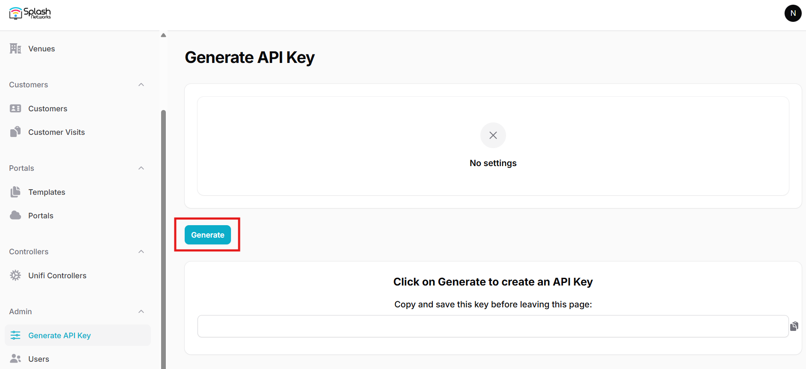
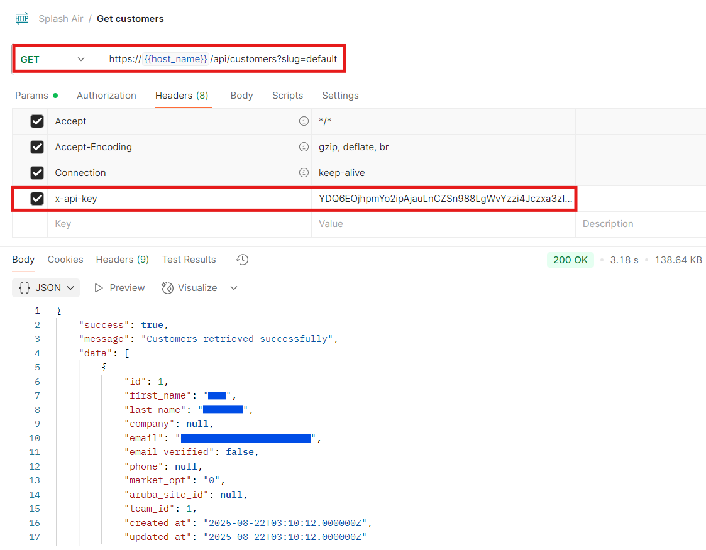
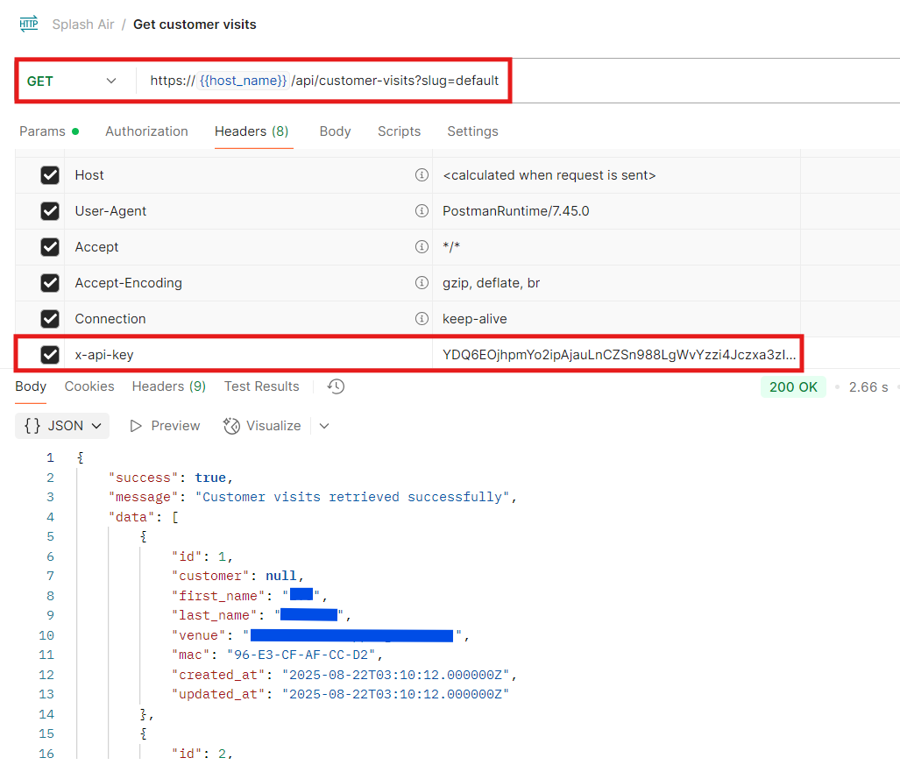
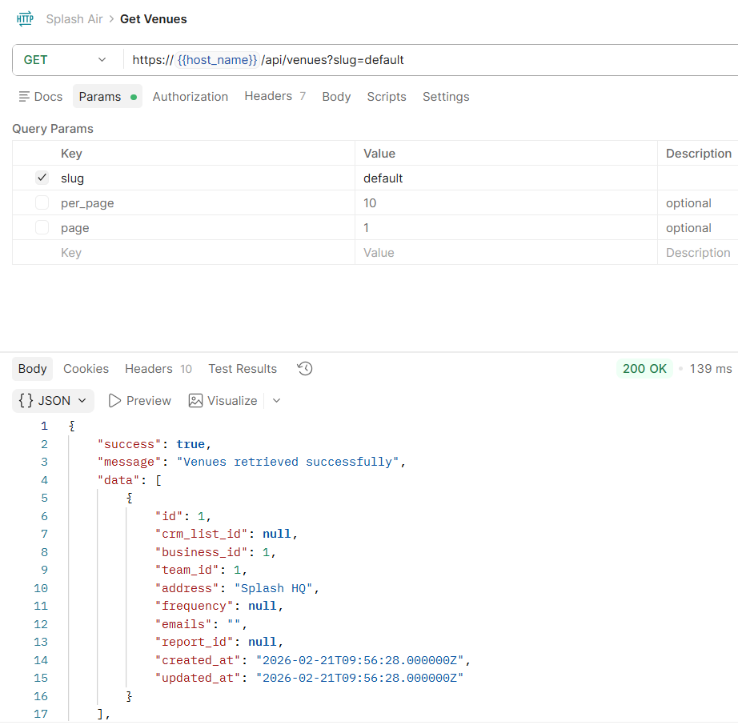
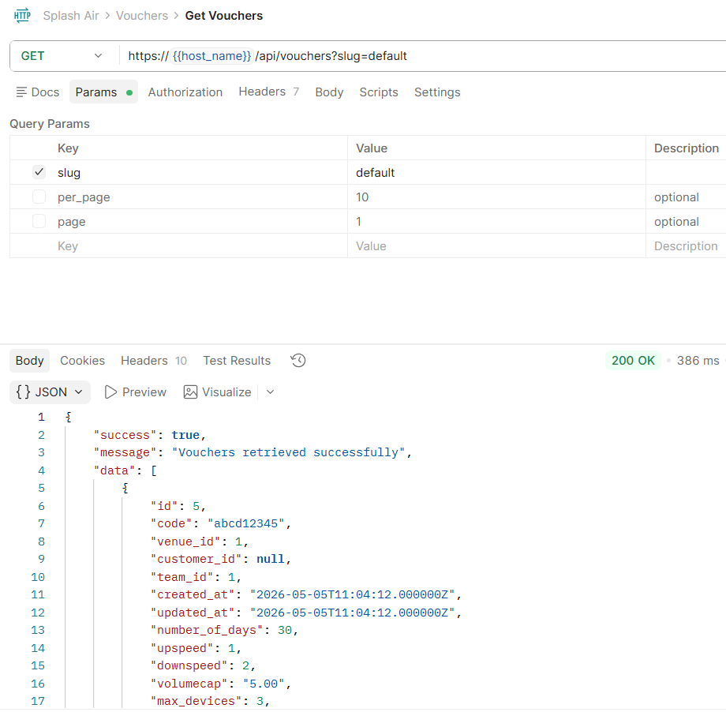
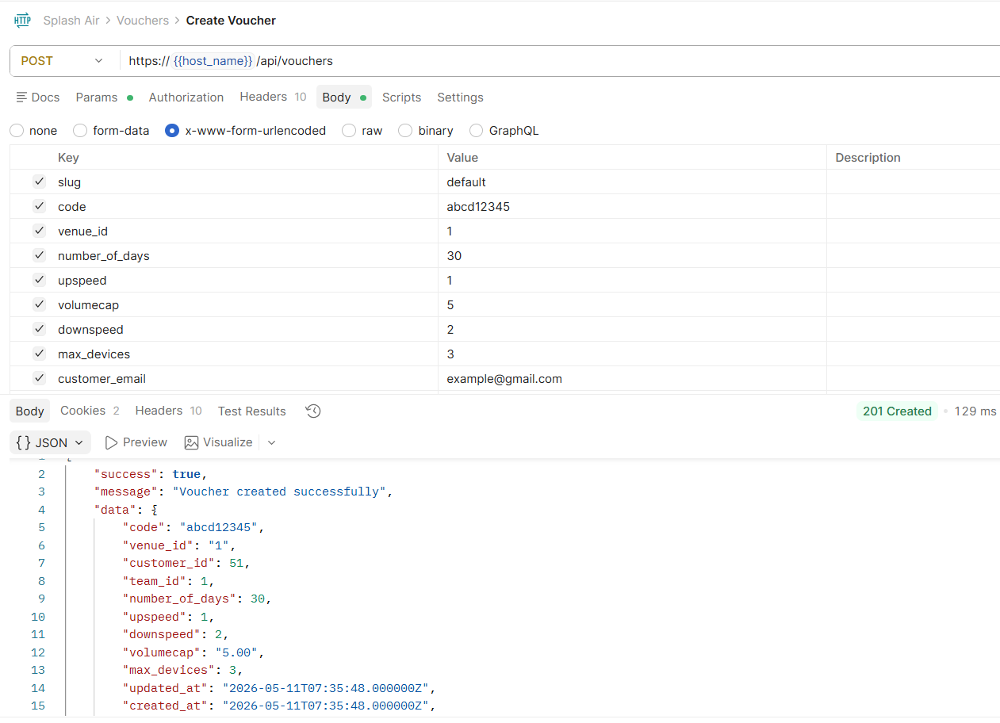
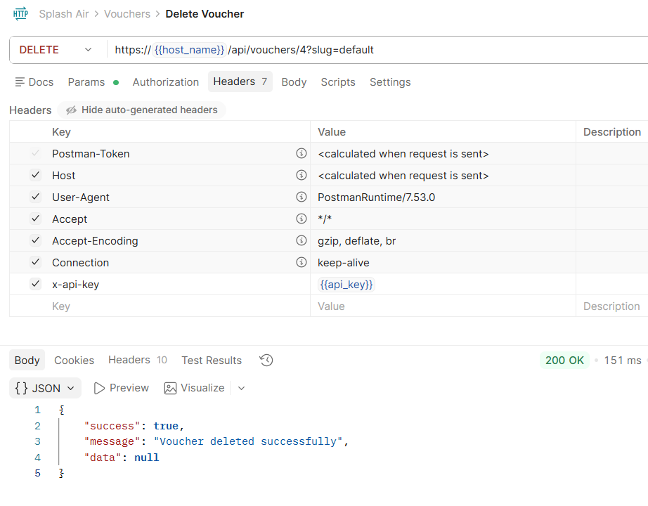

## API Key Creation

To access customer data via API the first step is to create an API Key.

Go to Admin > Generate API Key and press the Generate button.



Copy the generated API Key as it will only be displayed once.

You can use the same page to delete an existing key and create a new one if needed.

This API key will need to set as the value of the `X-API-Key` header when making API requests.

The URL for API requests will be:

```
https://<hostname>/api
```

This will be followed by the specific endpoint that you're querying.

## Customers

Customer data can be retrieved using the customers API. If using multi-tenancy replace `default` with the team identifier.

```
HTTP Verb: GET
API Endpoint: /customers
Headers: 'X-API-Key': '< your API key >'
```

_Query parameters_

| Parameter  | Required | Description                      |
|:-----------|----------|:---------------------------------|
| slug       | Required | Team name                        |
| per_page   | Optional | Number of items per page         |
| page       | Optional | Page number of paginated results |
| start_date | Optional | Show records since this date     |
| end_date   | Optional | Show records till this date      |



## Customer Visits

Customer visit data can be retrieved using the customer-visits API. If using multi-tenancy replace `default` with the team identifier.

```
HTTP Verb: GET
API Endpoint: /customer-visits
Headers: 'X-API-Key': '< your API key >'
```

_Query parameters_

| Parameter  | Required | Description                      |
|:-----------|----------|:---------------------------------|
| slug       | Required | Team name                        |
| per_page   | Optional | Number of items per page         |
| page       | Optional | Page number of paginated results |
| start_date | Optional | Show records since this date     |
| end_date   | Optional | Show records till this date      |



## Venues

Venue related data can be retrieved using the venues API. If using multi-tenancy replace `default` with the team identifier.

```
HTTP Verb: GET
API Endpoint: /venues
Headers: 'X-API-Key': '< your API key >'
```

_Query parameters_

| Parameter  | Required | Description                      |
|:-----------|----------|:---------------------------------|
| slug       | Required | Team name                        |
| per_page   | Optional | Number of items per page         |
| page       | Optional | Page number of paginated results |



## Vouchers

### Get Vouchers

To retrieve existing vouchers use the vouchers API. If using multi-tenancy replace `default` with the team identifier.

```
HTTP Verb: GET
API Endpoint: /vouchers
Headers: 'X-API-Key': '< your API key >'
```

_Query parameters_

| Parameter  | Required | Description                      |
|:-----------|----------|:---------------------------------|
| slug       | Required | Team name                        |
| per_page   | Optional | Number of items per page         |
| page       | Optional | Page number of paginated results |



### Create Voucher

To create a new voucher use the vouchers API with POST verb. If using multi-tenancy replace `default` with the team identifier.

```
HTTP Verb: POST
API Endpoint: /vouchers
Headers: 
 - 'Content-Type': 'application/x-www-form-urlencoded'
 - 'X-API-Key': '< your API key >'
```

_Body parameters_

| Parameter      | Required | Description                             |
|:---------------|----------|:----------------------------------------|
| slug           | Required | Team name                               |
| code           | Required | Voucher code                            |
| number_of_days | Required | Validity of voucher in days             |
| venue_id       | Optional | ID of venue at which voucher can work   |
| upspeed        | Optional | Upload speed in Mbps (0 = unlimited)    |
| downspeed      | Optional | Download speed in Mbps (0 = unlimited)  |
| volumecap      | Optional | Volume limit in GBs (0 = unlimited)     |
| max_devices    | Optional | Max allowed devices (0 = unlimited)     |
| customer_email | Optional | For sending voucher details to customer |



### Delete Voucher

To retrieve existing vouchers use the vouchers API. If using multi-tenancy replace `default` with the team identifier.

```
HTTP Verb: DELETE
API Endpoint: /vouchers/<voucher-id>
Headers: 'X-API-Key': '< your API key >'
```

_Query parameters_

| Parameter  | Required | Description                      |
|:-----------|----------|:---------------------------------|
| slug       | Required | Team name                        |
| per_page   | Optional | Number of items per page         |
| page       | Optional | Page number of paginated results |

