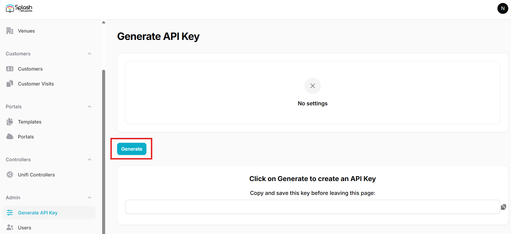

## API Key Creation

To access customer data via API the first step is to create an API Key.

Go to Admin > Generate API Key and press the Generate button.

Copy the generated API Key as it will only be displayed once.

You can use the same page to delete an existing key and create a new one if needed.

## API Docs

You can test APIs here by entering your Splash Air application's hostname in **Server** section in front of `your_server` and your API key in the **Authentication** section below:

