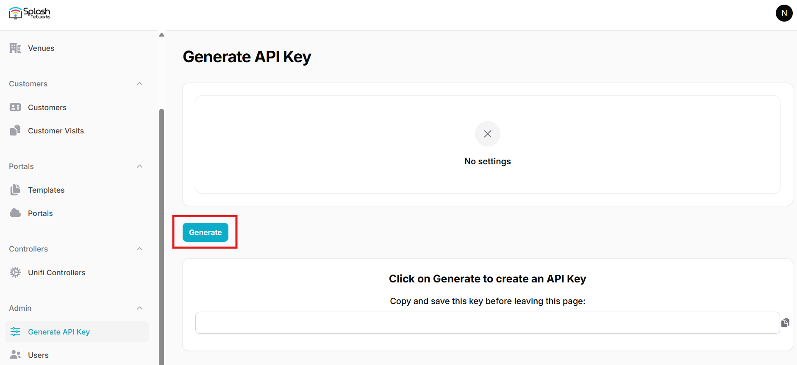
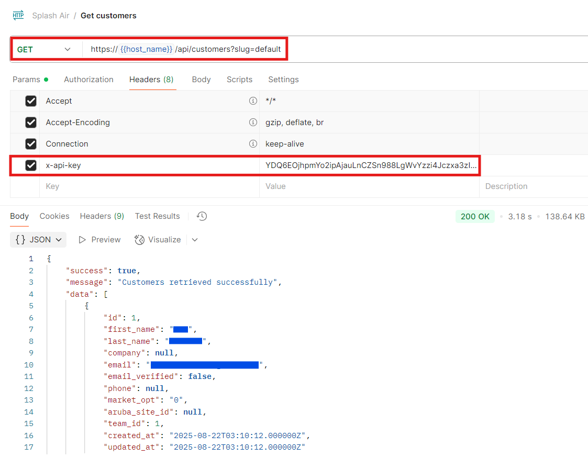
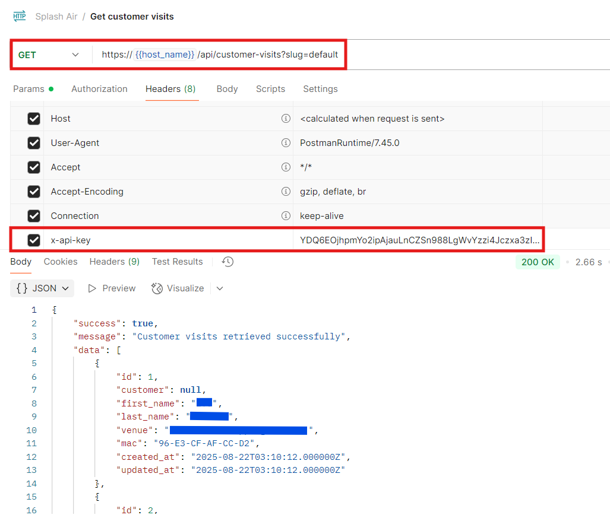

## API Key Creation

To access customer data via API the first step is to create an API Key.

Go to Admin > Generate API Key and press the Generate button.



Copy the generated API Key as it will only be displayed once.

You can use the same page to delete an existing key and create a new one if needed.

This API key will need to set as the value of the `X-API-Key` header when making API requests.

The URL for API requests will be:

```
https://<hostname>/api
```

This will be followed by the specific endpoint that you're querying.

## Customers

Customer data can be retrieved using the customers API. If using multi-tenancy replace `default` with the team identifier.

```
HTTP Verb: GET
API Endpoint: /customers
```

_Query parameters_

| Parameter  | Required | Description                      |
|:-----------|----------|:---------------------------------|
| slug       | Required | Team ID                          |
| per_page   | Optional | Number of items per page         |
| page       | Optional | Page number of paginated results |
| start_date | Optional | Show records since this date     |
| end_date   | Optional | Show records till this date      |



## Customer Visits

Customer visit data can be retrieved using the customer-visits API. If using multi-tenancy replace `default` with the team identifier.

```
HTTP Verb: GET
API Endpoint: /customer-visits
```

_Query parameters_

| Parameter  | Required | Description                      |
|:-----------|----------|:---------------------------------|
| slug       | Required | Team ID                          |
| per_page   | Optional | Number of items per page         |
| page       | Optional | Page number of paginated results |
| start_date | Optional | Show records since this date     |
| end_date   | Optional | Show records till this date      |

