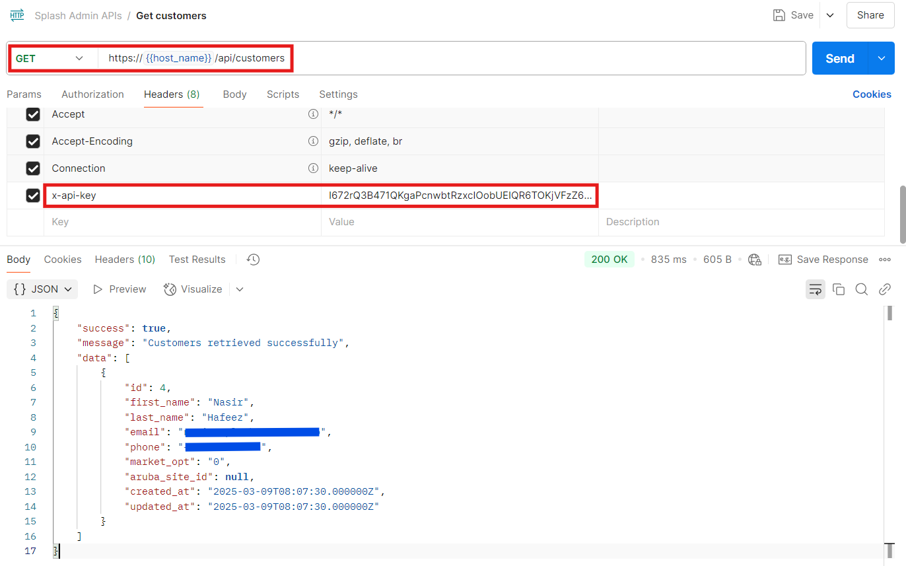
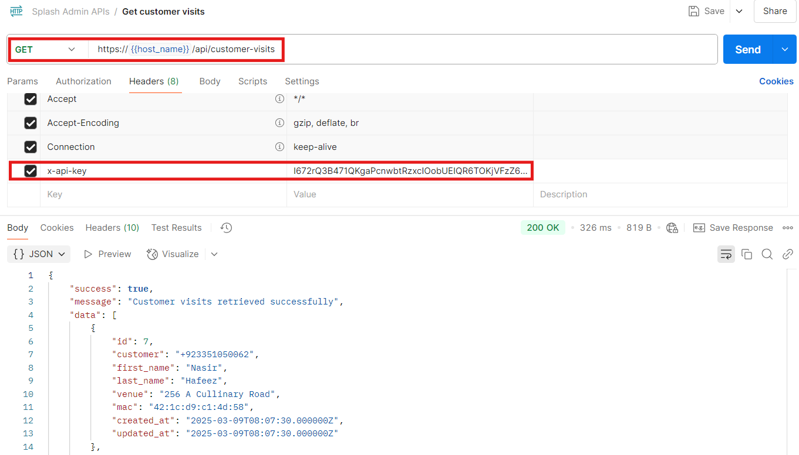

## API Key Creation

To access customer data via API the first step is to create an API Key.

Go to Admin > Generate API Key and press the Generate button.


Copy the generated API Key as it will only be displayed once.

You can use the same page to delete an existing key and create a new one if needed.

This API key will need to set as the value of the `X-API-Key` header when making API requests.

The URL for API requests will be:

```
https://<hostname>/api
```

This will be followed by the specific endpoint that you're querying.

## Customers

Customer data can be retrieved using the customers API.

```
Request Type: GET
API Endpoint: /customers
```



## Customer Visits

Customer visit data can be retrieved using the customer-visits API.

```
Request Type: GET
API Endpoint: /customer-visits
```

