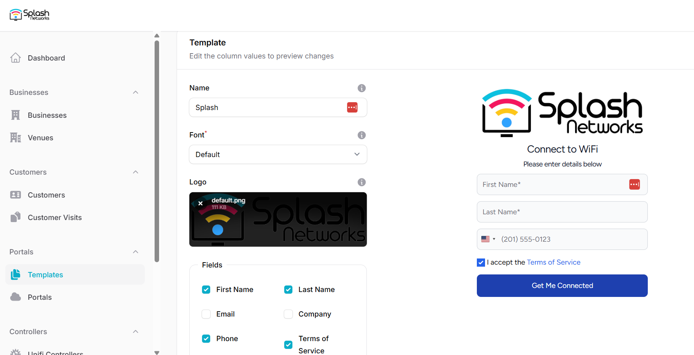
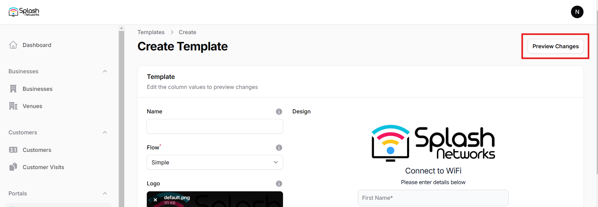
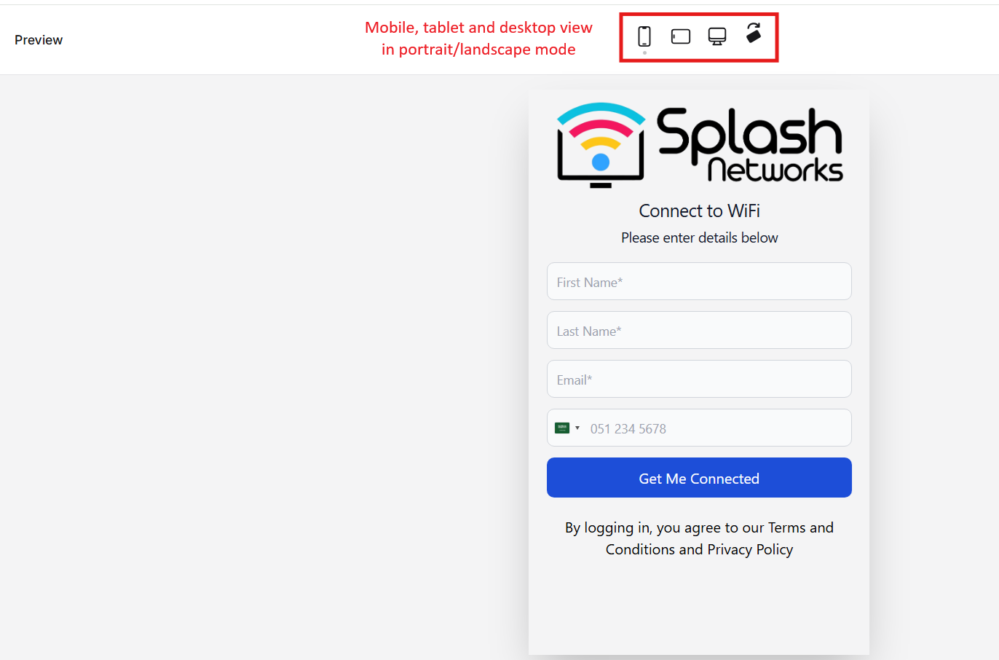

## Setting up Templates

In the Templates tab you can add a new template using the New template button. When creating a new template you can modify the logo and the text fields according to your preference. The field selector section allows you to enable/disable various fields like Email and Phone number based on your requirements. You can change the font, button color, and placeholders for fields. Also, you can add a Background Image. The changes will be displayed in real time on the panel on the right side.

## Flow

There are 3 types of user authorization flows that are currently supported:

 - Simple
 - OTP
 - Link

### Simple Flow

In Simple Flow the user enters their email and mobile number data but does not have to go through OTP based verification.

Here is an example of Simple flow:

<iframe width="560" height="315" 
    src="https://www.youtube.com/embed/K6QrtRPBBg4" 
    frameborder="0" allowfullscreen>
</iframe>

### OTP Flow

In OTP Flow the user has to verify their data using an OTP (One Time Password). You can setup either email verification or mobile number verification.

Here is an example of OTP flow:

<iframe width="560" height="315" 
    src="https://www.youtube.com/embed/yRG6ERp7FDg" 
    frameborder="0" allowfullscreen>
</iframe>

### Link Flow

In Link Flow the user has to verify their email address by clicking on a verification link. The user is given internet access briefly, typically for 5 min, so they can access their email for completing verification. If they don't verify their email address during that time, they will be unauthorized from the network. If they do verify their email address, their session will be extended - whether the extension will be applied dynamically on existing session or will apply the next time they connect depends on the hardware type. For details refer to the compatibility matrix below - in comments it's mentioned whether dynamic session extension is supported or not.

Here is an example of Link flow:

<iframe width="560" height="315" 
    src="https://www.youtube.com/embed/MrXu8W95FNA" 
    frameborder="0" allowfullscreen>
</iframe>

### Email Based OTP Verification Caveat

Our recommended flow for email verification is Link flow.

Implementing email based OTP verification is not recommended. A user in captive state does not have complete internet access, so they will not be able to check their email on the same device. Either they would need another device to check their email, or they would need to have cellular internet on the same device to receive email via that. Additionally, on iOS devices the Captive Network Assistant (CNA) launches a browser that does not allow switching to another window. If you switch to a different window for checking email the browser will close.

## Preview Template

You can click on the preview changes button on the top right to view a full screen preview for mobile, tablet and desktop in portrait and landscape orientation.

In the full screen preview you can use the buttons on the top to toggle between mobile, tablet and desktop view and switch orientation between portrait and landscape. This lets you visualize the captive portal as users will see it.

## Hardware and Template Flow Compatibility Matrix

The following compatibility matrix shows valid combinations of hardware and flow types along with comments:

| Hardware/Flow        | Simple           | OTP              |       Link       | Comments                                                      |
|:---------------------|:----------------:|:----------------:|:----------------:|:--------------------------------------------------------------|
| Aruba Instant On     | :material-check: | :material-check: | :material-check: | Link Flow dynamic session extension not supported             |
| Cambium              | :material-check: | :material-check: | :material-check: | Link Flow dynamic session extension not supported             |
| Cisco                | :material-check: | :material-check: | :material-check: | Link Flow dynamic session extension not supported             |
| Coova Chilli         | :material-check: | :material-check: | :material-check: | Link Flow dynamic session extension not supported             |
| Draytek              | :material-check: | :material-check: | :material-check: | Link Flow dynamic session extension not supported             |
| Fortinet             | :material-check: | :material-check: | :material-check: | Link Flow dynamic session extension not supported             |
| Mikrotik             | :material-check: | :material-check: | :material-close: |                                                               |
| Mikrotik with RADIUS | :material-check: | :material-check: | :material-check: | Link Flow dynamic session extension supported with RADIUS CoA |
| Open Mesh            | :material-check: | :material-check: | :material-check: | Link Flow dynamic session extension not supported             |
| OpenNDS              | :material-check: | :material-check: | :material-close: |                                                               |
| TP-Link Omada        | :material-check: | :material-check: | :material-check: | Link Flow dynamic session extension not supported             |
| Ruckus One           | :material-check: | :material-check: | :material-check: | Link Flow dynamic session extension not supported             |
| Ruckus SmartZone     | :material-check: | :material-check: | :material-check: | Link Flow dynamic session extension not supported             |
| Ruijie               | :material-check: | :material-check: | :material-check: | Link Flow dynamic session extension support                   |
| Ubiquiti Unifi       | :material-check: | :material-check: | :material-check: | Link Flow 24-hr session extension supported                   |