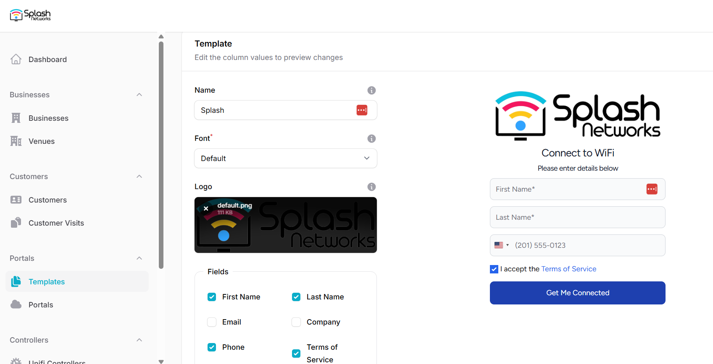
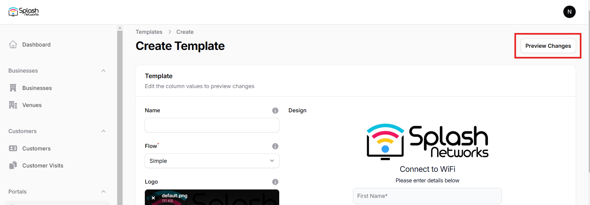
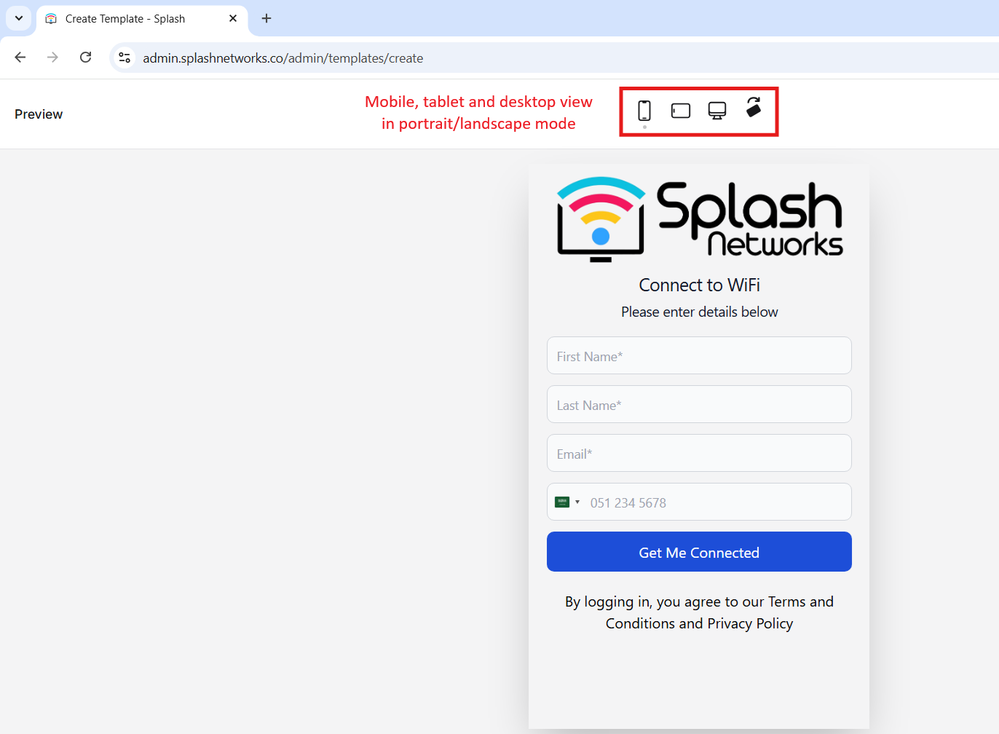

## Setting up Templates

In the Templates tab you can add a new template using the New template button or through the Import button if you have a previous export that you'd like to import.

When creating a new template we can modify the logo and the text fields according to our preference. Also, we can add a Background Image. The changes will be displayed in real time on the right.

## Flow

There are 2 types of user authorization flows that are currently supported:

 - Simple
 - OTP

### Simple Flow

In Simple Flow the user enters their email and mobile number data but does not have to go through OTP based verification.

Here is an example of Simple flow:

<iframe width="560" height="315" 
    src="https://www.youtube.com/embed/K6QrtRPBBg4" 
    frameborder="0" allowfullscreen>
</iframe>

### OTP Flow

In OTP Flow the user has to verify their data using an OTP (One Time Password). We can setup either email verification or mobile number verification.

Here is an example of OTP flow:

<iframe width="560" height="315" 
    src="https://www.youtube.com/embed/yRG6ERp7FDg" 
    frameborder="0" allowfullscreen>
</iframe>

## Preview Template

You can click on the preview changes button on the top right to view a full screen preview for mobile, tablet and desktop in portrait and landscape orientation.

In the full screen preview you can use the buttons on the top to toggle between mobile, tablet and desktop view and switch orientation between portrait and landscape. This lets you visualize the captive portal as the users will see it.

