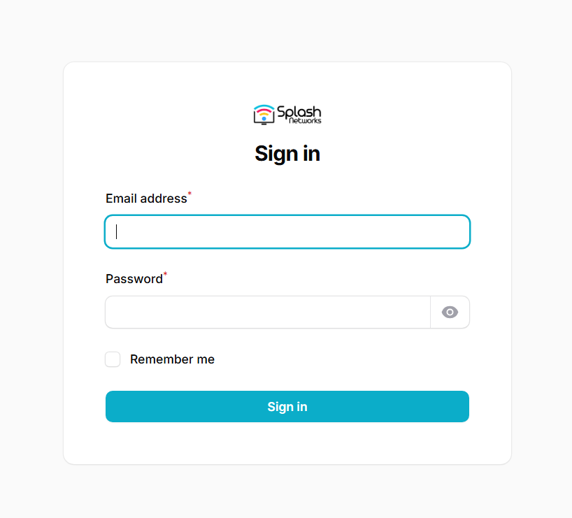
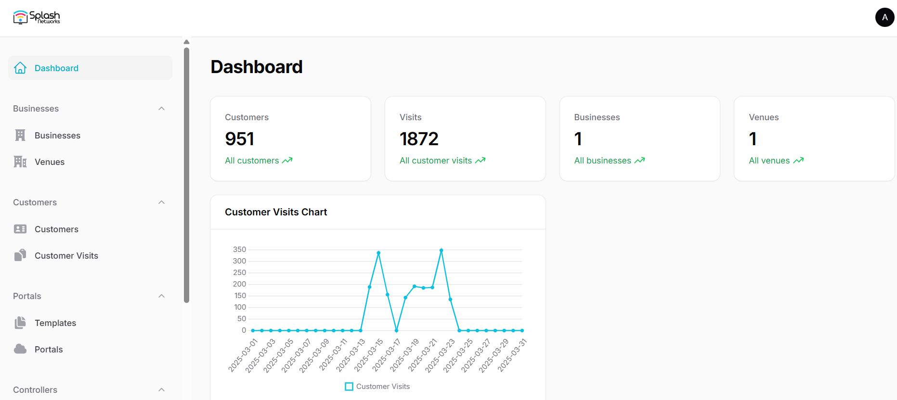
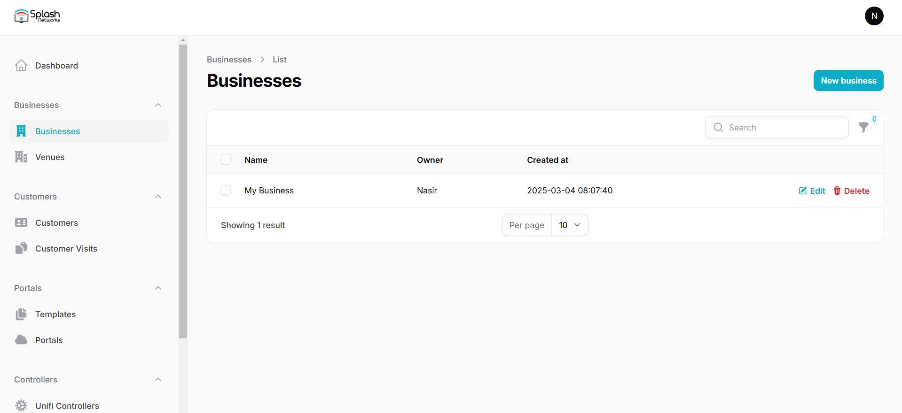
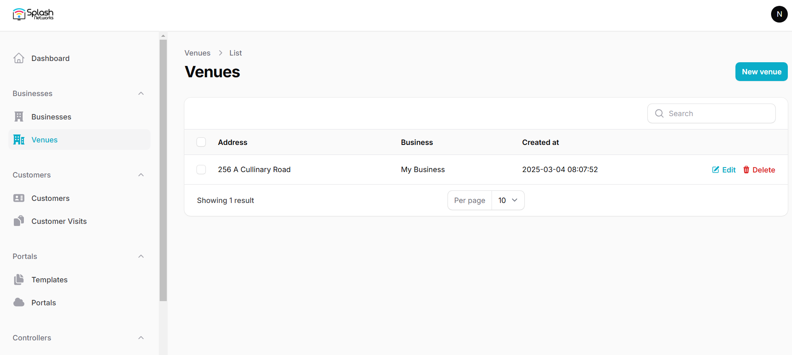
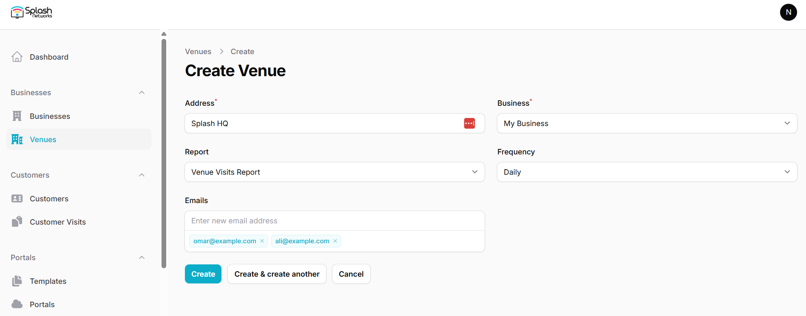

## Login

This is the login screen. You will login using your provided credentials.

<figure markdown="span">
  { width="70%" }
</figure>

## Dashboard

After successful login you will see a dashboard like this showing you some quick stats about your sites.

## Adding Businesses and Venues

In the Businesses tab you can add a new business by clicking on the New business button. After providing the business details its entry will be added:

Each business can have multiple venues. You can go to the Venues tab to add venues using the New venue button:

### Periodic Reports

Under venue settings you have the option of enabling periodic reports. The reporting frequency can be daily/weekly/monthly. It will contain the data of customers and visits to that venue for the selected duration and will be emailed to the provided email addresses.

### Email Marketing

You can upload customer data such as name, email address, phone number, etc. obtained via captive portal at this venue to your email marketing provider's account such as Mailchimp or Brevo. For that you need to select your Email Marekting Provider in Global Settings, and add their API parameters. Then, in Venues you can add or select the contact list to which those contacts will be uploaded.