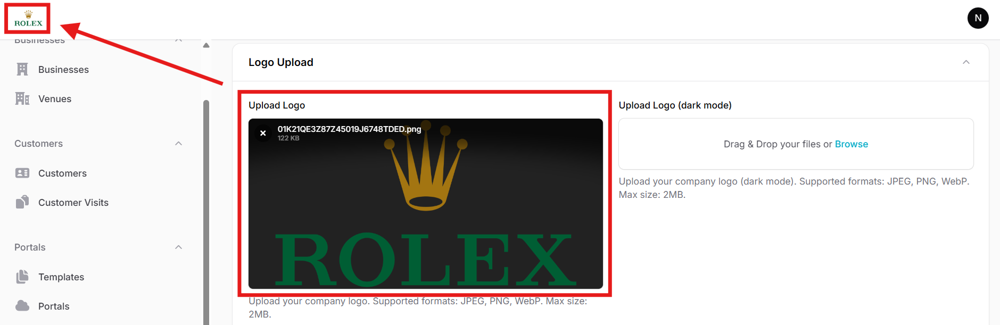
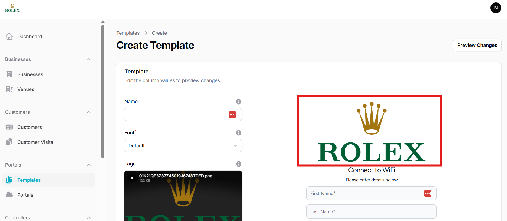

## Login

This is the login screen. You will login using your provided credentials.

<figure markdown="span">
  { width="70%" }
</figure>

## Dashboard

After successful login you will see a dashboard like this showing you some quick stats about your sites.

## Adding Businesses and Venues

In the Businesses tab you can add a new business by clicking on the New business button. After providing the business details its entry will be added:

Each business can have multiple venues. You can go to the Venues tab to add venues using the New venue button:

### Periodic Reports

Under venue settings you have the option of enabling periodic reports. The reporting frequency can be daily/weekly/monthly. It will contain the data of customers and visits to that venue for the selected duration and will be emailed to the provided email addresses.

## Global Settings

In Admin > Global Settings you can edit the global settings related to timezone, country, SMS and email options.

**Timezone** controls all the timestamps in the application, such as visit time and customer creation time.

**Country** controls which country is selected as the default in a portal template's phone number field (for details refer to the section on [defining templates](defining-templates.md))

The **SMS Provider** field can be used to select the default SMS provider when using SMS OTP based user authorization. Currently supported SMS providers are Twilio, Unifonic and TextBee. Each provider has their own API parameters like _Auth Token_, _SenderID_ etc that need to be added under that provider's settings. It is recommended to use the Test SMS button to send a test SMS to ensure SMS functionality is successfully integrated before using this feature in a captive portal.

If SMS OTP based verification is not used then this field is not relevant.

**SMTP** settings are required if these email based features need to be used:

 - Venue reports
 - Email OTP based user authorization
 - Email link based user authorization

You can use SMTP settings from an email service provider such as Sendgrid. It is recommended to use the Test Email button to send a test email to ensure email functionality is successfully integrated before using this feature in a captive portal.

### White Label

If you have obtained a white label license then you can implement that in Global Settings. You have the option of adding regular and dark mode logo. In the Logo Upload section you can upload your logo like this:

Your logo will be shown in the top left corner instead of the original Splash Networks logo. Similarly, it will also be shown as the default placeholder logo when you create a new template.

Similarly, you can add a favicon icon in Upload Favicon section. There are several online tools for creating a favicon icon file from a PNG or JPG file, such as [favicomatic](https://favicomatic.com/).

