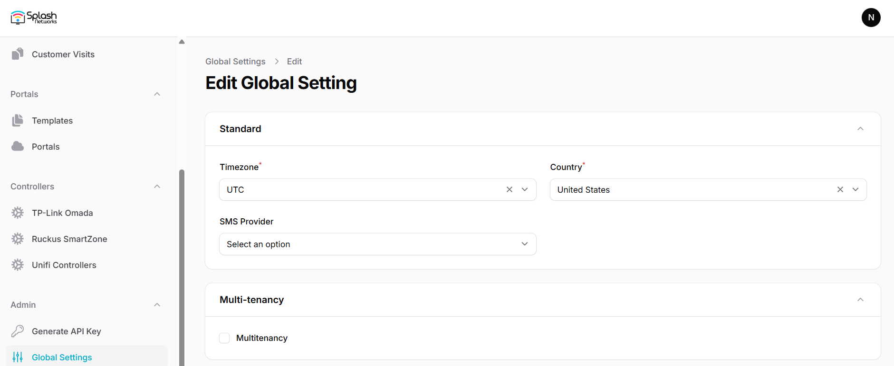
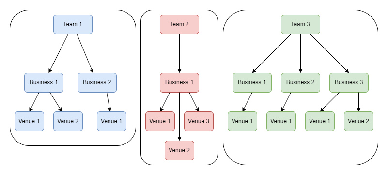
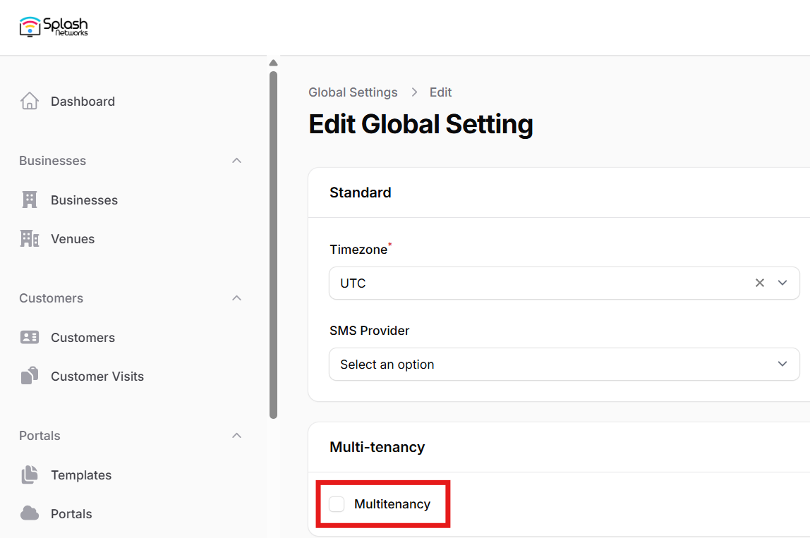
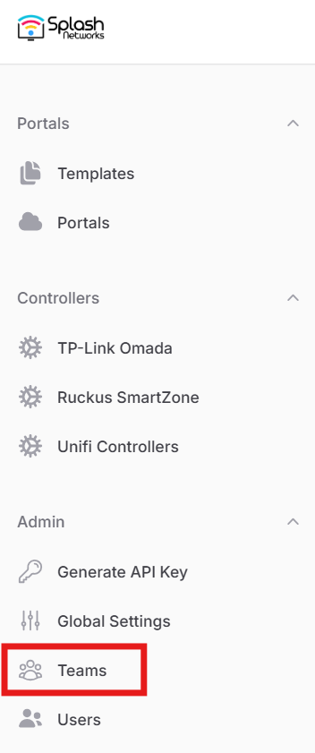
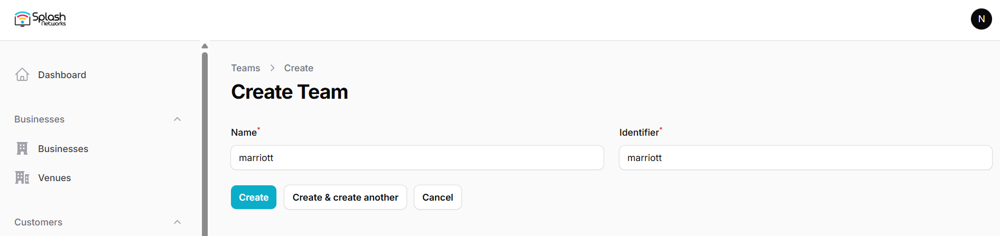
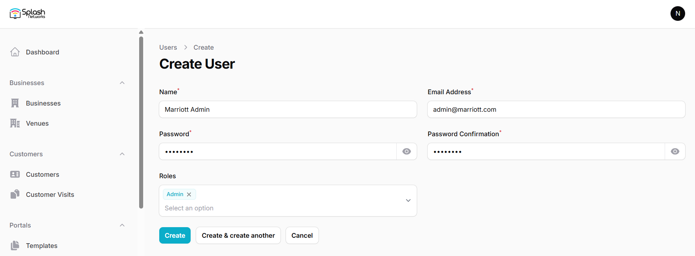
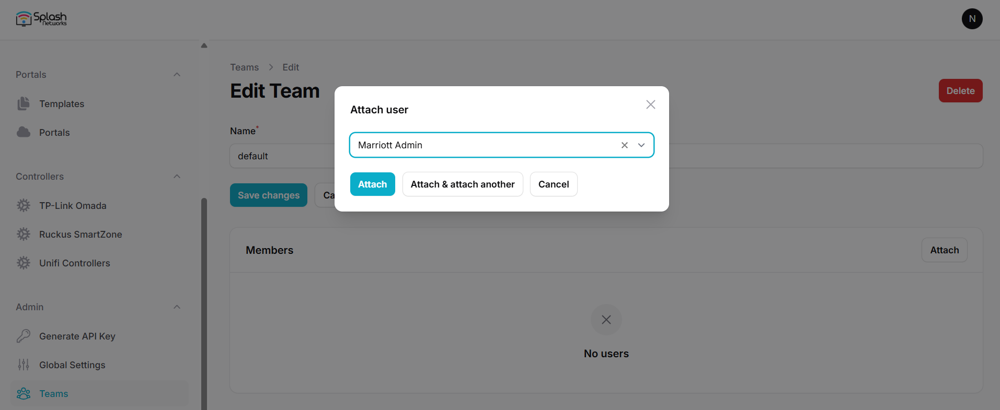
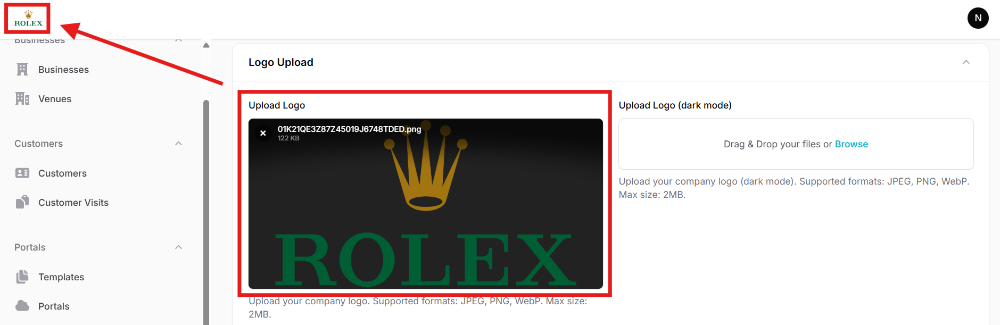
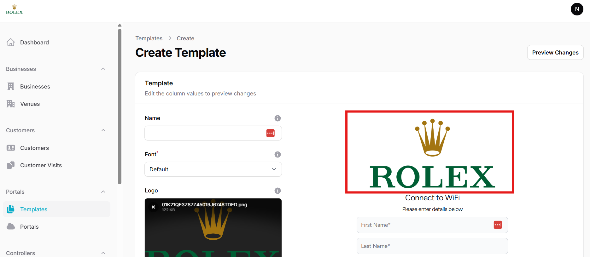
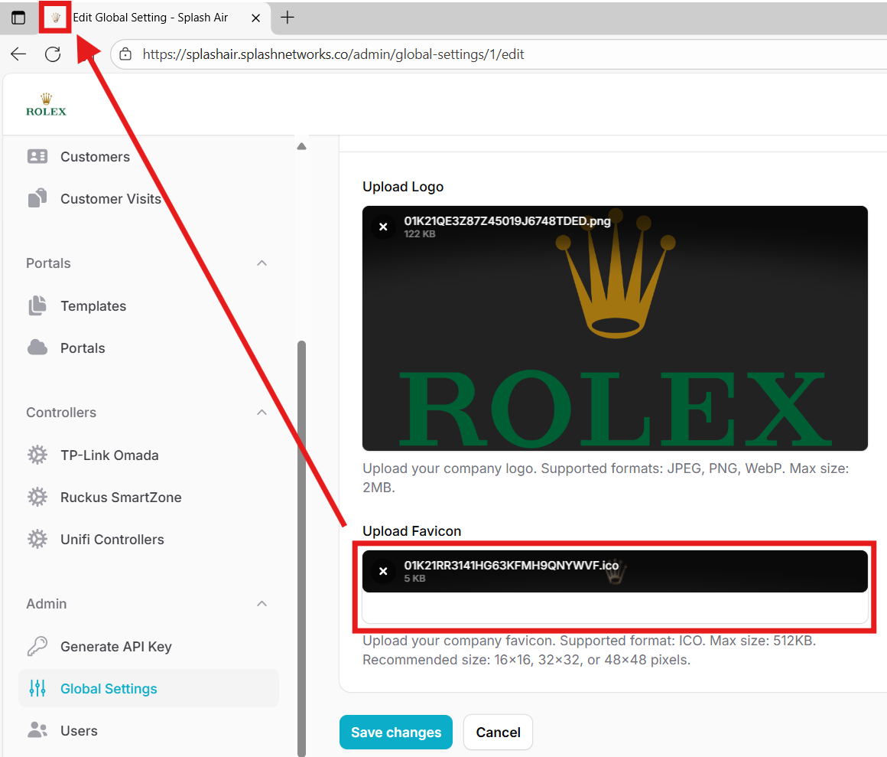

In Admin > Global Settings you can edit the global settings related to timezone, country, SMS and email options.

**Timezone** controls all the timestamps in the application, such as visit time and customer creation time.

**Country** controls which country is selected as the default in a portal template's phone number field (for details refer to the section on [defining templates](defining-templates.md))

The **SMS Provider** field can be used to select the default SMS provider when using SMS OTP based user authorization. Currently supported SMS providers are Twilio, Unifonic and TextBee. Each provider has their own API parameters like _Auth Token_, _SenderID_ etc that need to be added under that provider's settings. It is recommended to use the Test SMS button to send a test SMS to ensure SMS functionality is successfully integrated before using this feature in a captive portal.

If SMS OTP based verification is not used then this field is not relevant.

**SMTP** settings are required if these email based features need to be used:

 - Venue reports
 - Email OTP based user authorization
 - Email link based user authorization

You can use SMTP settings from an email service provider such as Sendgrid. It is recommended to use the Test Email button to send a test email to ensure email functionality is successfully integrated before using this feature in a captive portal.

### Multi-tenancy

Multi-tenancy allows a single instance of Splash Air to serve multiple tenants. Each tenant will have an isolated view of the application. All the data of a tenant related to customers, visits, templates, portals etc. will not be visible to other tenants.

Each tenant is called a team. Each team can have one or more businesses, and each business can have one or more venues. Portals will be created on a per-venue basis.

Multi-tenancy can be enabled by checking multitenancy option. Click on the Save changes button to apply the setting.

Once multi-tenancy has been enabled a Teams option will appear in the left sidebar. Accessing this option will allow you to create new teams. A root team called `default` is present from the start and cannot be removed.

<figure markdown="span">
  { width="70%" }
</figure>

You can click on the New team button to create a new team.

The next step is to go to Users and click on the New user button to create a user for this team. There are 3 roles:

1. **Super Admin**: a global user that has full visibility of the application including the data of all tenants, and can add/delete/update all data such as businesses, venues, templates, portals, customers and visits
2. **Admin**: a tenant user that is a part of one or more teams
3. **Viewer**: a global user that has read-only visibility of the application including the data of all tenants, but cannot make any changes

For a tenant you should create a user with **Admin** role.

Once the user is created go back to team and click on the team to which this user should be added. Then, click on the Attach button and select the user in the Attach user modal.

Click on the Attach button to bind this Admin account to the selected team/tenant.

#### Team Login

The Admin user belonging to any team will use the following URL to login to the application: `https://<Application Hostname>/app`

If the application URL is `https://example.com`, then the login URL for team users will be `https://example.com/app`. Only Super Admins and Viewers will be able to login using `https://exmaple.com`. Teams will have to use the `/app` path.

After login a team user will be able to perform all the operations of the application normally such as creating new businesses, venues, templates, and portals etc.

### White Label

If you have obtained a white label license then you can implement that in Global Settings. You have the option of adding regular and dark mode logo. In the Logo Upload section you can upload your logo like this:

Your logo will be shown in the top left corner instead of the original Splash Networks logo. Similarly, it will also be shown as the default placeholder logo when you create a new template.

Similarly, you can add a favicon icon in Upload Favicon section. There are several online tools for creating a favicon icon file from a PNG or JPG file, such as [favicomatic](https://favicomatic.com/).

