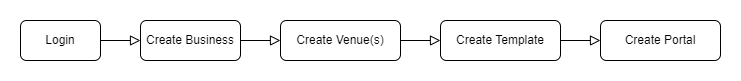

# Documentation Home

This is a basic guide for setting up and performing common tasks on Splash Air.

## Introduction

The Splash Air application has 2 main purposes:

1. Creating external captive portals
2. Providing a user-friendly interface for viewing and exporting user data

## Terminology

It is important to familiarize yourself with the following terminology to understand the sequence of steps required to set up the system.

- #### Business:
The organization in which portal is being deployed, such as Starbucks or Harvard University. A business can have several venues.
- #### Venue:
The location or site where portal is being deployed, such as Starbucks Dubai Mall or Harvard Law School.
- #### Template:
The template refers to the design of a portal splash page typically including logo, background, fonts, colors, form fields, and terms and conditions. It also specifies the portal flow i.e. the process a user has to complete to gain network access, such as verifying their contact information via a One Time Password (OTP). It is hardware-agnostic.
- #### Portal:
A portal is defined by attaching a template to a particular venue and hardware type such as Aruba or Unifi. It can have several unique parameters and settings such as URL, session timeout, Redirect URL etc. for each particular hardware type.

## Configuration Steps

The typical flow of operations when working on a new deployment of Splash Air would be like this:

