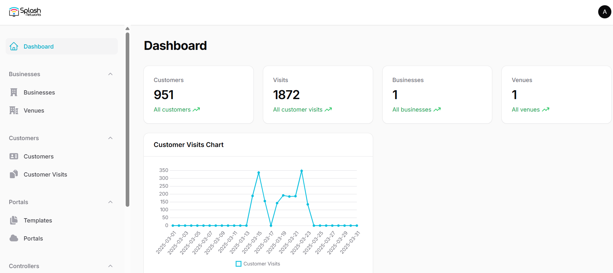

# Documentation

This is a basic guide for setting up and performing common tasks on the Splash Admin Panel.

## Login

This is the login screen. You will login using your credentials.

## Dashboard

After successful login you will see a dashboard like this showing you some quick stats about your sites.

