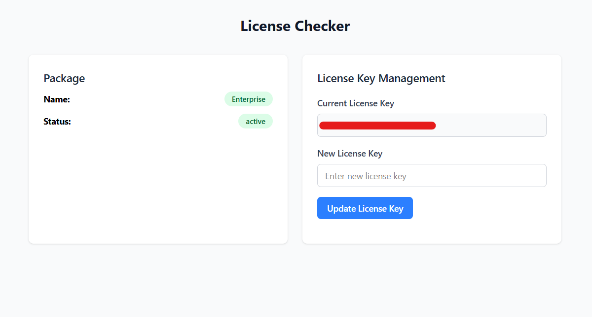

The Splash Air application can be hosted on a cloud Virtual Private Server (VPS) or an on-prem virtual machine (VM). These are the recommended specifications:

 - **OS**: Ubuntu 24 LTS
 - **RAM**: 2 GB
 - **Storage**: 30 GB

A DNS hostname (A record) pointing to the public IP address of your VM/VPS will be required. This will be used to generate a TLS certificate for the Splash Air application. It is a mandatory requirement; without it Wi-Fi captive portals display a certificate warning which affects user experience.

The following ports need to be open for the application to function correctly:

 - TCP port 80 and 443 (for Splash Air application and TLS certificate generation)
 - UDP port 1812 and 1813 (for RADIUS)

### Installation Script

The installation can be done using a script. Your DNS hostname needs to be passed as a parameter to the script. Suppose your DNS hostname is `your-hostname.com` then you can run this one-liner command to download and execute the script (replace `your-hostname.com` with your actual DNS hostname):

```text { .copy }
curl -fsSL https://gist.githubusercontent.com/nasirhafeez/1d2453275c7fc62d32c1678b48d734c3/raw | bash -s -- your-hostname.com
```

The script uses Docker and sets up a Docker Compose based environment, so make sure your VM/VPS supports Docker.

### Caveats

It's possible that you may be using a non-standard environment, such as the following scenarios:

 - You want to run the application on a port other than TCP 443
 - The machine is behind NAT/CG-NAT
 - The machine's public IP does not correspond to its hostname, rather you're using an alternate/private IP for it

In such cases the script given above may not work correctly. Reach out to <support@splashnetworks.co> and explain your scenario, and you'll be guided accordingly.

### Default Credentials

After the installation is complete you'll be able to access your Splash Air application instance via browser. 

<https://your-hostname.com>

The default login credentials are given below:

```
Username: admin@splashnetworks.co
Password: password
```

It is recommended to change these upon first login.

### License

Go to <https://your-hostname.com/license> page and enter the license key you received via email:



Upon successful license activation it should show your package name and the status should be `active`. Without a valid license you will not be able to set up a portal.