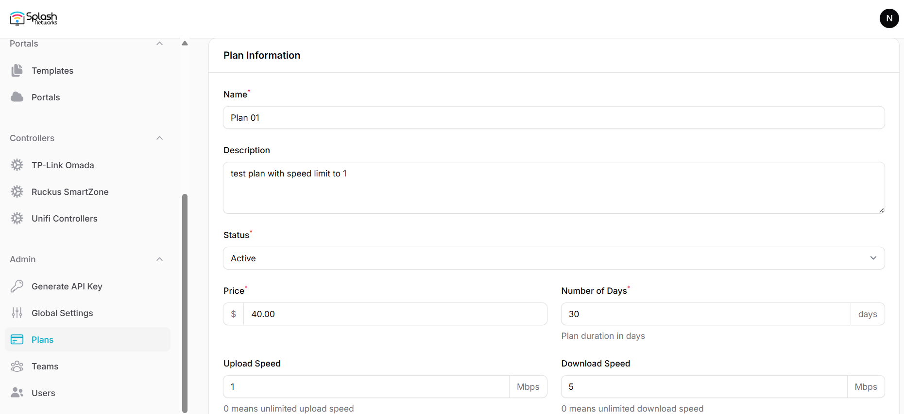
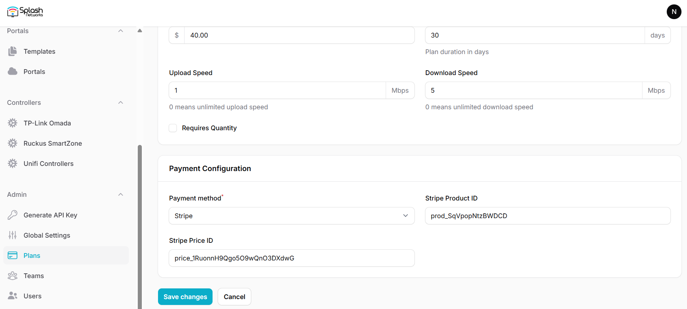

To create payment plans for Payment flow go to Plans and create a new plan.

Enter the following parameters for it:

- **Name**: a name to identify the plan
- **Description**: Optional description about the plan
- **Status**: To control whether the plan will be shown in the payment flow or not. Default is `Active`
- **Price**: The price of the plan. It should match the plan's price configured in the payment gateway
- **Number of Days**: The duration for which the plan will be active after purchase
- **Upload Speed**: Bandwidth rate-limit for upload
- **Download Speed**: Bandwidth rate-limit for download
- **Volume Cap**: Volume quota*
- **Max Devices**: Number of devices allowed for a user

_*Note on volume quota: volume quota is calculated when a user connects. It does not affect a user's existing session. If a user exceeds their plan's volume they will not be able to connect the next time they attemp to connect._

### Payment Configuration

In payment configuration select a payment method such as Stripe. Note that Stripe API keys will need to be configured in [Global Settings](global-settings.md/#payment-gateway).

For Stripe a Product ID and Price ID needs to be added.

Note: the product needs to have a One-off price. It should not be a subscription.