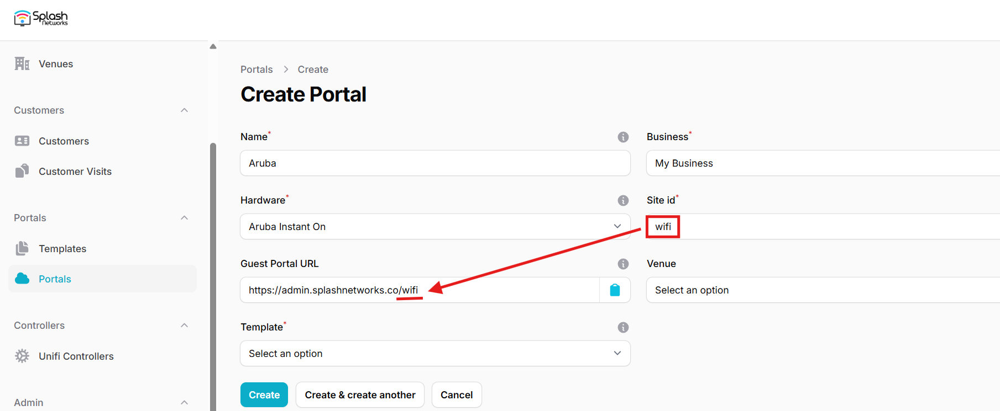
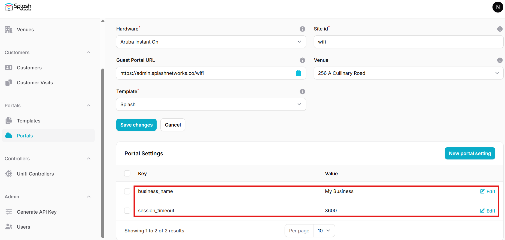
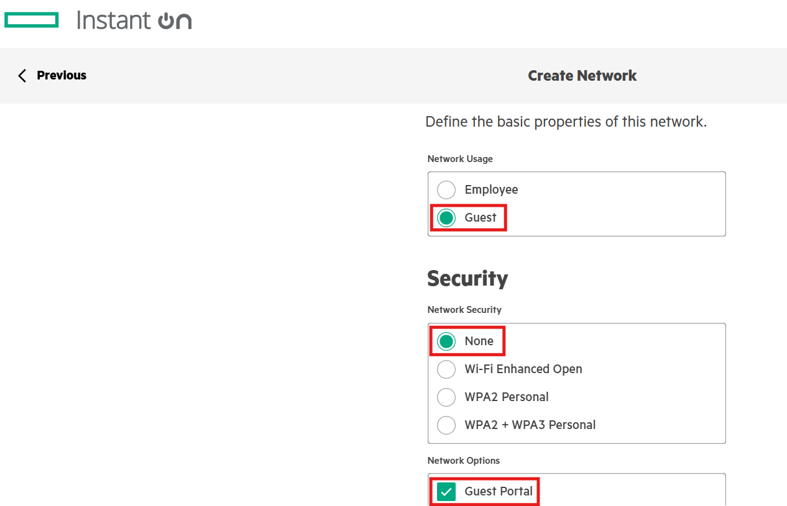
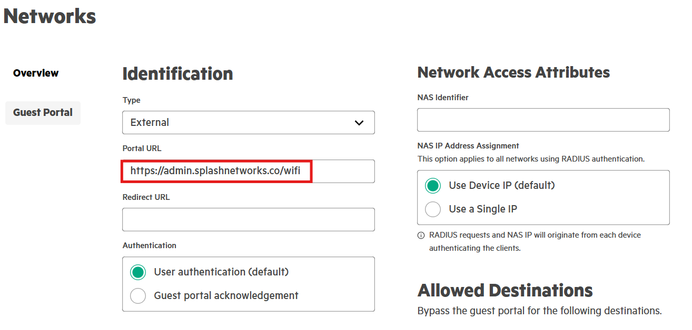
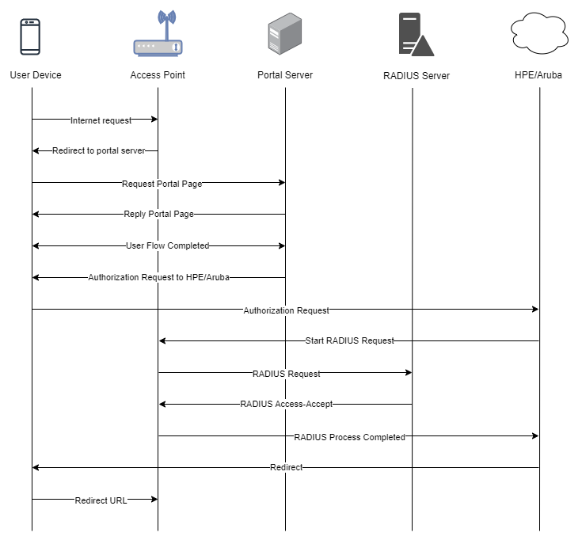

To set up a portal for Aruba/HPE Instant On first you need to [create a template](../defining-templates.md).

## Add a Portal

To create a portal go to the Portals tab and click on the New portal button. Enter a name for the portal, and in Hardware select `Aruba Instant On`. Then, enter a Site ID based on which the path of the portal URL will be defined.



The `Guest Portal URL` will be created based on the URL of the Splash Air application followed by the path given by Site ID. Note this URL as it will be required later.

Select the venue and template and click on the Create button.

## Portal Settings

You can go to Portals to view the settings for the portal(s) just added.

Clicking on a portal takes you to the details for that portal. It lets you specify additional settings:

```
Business Name: name of the venue which will be displayed on top of the portal
Duration (seconds): the time in seconds for which a user is authorized on the network
Expiry: the time in days after which a repeat user will have to enter their data again on the portal
```

You can click on the Edit button against each entry to modify it if needed.



## Instant On Portal Settings

Login to your account on the [HPE Instant On cloud](https://portal.instant-on.hpe.com/) and select the site on which you want to apply guest portal. Create a new Network of type `Guest`. In Network Options enable `Guest Portal`.



In Networks > Guest Portal select Type `External`. In Portal URL select the Guest Portal URL that you copied earlier.



In Primary RADIUS add the details of your RADIUS server, such as IP address and shared secret.

## Troubleshooting

To troubleshoot problems it is important to understand the components involved in the captive portal user authorization process and the interactions between them.

### Traffic Flow

Here is the traffic flow in the case of HPE/Aruba Instant On:

