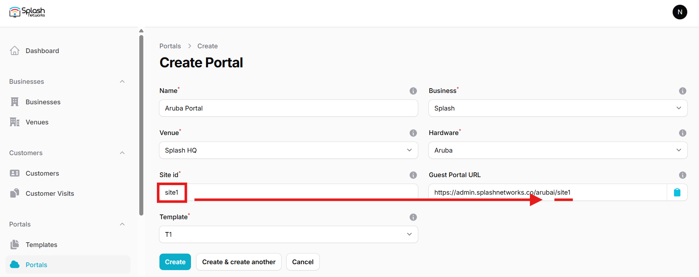
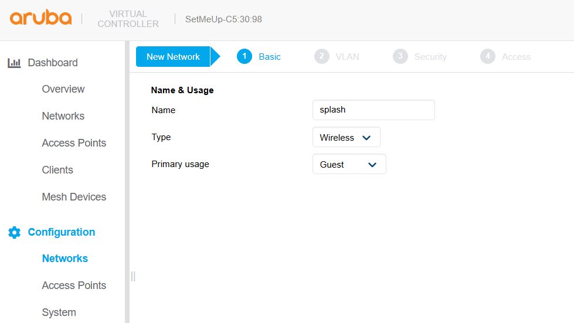
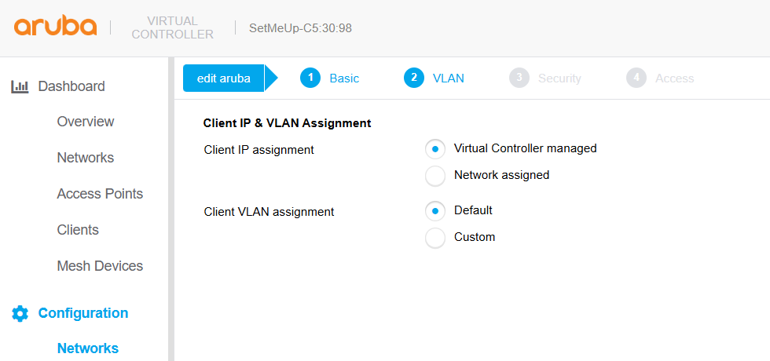
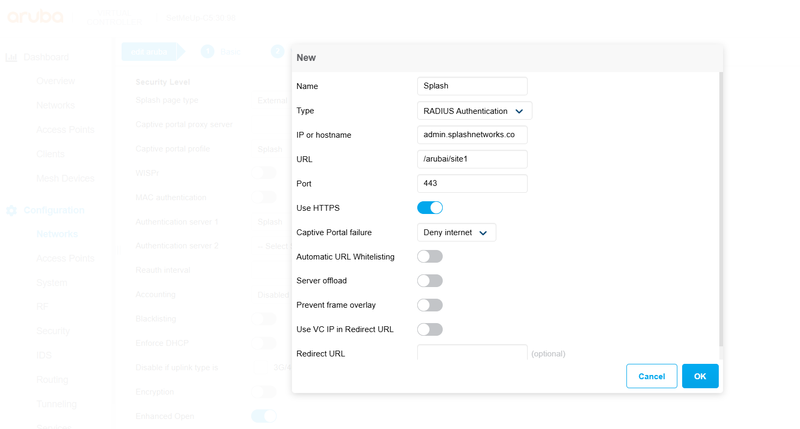
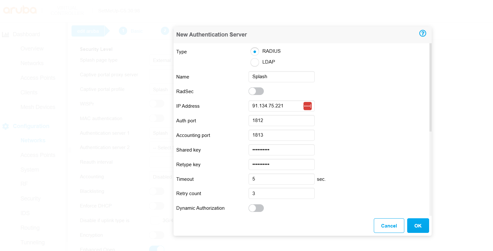
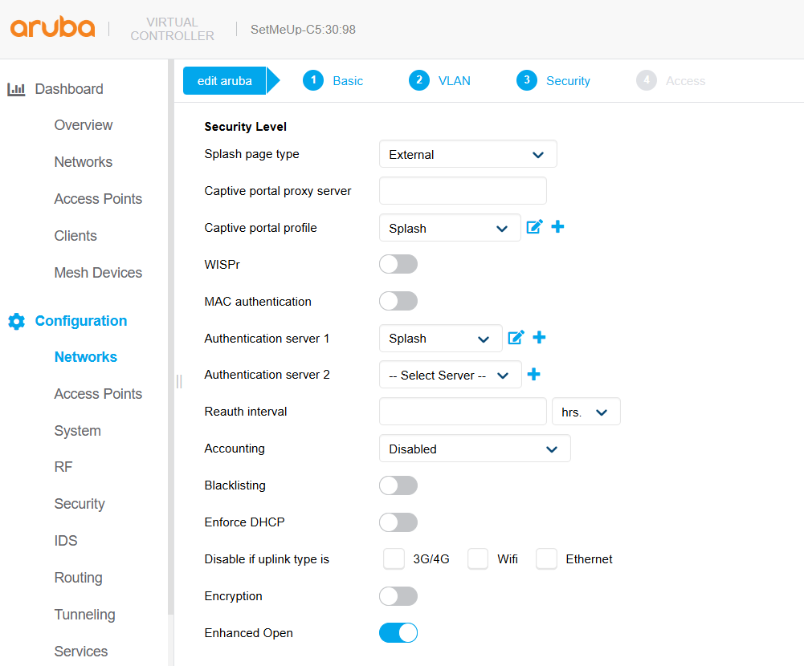
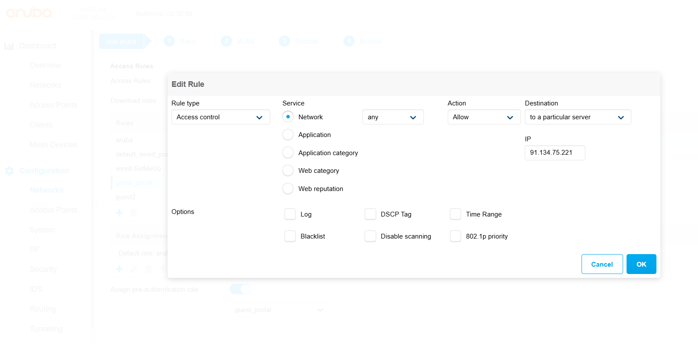
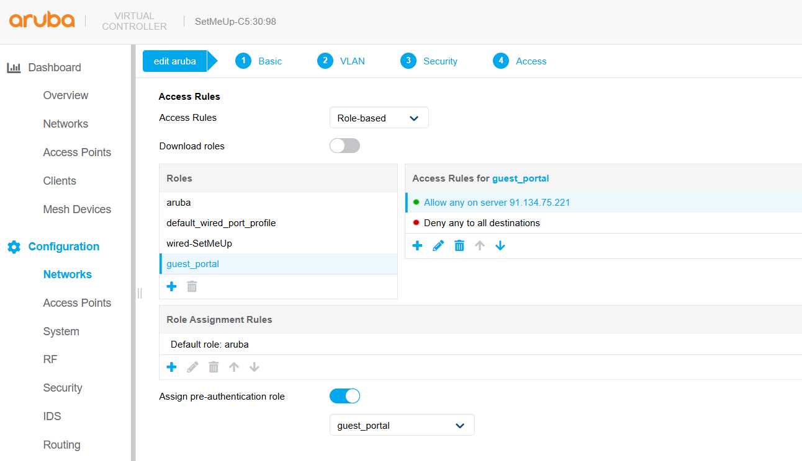
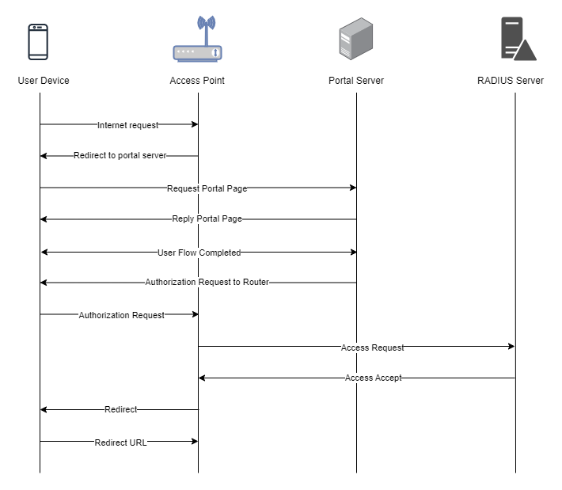

To set up a portal for Aruba/HPE first you need to [create a template](../defining-templates.md).

## Add a Portal

To create a portal go to the Portals tab and click on the New portal button. Enter a name for the portal, and in Hardware select `Aruba`. Then, enter a Site ID based on which the path of the portal URL will be defined.



The `Guest Portal URL` will be created based on the URL of the Splash Air application followed by the path given by Site ID. Note this URL as it will be required later.

Select the venue and template and click on the Create button.

## Portal Settings

You can go to Portals to view the settings for the portal(s) just added.

Clicking on a portal takes you to the details for that portal. It lets you specify additional settings:

```
Business Name: name of the venue which will be displayed on top of the portal
Expiry (days): the time in days after which a repeat user will have to enter their data again on the portal
Redirect URL: the URL a user is redirected to after successful portal authorization
Duration (seconds) after email verification: when using "Link" type Flow it is the "Session-Timeout" a user will receive via RADIUS after successful email verification 
```

You can click on the Edit button against each entry to modify it if needed.

## Aruba/HPE Settings

Login to your Aruba AP in instant mode via web and go to Configuration > Networks. Select an existing network or create a new network on which you want to apply guest portal. Enter a name for it, and in Primary usage select `Guest`.



On the Next screen in Client IP assignment select `Virtual Controller managed` and in Client VLAN assignment select `Default`.



Click Next to go to the third screen. In Splash page type select `External`. In Captive portal profile click on the `+` icon to create a new profile. Enter a name for it and in Type select `RADIUS Authentication`. The Guest Portal URL noted earlier now needs to be input in the **IP or hostname** and **URL** fields in the following way:

Suppose the Guest portal URL is: `https://admin.splashnetworks.co/arubai/site1`. It will be divided into 2 sections:

 - _Hostname_: `admin.splashnetworks.co`

 - _URL_: `/arubai/site1`

Enter these values in **IP or hostname** and **URL** fields respectively. In **Port** enter `443`. Toggle **Use HTTPS** to on.



Click OK to save the profile. In **Authentication server 1** click on the `+` sign. In **Type** select `RADIUS`. Enter a name for it, and in **IP address** and **Shared key** enter the details of your RADIUS server (will be provided by Splash Networks' team).



Click OK to save RADIUS profile. Keep the other options at default.



Click Next to go to the last screen. In **Access Rules** `Role-based` should be selected. In **Roles** click on the `+` icon to create a new role. Enter a name for it, such as `guest_portal`. The default access rule is set to _Allow any to all destinations_. Edit it and change the Action to `Deny`. Add a new rule with Destination type `to a particular server` to allow access to captive portal server. In **IP** enter the IP of Splash Air server. The remaining options will remain at their default values.



Bring your newly added rule to the top. Toggle **Assign pre-authentication role** option to On and in the dropdown menu select your newly created profile `guest_portal`. The final settings should look like this:



Click on Finish to save the settings.

## Troubleshooting

To troubleshoot problems it is important to understand the components involved in the captive portal user authorization process and the interactions between them.

### Traffic Flow

Here is the traffic flow in the case of Aruba/HPE:

