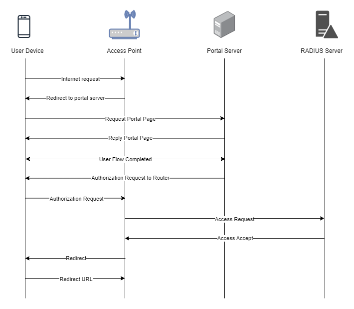

To set up a portal for Cambium first you need to [create a template](../defining-templates.md).

## Add a Portal

To create a portal go to the Portals tab and click on the New portal button. Enter a name for the portal and specify the business and venue. In Hardware select `Cambium`. Then, enter a Site ID based on which the path of the portal URL will be defined.


The `Guest Portal URL` will be created based on the URL of the Splash Air application followed by the path given by Site ID. Note this URL as it will be required later.

Select the template and click on the Create button.

## Portal Settings

You can go to Portals to view the settings for the portal(s) just added.

Clicking on a portal takes you to the details for that portal. It lets you specify additional settings:

```
Business Name: name of the venue which will be displayed on top of the portal
Expiry: the time in days after which a repeat user will have to enter their data again on the portal
Redirect URL: when using "Link" type Flow it is the URL to which a user is redirected after successful email verification
Duration (seconds) after email verification: when using "Link" type Flow it is the "Session-Timeout" a user will receive via RADIUS after successful email verification 
```

You can click on the Edit button against each entry to modify it if needed.

## Cambium Settings

Access Cambium cnMaestro using web interface. Go to Wi-Fi Profiles > WLANs and select the profile on which you want to enable captive portal (or create a new one). In **AAA Servers** enter the IP address and secret of your RADIUS server (will be provided by Splash Networks' team).


In **Guest Access** tab, click on the **Enable** checkbox. In **Portal Mode** select `Enternal Hotspot`. **Access Policy** should be `RADIUS`. **AP Server Protocol** should be `HTTP`. In **External Page URL** enter the `Guest Portal URL` copied earlier.


Save the settings. In case you created a new WLAN profile you'll need to apply that to your AP Group.

## Troubleshooting

To troubleshoot problems it is important to understand the components involved in the captive portal user authorization process and the interactions between them.

### Traffic Flow

Here is the traffic flow in the case of Cambium:


