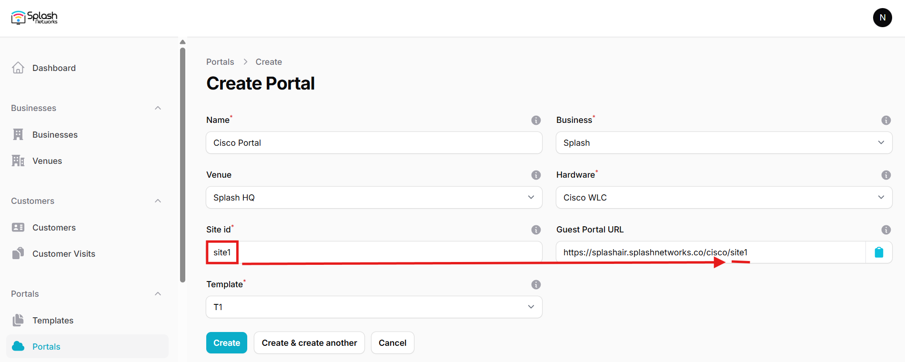
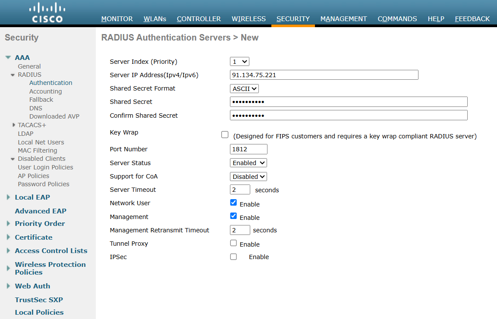
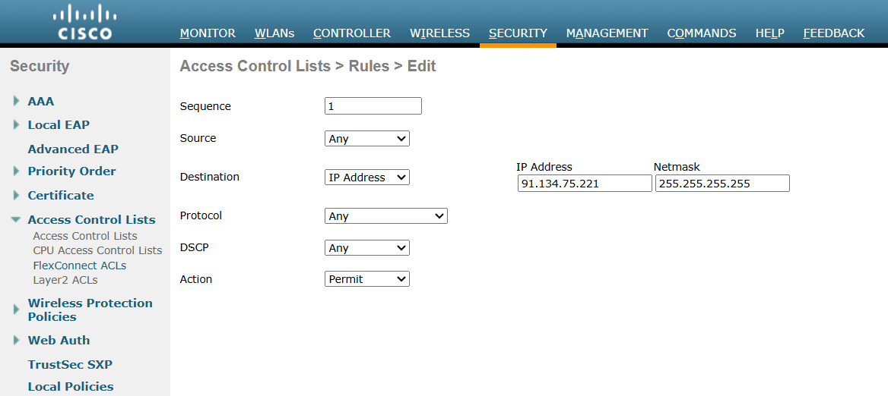
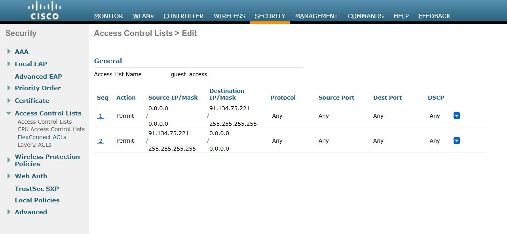
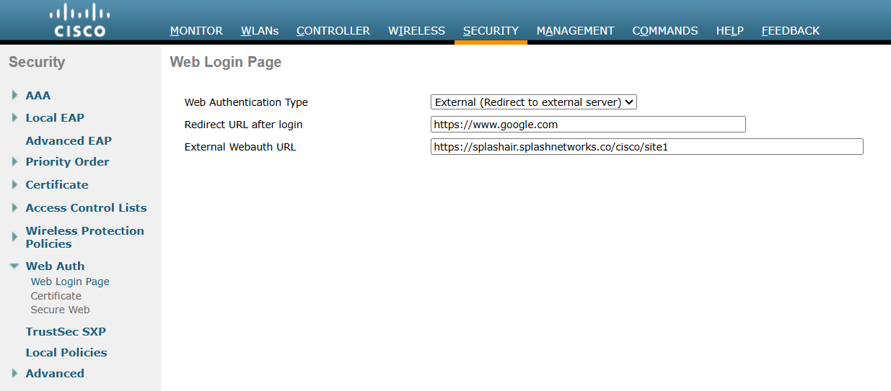
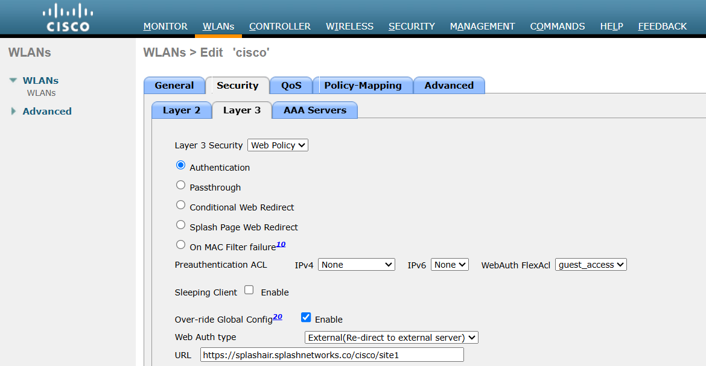
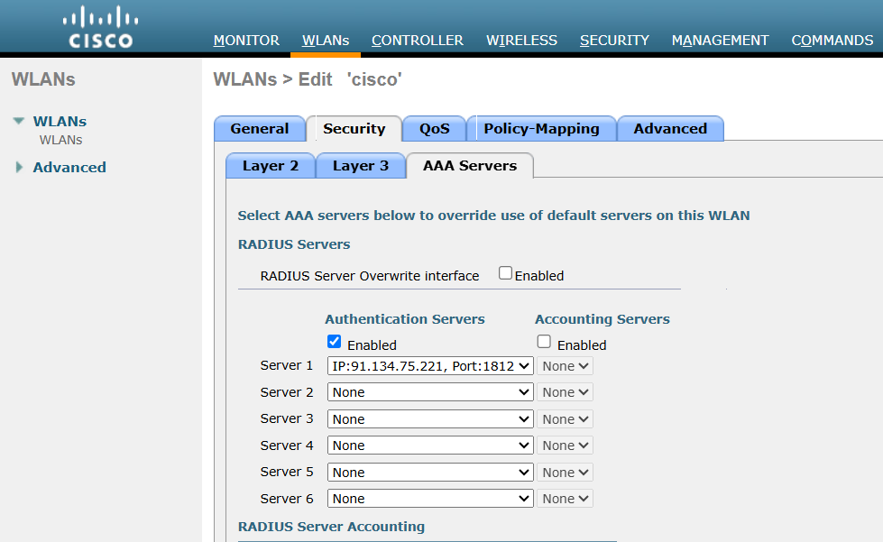
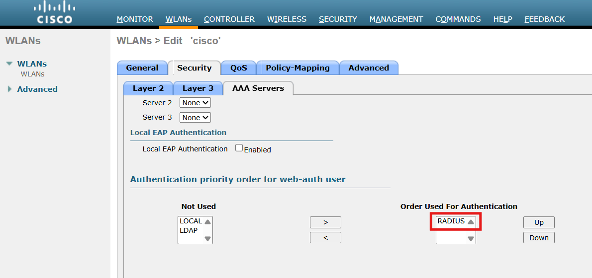
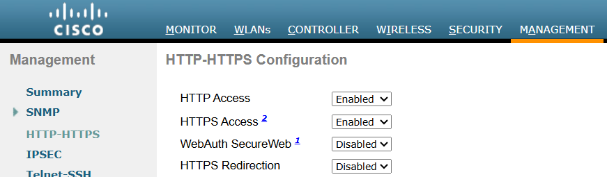
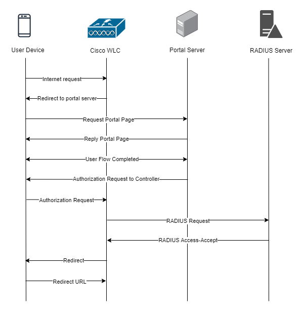

To set up a portal for Cisco WLC first you need to [create a template](../defining-templates.md).

## Add a Portal

To create a portal go to the Portals tab and click on the New portal button. Enter a name for the portal and specify the business and venue. In Hardware select `Cisco WLC`. Then, enter a Site ID based on which the path of the portal URL will be defined.



The `Guest Portal URL` will be created based on the URL of the Splash Air application followed by the path given by Site ID. Note this URL as it will be required later.

Select the template and click on the Create button.

## Portal Settings

You can go to Portals to view the settings for the portal(s) just added.

Clicking on a portal takes you to the details for that portal. It lets you specify additional settings:

```
Business Name: name of the venue which will be displayed on top of the portal
Redirect URL: the URL a user is redirected to after successful portal authorization
Expiry: the time in days after which a repeat user will have to enter their data again on the portal
Duration (seconds) after email verification: when using "Link" type Flow it is the "Session-Timeout" a user will receive via RADIUS after successful email verification 
```

You can click on the Edit button against each entry to modify it if needed.

## Cisco WLC Settings

Access Cisco WLC using web interface and click on **Advanced**. Go to Security > AAA > RADIUS > Authentication and add a new RADIUS server. The IP address and RADIUS secret shared by Splash Networks' support team will be entered here.



Click on Apply to save the settings. Then go to Security > Access Control Lists > Access Control Lists (or FlexConnect ACLs if you're using FlexConnect) and create a new ACL. Click on the ACL name and add a new rule to it. Configure these settings:

```
Sequence: 1
Source: Any
Destination: IP Address
Protocol: Any
DSCP: Any
Action: Permit
```

In IP address enter the IP address of Splash Air server with Netmask `255.255.255.255`.



Similarly, add a new rule with Source equal to Splash Air IP address and Destination Any:



Go to Security > Web Auth > Web Login Page. In **Web Authentication Type** select `External (Redirect to external server)`. In **Redirect URL after login** enter a redirect URL (optional). In **External Webauth URL** enter the Guest Portal URL copied earlier. Click on Apply to save settings.



Next, go to WLANs and select the WLAN on which to apply guest portal. In Security > Layer 3 set **Layer 3 Security** to be `Web Policy`. Below it select the **Authentication** option. In **Preauthentication ACL** select the ACL created previously. Check **Over-ride Global Config** option. In Web Auth type select **External(Re-direct to external server)** and in URL enter the Guest Portal URL.



Then go to Security > AAA Servers and in Authentication servers check the **Enabled** button. In Server 1 add the RADIUS server created previously:



Scroll down to **Authentication priority order for web-auth user**. Use the arrows to ensure only **RADIUS** is in the `Order Used for Authentication` section:



Click on Apply to save the settings.

Finally, go to Management > HTTP-HTTPS and configure these settings:

```
HTTP Access: Enabled
HTTPS Access: Enabled
WebAuth SecureWeb: Disabled
HTTPS Redirection: Disabled
```



Click on Apply to save settings. WLC may need to be rebooted for these settings to take effect.

## Troubleshooting

To troubleshoot problems it is important to understand the components involved in the captive portal user authorization process and the interactions between them.

### Traffic Flow

Here is the traffic flow in the case of Cisco WLC:


