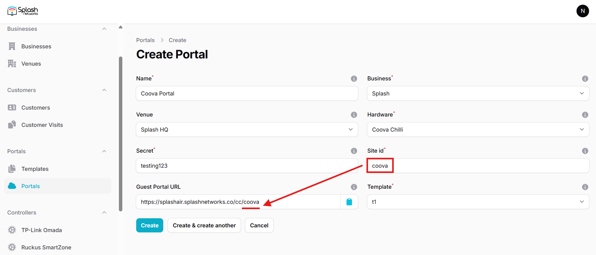
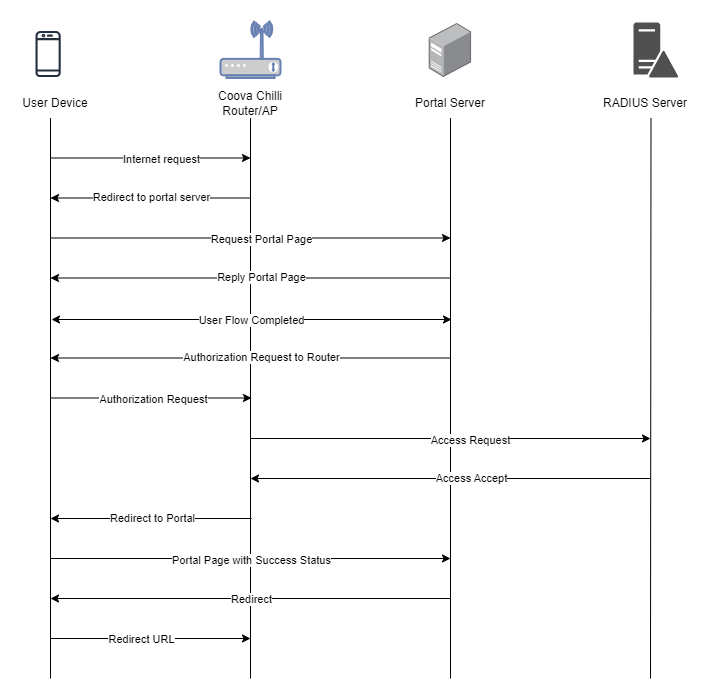

To set up a portal for Coova Chilli first you need to [create a template](../defining-templates.md).

## Add a Portal

To create a portal go to the Portals tab and click on the New portal button. Enter a name for the portal and specify the business and venue. In Hardware select `Coova Chilli`. Enter a secret which will be used to secure communication between the router/AP and Splash Air server. Then, enter a Site ID based on which the path of the portal URL will be defined.



The `Guest Portal URL` will be created based on the URL of the Splash Air application followed by the path given by Site ID. Note this URL as it will be required later.

Select the template and click on the Create button.

## Portal Settings

You can go to Portals to view the settings for the portal(s) just added.

Clicking on a portal takes you to the details for that portal. It lets you specify additional settings:

```
Business Name: name of the venue which will be displayed on top of the portal
Expiry: the time in days after which a repeat user will have to enter their data again on the portal
Redirect URL: the URL a user is redirected to after successful portal authorization
Duration (seconds) after email verification: when using "Link" type Flow it is the "Session-Timeout" a user will receive via RADIUS after successful email verification 
```

You can click on the Edit button against each entry to modify it if needed.

## Coova Chilli Settings

Coova Chilli is an open-source captive portal package which is used in many Linux based routers. This guide is written for OpenWRT. Our recommended OpenWRT firmware version is OpenWRT 19. Newer versions do not have `iptables` installed by default so Coova Chilli will not work out of the box. For newer firmwares we recommend using OpenNDS package instead of Coova Chilli.

Access OpenWRT router/AP using LuCI web interface. By default, OpenWRT firewall does not allow web or SSH access on WAN IP. As a captive portal blocks all traffic on LAN until user is authenticated so when we initially enable captive portal on OpenWRT we would lose management access to the router. To manage OpenWRT we should therefore open access from WAN side. 

Go to Network > Firewall > Traffic Rules. Add a new rule with these properties:

```
Protocol: TCP
Source zone: wan
Destination zone: Device (input)
Destination port: 80
```

Similarly, add another rule for `Destination port: 22`. Click on Save and apply. Once these rules are added you would be able to access OpenWRT via web and SSH from WAN side.

Access your OpenWRT device over SSH using its WAN IP. Enter these commands:

```text { .copy }
opkg update
opkg install coova-chilli nano
```

Open coova-chilli config file:

```text { .copy }
nano /etc/config/chilli
```

Make the following changes:

**option disabled 1**: should be commented out

**option radiusserver1 `radius IP`**: the IP of Splash Air should be added here

**option radiusserver2 rad02.chillispot.org**: should be commented out

**option radiussecret `secret`**: RADIUS secret should be entered here (will be provided by Splash Networks' team)

**option dhcpif `br-lan`**: LAN interface such as `br-lan` or `eth0` should be given here

**option uamserver `Guest Portal URL`**: the `Guest Portal URL` created earlier should be added here

**option uamsecret `secret`**: UAM secret created earlier should be entered here

Save and exit.

To check chilli runtime settings use this command:

```text { .copy }
cat /var/run/chilli_<config>.conf
```

To apply the changes stop and start the service:

```text { .copy }
/etc/init.d/chilli stop
/etc/init.d/chilli start
```

### Helpful commands

Enable/disable service

```text { .copy }
/etc/init.d/chilli enable
/etc/init.d/chilli disable
```

Check online users

```text { .copy }
chilli_query list
```

Logout connected user

```text { .copy }
chilli_query logout <MAC address>
```

View logs

```text { .copy }
logread -f
```

## Troubleshooting

To troubleshoot problems it is important to understand the components involved in the captive portal user authorization process and the interactions between them.

### Traffic Flow

Here is the traffic flow in the case of Coova Chilli:

