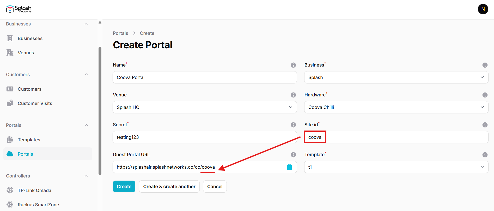

To set up a portal for Datto first you need to [create a template](../defining-templates.md).

## Add a Portal

To create a portal go to the Portal tab and click on the New portal button. Enter a name for the portal and specify the business and venue. In Hardware select `Coova Chilli`. Enter a secret which will be used to secure communication between the router/AP and Splash Air server. Then, enter a Site ID based on which the path of the portal URL will be defined.



The `Guest Portal URL` will be created based on the URL of the Splash Air application followed by the path given by Site ID. Note this URL as it will be required later.

Select the template and click on the Create button.

## Portal Settings

You can go to Portals to view the settings for the portal(s) just added.

Clicking on a portal takes you to the details for that portal. It lets you specify additional settings:

```
Business Name: name of the venue which will be displayed on top of the portal
Expiry: the time in days after which a repeat user will have to enter their data again on the portal
Redirect URL: the URL a user is redirected to after successful portal authorization
Duration (seconds) after email verification: when using "Link" type Flow it is the "Session-Timeout" a user will receive via RADIUS after successful email verification 
```

You can click on the Edit button against each entry to modify it if needed.

## Datto Settings

Access Datto Network Manager web portal and select the SSID on which captive portal needs to be enabled in Access Points > SSID #.

In Common tab, set an SSID in **SSID name**. Turn on the **Enable** option. In **Authentication** select `Open`.


Go to Captive Portal tab and turn on **Splash page**. In **Splash page type** select `Hosted remotely`. In **Splash page URL** enter the `Guest Portal URL` copied earlier. In **Splash page secret** enter the secret created earlier.


In **Splash page authentication type** select `RADIUS`. In **Server address 1** and **Server secret** enter the IP address and secret of your RADIUS server (will be provided by Splash Networks' team). Keep the **Use MAC addr for password** option off. In **Client force timeout** select a session timeout value. **Block unauthenticated users** should be on.

Go to Advanced tab. **Block LAN access**, **Client isolation** and **DNS Intercept** should be on.

## Troubleshooting

To troubleshoot problems it is important to understand the components involved in the captive portal user authorization process and the interactions between them.

### Traffic Flow

For traffic flow refer to the traffic flow section of Coova Chilli [here](coova-chilli.md/#traffic-flow).

### Pre Auth

Datto devices perform a pre-auth process when a user comes online. It sends a RADIUS Access-Request with that user's MAC address as User-Name and empty User-Password (can be changed to MAC address by using the **Use MAC addr for password** toggle in Network Manager settings). If RADIUS accepts that request the user won't see the captive portal at all and would have internet directly. If you are using the RADIUS settings given [here](../radius.md) then add the following line at the top of `/etc/freeradius/3.0/users` file:

```
DEFAULT User-Password == "", Auth-Type := Reject
```

This will ensure that the portal always pops up for the client.