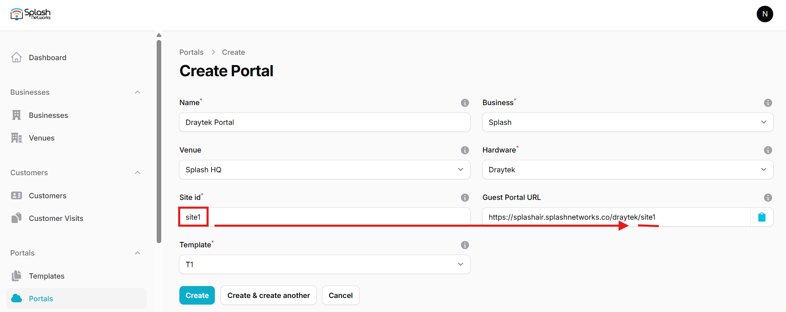
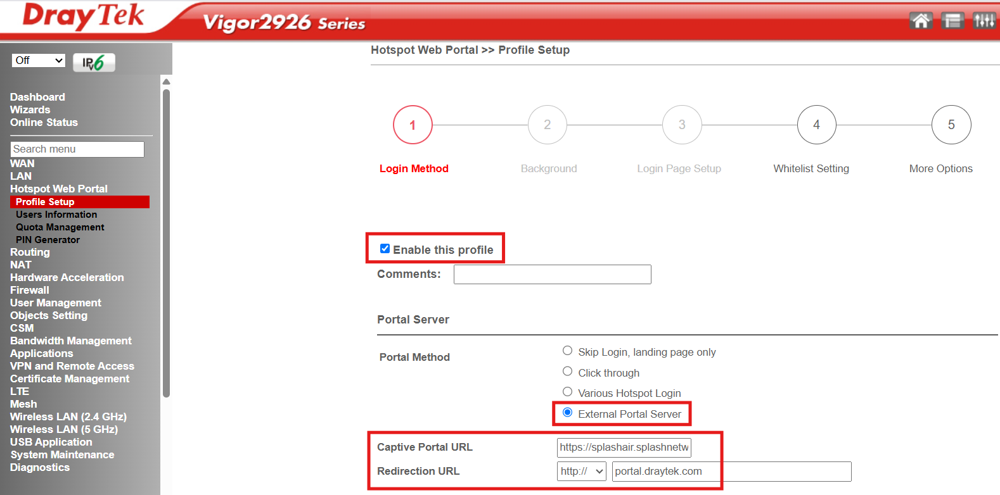
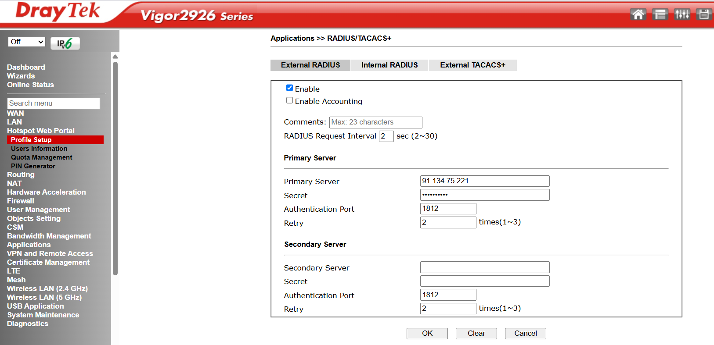
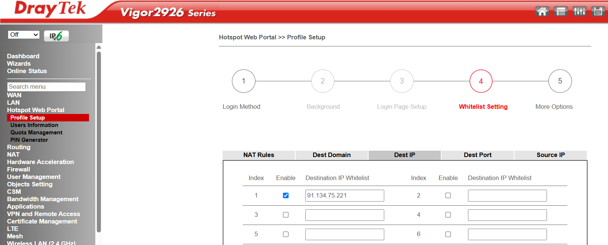
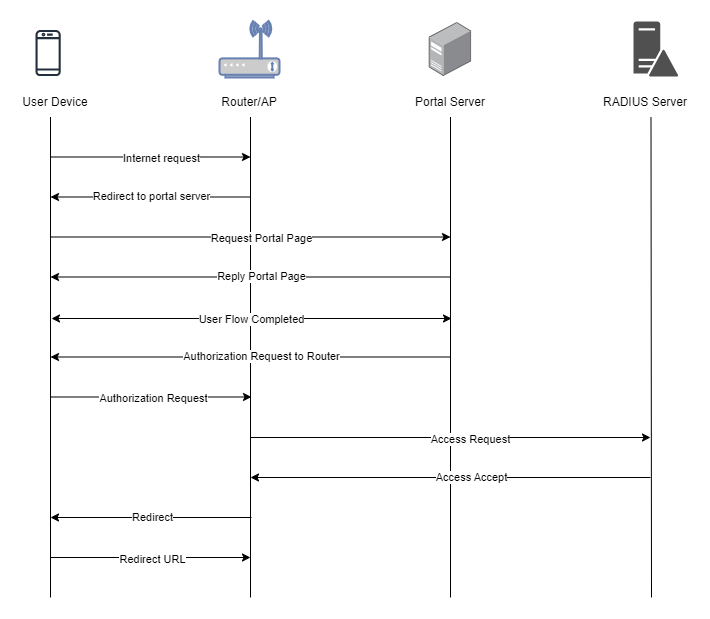

To set up a portal for Draytek first you need to [create a template](../defining-templates.md).

## Add a Portal

To create a portal go to the Portals tab and click on the New portal button. Enter a name for the portal and specify the business and venue. In Hardware select `DrayTek`. Then, enter a Site ID based on which the path of the portal URL will be defined.



The `Guest Portal URL` will be created based on the URL of the Splash Air application followed by the path given by Site ID. Note this URL as it will be required later.

Select the template and click on the Create button.

## Portal Settings

You can go to Portals to view the settings for the portal(s) just added.

Clicking on a portal takes you to the details for that portal. It lets you specify additional settings:

```
Business Name: name of the venue which will be displayed on top of the portal
Expiry (days): the time in days after which a repeat user will have to enter their data again on the portal
Duration (seconds) after email verification: when using "Link" type Flow it is the "Session-Timeout" a user will receive via RADIUS after successful email verification 
```

You can click on the Edit button against each entry to modify it if needed.

## Draytek Settings

Access Draytek device using web interface. Go to Hotspot Web Portal > Profile Setup and click on an available index such as **1**. Configure the following parameters:

```
Enable this profile: check
Portal Method: External Portal Server
Captive Portal URL: <Guest Portal URL>
Redirection URL: http://portal.draytek.com
```



In **RADIUS Server** section click on the `External RADIUS Server` link. Check the **Enable** option, and under **Primary Server** section enter the IP address and RADIUS secret shared by Splash Networks' support team in `Primary Server` and `Secret` fields.



Click on OK to save RADIUS settings. A router reboot will be required at this point. Once the router is accessible again continue on to the next steps.

In Whitelist Setting click on Dest IP tab and enter the IP address of Splash Air server and enable it.



Click on Save and Next to see the final step in Profile Setup. In Web Portal Options configure these settings:

Press Save and Next to continue. Then configure the following attributes:

```
HTTPS Redirection: uncheck
Captive Portal Detection: check
```

In **Landing Page After Authentication** select `User Requested URL`. In WLAN select the SSID on which to apply captive portal. Click Finish to save settings.

## Troubleshooting

To troubleshoot problems it is important to understand the components involved in the captive portal user authorization process and the interactions between them.

### Traffic Flow

Here is the traffic flow in the case of Draytek:


