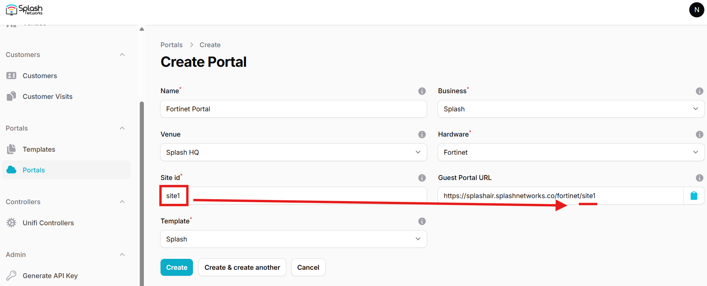
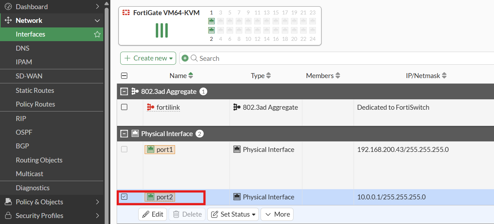
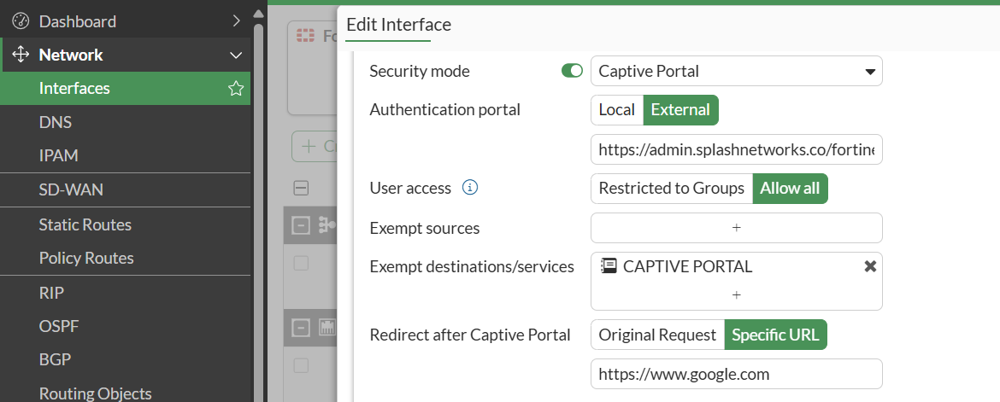
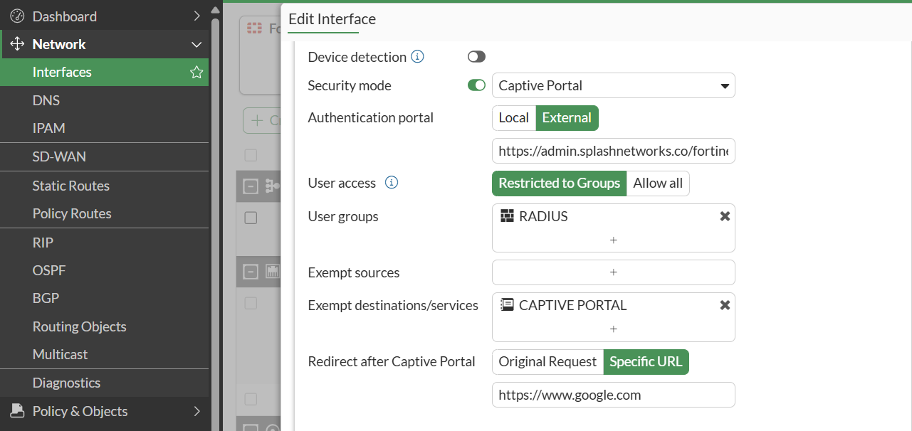

To set up a portal for Fortinet FortiGate firewall first you need to [create a template](../defining-templates.md).

## Add a Portal

To create a portal go to the Portal tab and click on the New portal button. Enter a name for the portal, and in Hardware select `Fortinet`. Then, enter a Site ID based on which the path of the portal URL will be defined.



The `Guest Portal URL` will be created based on the URL of the Splash Air application followed by the path given by Site ID. Note this URL as it will be required later.

Select the venue and template and click on the Create button.

## Portal Settings

You can go to Portals to view the settings for the portal(s) just added.

Clicking on a portal takes you to the details for that portal. It lets you specify additional settings:

```
Business Name: name of the venue which will be displayed on top of the portal
Expiry: the time in days after which a repeat user will have to enter their data again on the portal
```

You can click on the Edit button against each entry to modify it if needed.

## FortiGate Settings

Access FortiGate firewall using web interface. Go to Network -> Interfaces and select the interface on which you want to enable captive portal. Typically, it will be the LAN gateway interface.



Click on Edit to modify its settings. Enable Security mode -> Captive Portal. In Authentication Portal, select `External` and enter the Guest Portal URL generated when creating the portal in Splash Air. In Exempt destination/services create a new entry and add the IP address of Splash Air application server in it.



In Redirect after Captive Portal you can specify a URL to which the URL will be redirected after successful portal authorization.

Click OK to save the settings.

Go to User & Authorization -> RADIUS Servers and create a new RADIUS server. The IP address and RADIUS secret shared by Splash Networks support team will be entered here.

Then go to User & Authorization -> User Groups and create a new group. Add the RADIUS server selected in the previous step and click on OK to save it.

Go back to Network -> Interface and select the interface on which captive portal is enabled. In User access select `Restricted to Groups` option. In `User groups` add the group that you created in the last step. Click OK to save the settings.

