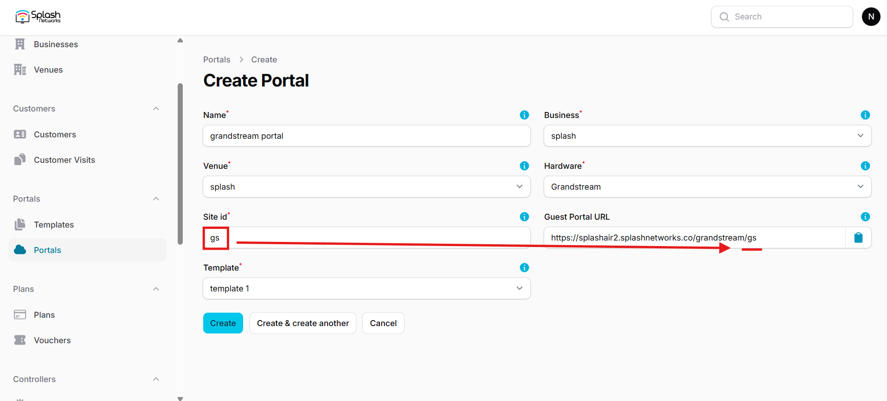
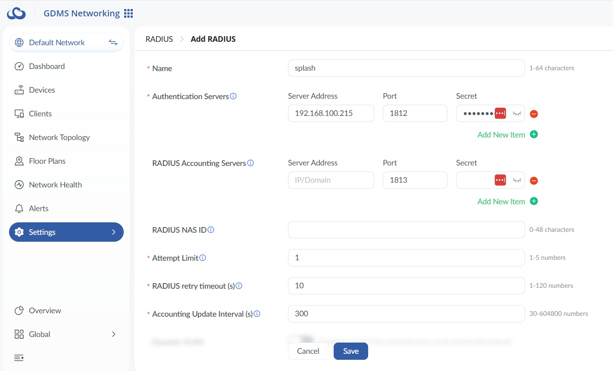
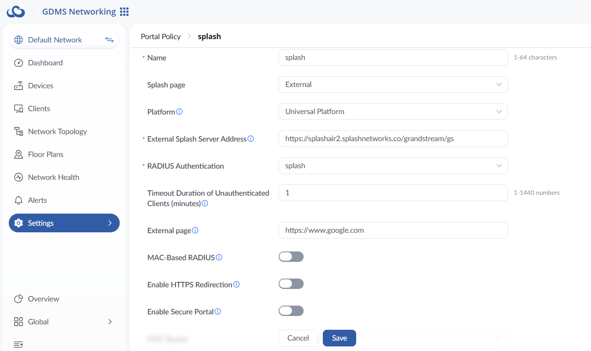
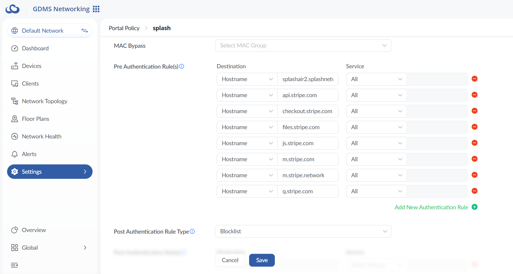
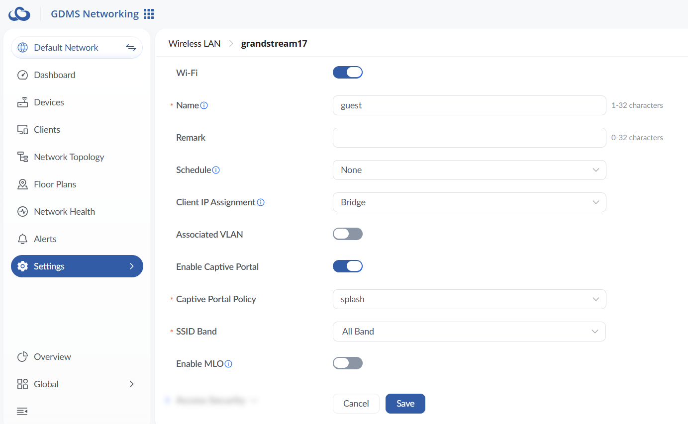
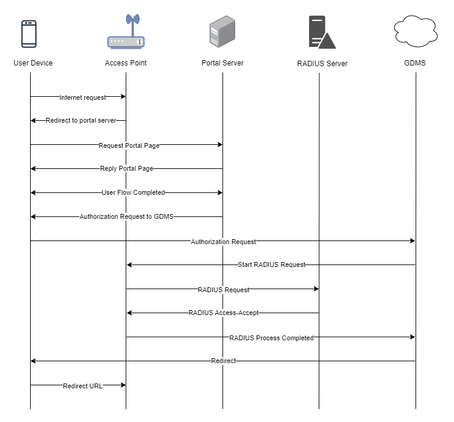

To set up a portal for Grandstream first you need to [create a template](../defining-templates.md).

## Add a Portal

To create a portal go to the Portals tab and click on the New portal button. Enter a name for the portal, and in Hardware select `Grandstream`. Then, enter a Site ID based on which the path of the portal URL will be defined.



The `Guest Portal URL` will be created based on the URL of the Splash Air application followed by the path given by Site ID. Note this URL as it will be required later.

Select the venue and template and click on the Create button.

## Portal Settings

You can go to Portals to view the settings for the portal(s) just added.

Clicking on a portal takes you to the details for that portal. It lets you specify additional settings:

```
Business Name: name of the venue which will be displayed on top of the portal
Expiry: the time in days after which a repeat user will have to enter their data again on the portal
Redirect URL: the URL a user is redirected to after successful portal authorization
Duration (seconds) after email verification: when using "Link" type Flow it is the "Session-Timeout" a user will receive via RADIUS after successful email verification
Duration (seconds): the time in seconds for which a user is authorized on the network
```

You can click on the Edit button against each entry to modify it if needed.

## Grandstream Settings

Login to your account on the [GDMS account](https://www.gdms.cloud/gwn) and go to Settings > Profiles > RADIUS. Add a new RADIUS profile. The IP address and RADIUS secret shared by Splash Networks' support team will be entered here:



Next, go to Settings > Wi-Fi > Portal Policy and add a new policy. Add a name for it and enter the following settings:

 - **Splash page**: External
 - **Platform**: Universal Platform
 - **External Splash Server Address**: enter the `Guest Portal URL` created earlier
 - **RADIUS Authentication**: select the RADIUS profile created in the previous step
 - **Timeout Duration of Unauthenticated Clients (minutes)**: 1
 - **External page**: a URL to which the client should be redirected to after successful authorization
 - **MAC-Based RADIUS**: disabled
 - **Enable HTTPS Redirection**: disabled
 - **Enable Secure Portal**: disabled



In Pre Authentication Rules enter the hostname of your Splash Air server. If using `Payment` Flow you need to add [walled garden](../walled-garden.md) entries for your payment gateway such as Stripe in Allowed Domains.



Finally, go to Settings > Wi-Fi > Wireless LAN and create a new Wireless LAN (or edit an existing one). Enter a name for it, and use the following settings:

 - **Enable Captive Portal**: enabled
 - **Captive Portal Policy**: select the Policy created in the previous step



## Troubleshooting

To troubleshoot problems it is important to understand the components involved in the captive portal user authorization process and the interactions between them.

### Traffic Flow

Here is the traffic flow in the case of Grandstream:

