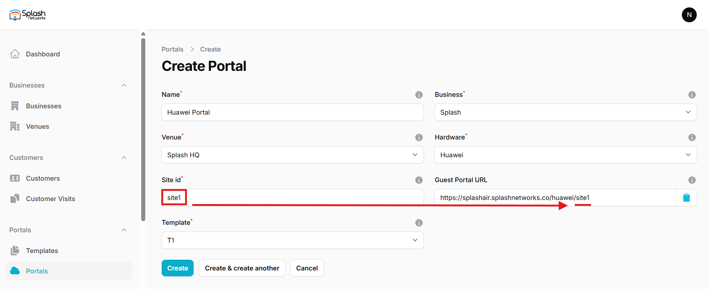
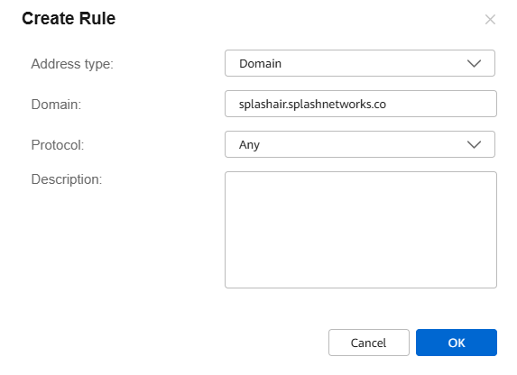
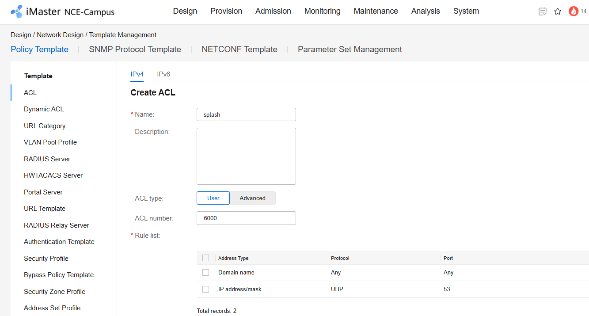
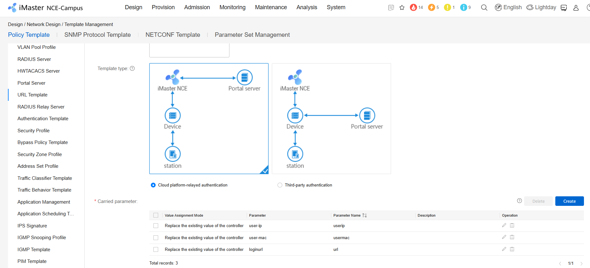
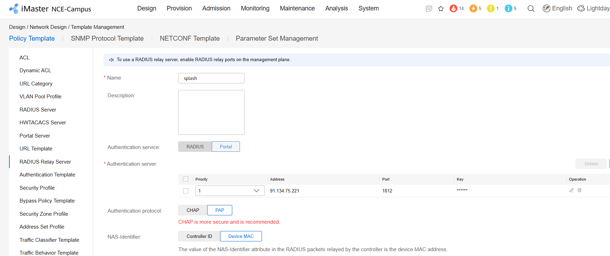
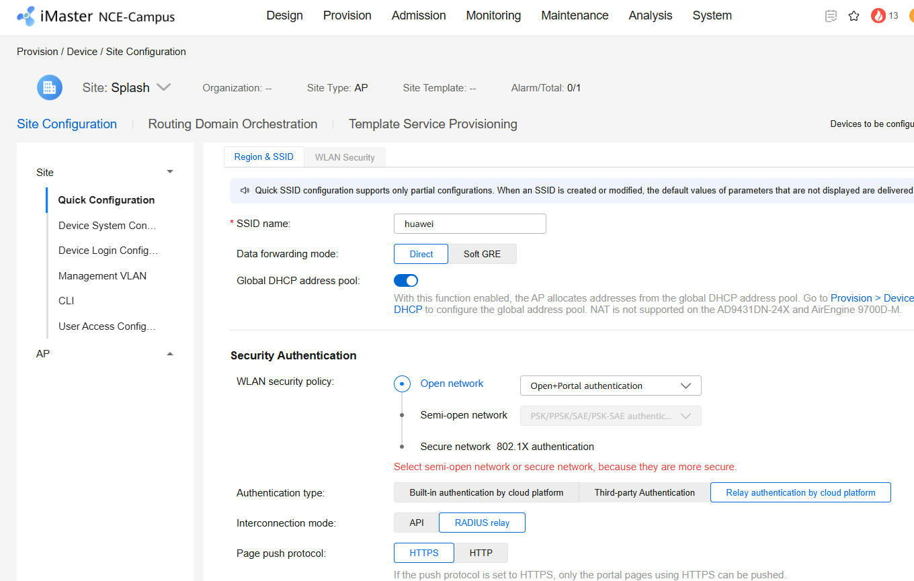
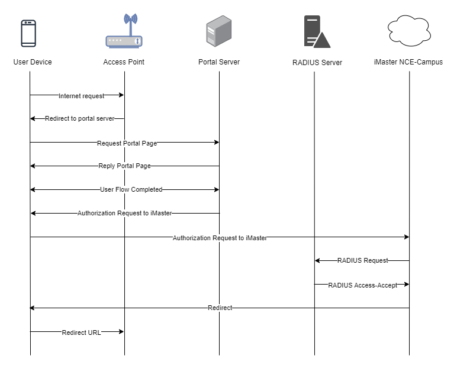

To set up a portal for Huawei first you need to [create a template](../defining-templates.md).

## Add a Portal

To create a portal go to the Portals tab and click on the New portal button. Enter a name for the portal, and in Hardware select `Huawei`. Then, enter a Site ID based on which the path of the portal URL will be defined.



The `Guest Portal URL` will be created based on the URL of the Splash Air application followed by the path given by Site ID. Note this URL as it will be required later.

Select the venue and template and click on the Create button.

## Portal Settings

You can go to Portals to view the settings for the portal(s) just added.

Clicking on a portal takes you to the details for that portal. It lets you specify additional settings:

```
Business Name: name of the venue which will be displayed on top of the portal
Expiry (days): the time in days after which a repeat user will have to enter their data again on the portal
Redirect URL: the URL a user is redirected to after successful portal authorization
Duration (seconds) after email verification: when using "Link" type Flow it is the "Session-Timeout" a user will receive via RADIUS after successful email verification 
```

You can click on the Edit button against each entry to modify it if needed.

## Huawei iMaster NCE-Campus Settings

Access iMaster NCE-Campus using web interface. Go to Design > Template Management > ACL. Create a new ACL. Set a name and number for it. Add a rule for the domain of your portal like this:

<figure markdown="span">
  { width="70%" }
</figure>

Add another rule for UDP port 53 (to allow DNS traffic).



Then go to URL Template and create a new template. Specify a name for it. In **Template type** select `Cloud platform-relayed authentication`. In **Carried parameter** add the following parameters along with their values:

| Parameter      |  Parameter Name  |
|:---------------|:----------------:|
| user-ip        |      userip      |
| user-mac       |     usermac      |
| loginurl       |       url        |



Click OK to save the template.

Go to **RADIUS Relay Server** and create a new template. Enter a name for it and in **Authentication server** section add a new server. Enter the IP address and Secret of your RADIUS server (will be provided by Splash Networks' team) and click on the submit button to save it. In **Authentication protocol** select `PAP`. Keep the other settings at default and click OK to save the template.



Next, go to Provision > Device > Site Configuration and create a new SSID (or modify an existing one). Enter the following settings:

- **SSID name**: enter an SSID
- **Data forwarding mode**: `Direct`
- **Global DHCP address pool**: enabled
- **WLAN security policy**: `Open+Portal authentication`
- **Authentication type**: `Relay authentication by cloud platform`
- **Interconnection mode**: `RADIUS relay`



Under **Third-party portal page authentication parameters** enter these values:

- **Username**: `Username`
- **Password parameter name**: `Password`
- **Redirect URL matching rule**: `Redirect URL`
- **Redirect URL upon authentication success**: a redirect URL such as `https://www.google.com`
- **RADIUS relay server**: select the RADIUS relay server created in the previous step
- **Default permit rule**: select the ACL created previously

Finally, go to Admission > Admission Resource > Page Management > Portal Page Push Policy. Enter a name for it. In Push Rule enable **Match SSIDs** and add the SSID created in the last step. In Page Push Rule use the following settings:

- **Authentication mode**: `Cloud platform-based relay authentication`
- **Interconnection mode**: `RADIUS relay`
- **URL template**: select the URL template created previously
- **Third-party authentication URL**: enter the Guest Portal URL created earlier in Splash Air

## Troubleshooting

To troubleshoot problems it is important to understand the components involved in the captive portal user authorization process and the interactions between them.

### Traffic Flow

Here is the traffic flow in the case of Huawei iMaster NCE-Campus:

