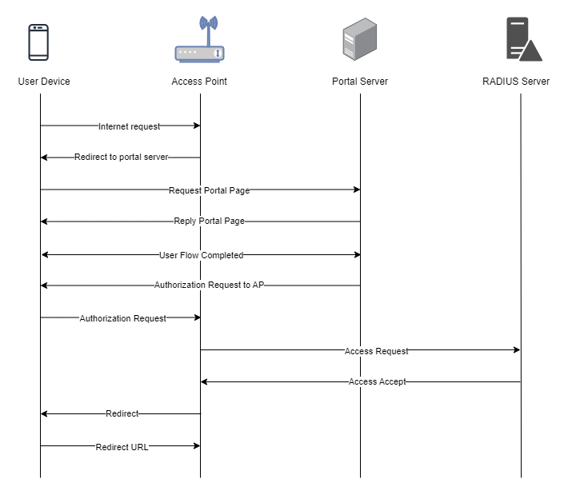

To set up a portal for Huawei first you need to [create a template](../defining-templates.md).

## Add a Portal

To create a portal go to the Portals tab and click on the New portal button. Enter a name for the portal, and in Hardware select `Huawei`. Then, enter a Site ID based on which the path of the portal URL will be defined.


The `Guest Portal URL` will be created based on the URL of the Splash Air application followed by the path given by Site ID. Note this URL as it will be required later.

Select the venue and template and click on the Create button.

## Portal Settings

You can go to Portals to view the settings for the portal(s) just added.

Clicking on a portal takes you to the details for that portal. It lets you specify additional settings:

```
Business Name: name of the venue which will be displayed on top of the portal
Expiry (days): the time in days after which a repeat user will have to enter their data again on the portal
Redirect URL: the URL a user is redirected to after successful portal authorization
Duration (seconds) after email verification: when using "Link" type Flow it is the "Session-Timeout" a user will receive via RADIUS after successful email verification 
```

You can click on the Edit button against each entry to modify it if needed.

## Huawei FAT AP Settings

Login to your Huawei FAT AP using its web interface. Go to Configuration > Internet Configuration and make sure Internet access mode is `Gateway` and NAT is On.


Similarly, ensure that the LAN interface on which you want to enable portal is using DHCP from the AP.

Go to Advanced > Security > ACL > User ACL Settings. Create a new ACL and give it a number such as `6000` and a name such as `splash`. This ACL will be used for pre-authentication access, also known as walled garden. Enter a new rule in it to permit traffic for UDP destination port `53` to allow access to DNS servers.


Similarly, add another rule to permit access to the AP from LAN. In this example the AP LAN interface has the IP of `192.168.50.1`.


Then go to Advanced > Security > AAA and in Portal Server Global Configuration switch to External Portal tab. Check the **HTTP Protocol** option and in **HTTP interoperation mode** select `HTTP-based`. In **Local gateway address** select `All addresses`. Click Apply to save the settings.


In **Portal Authentication Server List** click on the Create button. In **Server name** enter a name for the server. In Server IP enter the IP of Splash Air server and click on the `+` button to add it. In **Protocol type** select `HTTP/HTTPS`. In **URL** enter the `Guest Portal URL` obtained earlier.


Navigate down to URL Option Settings and set up the following options:

 - User IP address keyword: `userip`
 - User MAC keyword: `usermac`
 - Login URL keyword/Login URL: `url`. The value of the URL will be based on your LAN gateway IP. For gateway IP of `192.168.50.1` the value will be `http://192.168.50.1:8000`


Click OK to save the settings.

Next, go to Advanced > Security > AAA > RADIUS tab and create a new RADIUS Server Profile. Enter the IP address and Secret (will be provided by Splash Networks' team) and check the **Authentication** option.


In **Profile default shared key** input the same RADIUS secret added earlier.


Click OK to save RADIUS profile. Then go to Advanced > HTTP Access tab. In **Access mode** select `HTTP` and in **Local gateway address** select `Any address`.


Click on Apply to save the settings.

Finally, go to Configuration > WLAN Configuration and create a new SSID (or select an existing SSID) to enable captive portal on it. In Step 1 enter a SSID and select the interface VLAN of LAN side (which should have DHCP configured).

<figure markdown="span">
  { width="80%" }
</figure>


Click Next to go to the second step. In **Security settings** select `Portal`. In **Portal server** select `External Portal server`. Uncheck **MAC address-prioritized** option. In External Portal Server Configuration select the server template that you created earlier. Similarly, in External RADIUS Server Configuration select the RADIUS template that you created earlier.


In Authentication-free Rule select Control mode `ACL`. In **ACL number** select the ACL that you created earlier.

<figure markdown="span">
  { width="70%" }
</figure>


Click Next to go to the last step. In Step 3 keep the default settings and click Finish to save the settings.

## Troubleshooting

To troubleshoot problems it is important to understand the components involved in the captive portal user authorization process and the interactions between them.

### Traffic Flow

Here is the traffic flow in the case of Huawei:

