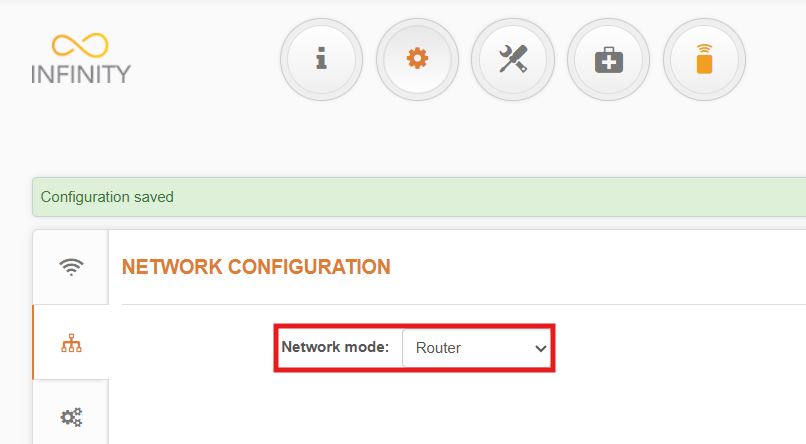
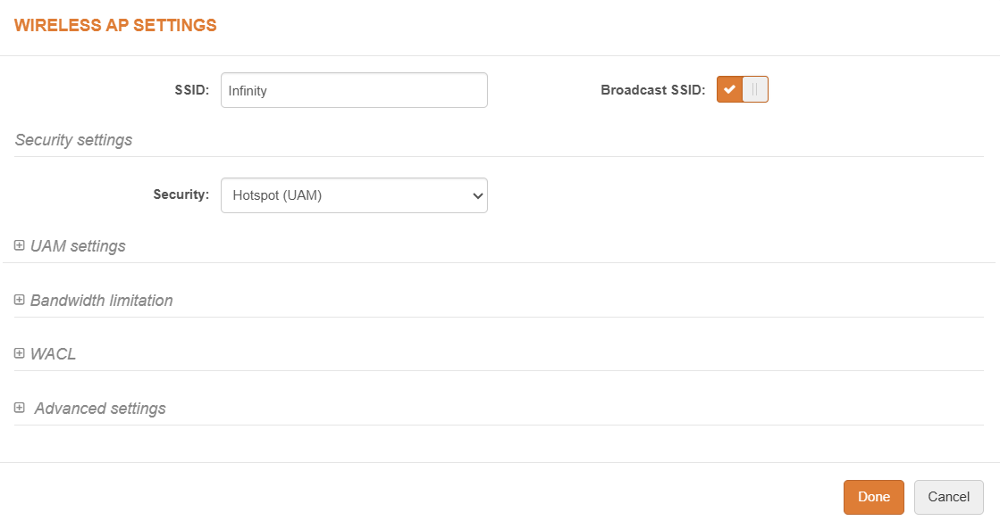
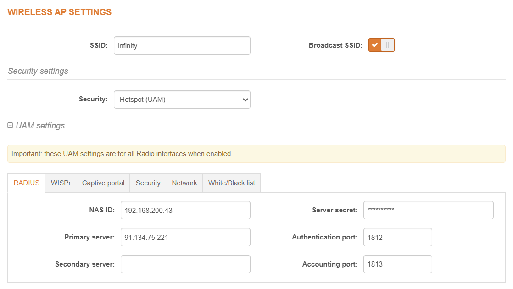
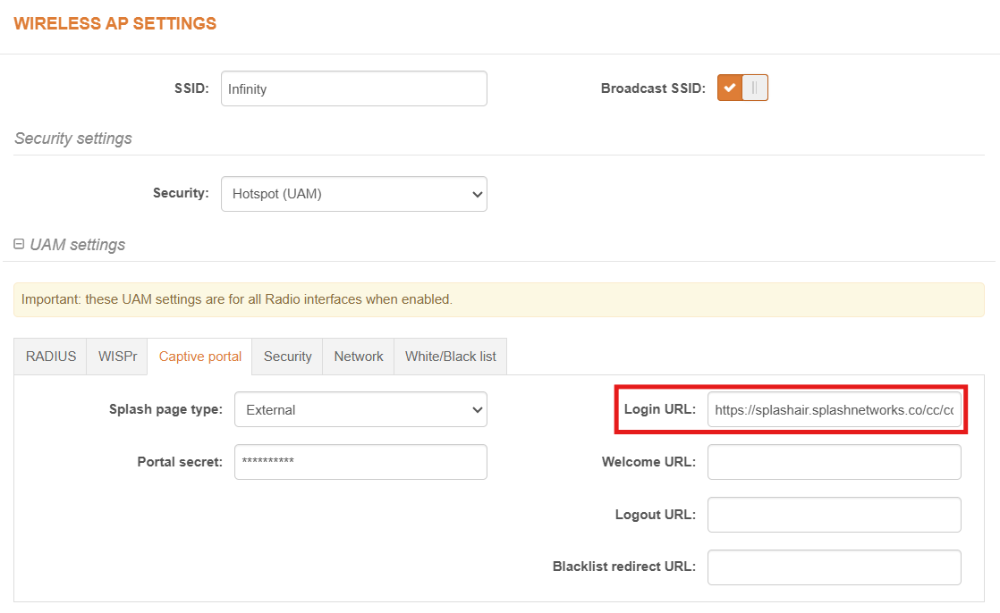
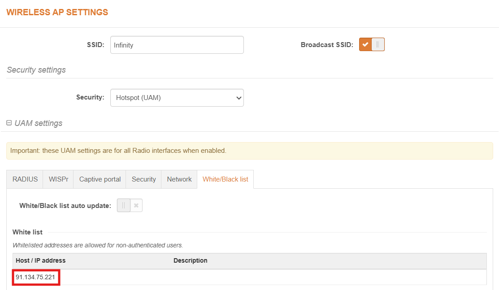

To set up a portal for LigoWave Infinity first you need to [create a template](../defining-templates.md).

## Add a Portal

To create a portal go to the Portal tab and click on the New portal button. Enter a name for the portal and specify the business and venue. In Hardware select `Coova Chilli`. Enter a secret which will be used to secure communication between the router/AP and Splash Air server. Then, enter a Site ID based on which the path of the portal URL will be defined.


The `Guest Portal URL` will be created based on the URL of the Splash Air application followed by the path given by Site ID. Note this URL as it will be required later.

Select the template and click on the Create button.

## Portal Settings

You can go to Portals to view the settings for the portal(s) just added.

Clicking on a portal takes you to the details for that portal. It lets you specify additional settings:

```
Business Name: name of the venue which will be displayed on top of the portal
Expiry: the time in days after which a repeat user will have to enter their data again on the portal
Redirect URL: the URL a user is redirected to after successful portal authorization
Duration (seconds) after email verification: when using "Link" type Flow it is the "Session-Timeout" a user will receive via RADIUS after successful email verification 
```

You can click on the Edit button against each entry to modify it if needed.

## LigoWave Settings

Access LigoWave Infinity device using web portal.

Go to Settings > Network configuration and set Network mode to **Router**.

<figure markdown="span">
  { width="80%" }
</figure>

In Settings > Wireless Configuration go to Wireless settings (AP). Edit the settings on the SSID on which you want to enable captive portal. In Security settings set Security type to **Hotspot (UAM)**.



In UAM settings > RADIUS, enter a NAS ID which can be the IP address of the AP. Enter the IP address and secret of RADIUS server (will be provided by Splash Networks' team).



In Captive portal tab, **Splash page type** should be `External`. In **Login URL** enter the `Guest Portal URL` copied earlier. In **Portal secret** enter the secret created earlier.


In White/Black list tab, enter the IP address of Splash Air server in **White list** section.



Click the Done button. Then click on the Save changes button to apply the settings.

## Troubleshooting

To troubleshoot problems it is important to understand the components involved in the captive portal user authorization process and the interactions between them.

### Traffic Flow

For traffic flow refer to the traffic flow section of Coova Chilli [here](coova-chilli.md/#traffic-flow).