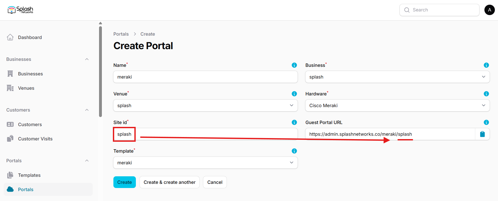
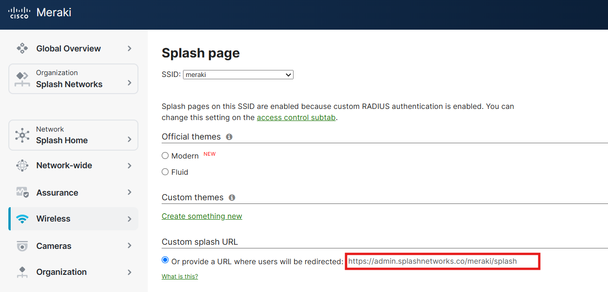
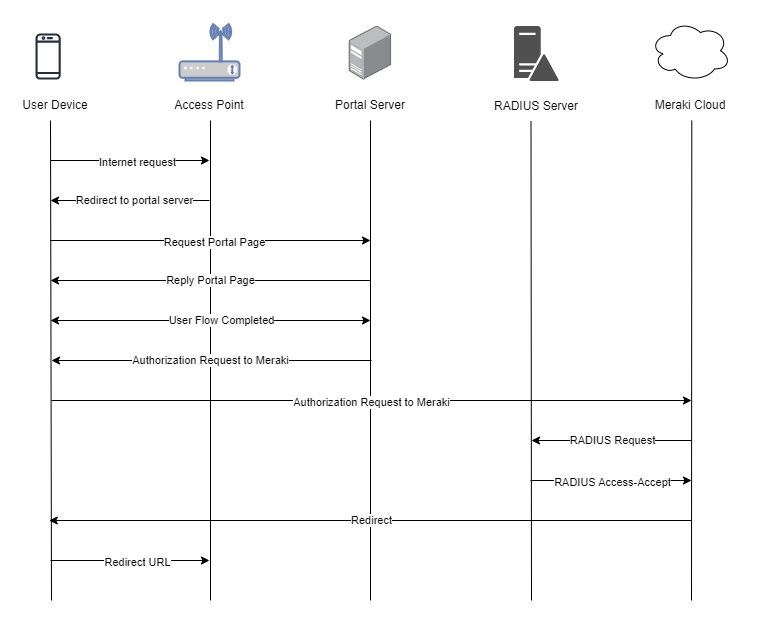

To set up a portal for Cisco Meraki first you need to [create a template](../defining-templates.md).

## Add a Portal

To create a portal go to the Portals tab and click on the New portal button. Enter a name for the portal, and in Hardware select `Cisco Meraki`. Then, enter a Site ID based on which the path of the portal URL will be defined.



The `Guest Portal URL` will be created based on the URL of the Splash Air application followed by the path given by Site ID. Note this URL as it will be required later.

Select the venue and template and click on the Create button.

## Portal Settings

You can go to Portals to view the settings for the portal(s) just added.

Clicking on a portal takes you to the details for that portal. It lets you specify additional settings:

```
Business Name: name of the venue which will be displayed on top of the portal
Duration (seconds): the time in seconds for which a user is authorized on the network
Expiry: the time in days after which a repeat user will have to enter their data again on the portal
Duration (seconds) after email verification: when using "Link" type Flow it is the "Session-Timeout" a user will receive via RADIUS after successful email verification 
```

You can click on the Edit button against each entry to modify it if needed.

## Meraki Portal Settings

Login to your Cisco Meraki account and select the SSID on which you want to apply guest portal in Wireless > SSIDs.

In **Security** select `Open`. Under **Splash page** select `Sign-on with my RADIUS server`. In **Advanced splash settings** go to `Walled Garden` and enable it. Add the IP address of your Splash Air server in walled garden ranges. If using `Payment` Flow you need to add [walled garden](../walled-garden.md) entries for your payment gateway such as Stripe in Allowed Domains. In RADIUS add the IP address and RADIUS secret shared by Splash Networks' support team.

Go to Wireless > Splash Page and select your SSID. In **Custom splash URL** enter the `Guest Portal URL` generated earlier.



Optionally, under "Where should users go after the splash page?" you can select `A different URL` and enter the URL to which you want users to be redirected to.

## Troubleshooting

To troubleshoot problems it is important to understand the components involved in the captive portal user authorization process and the interactions between them.

### Traffic Flow

Here is the traffic flow in the case of Cisco Meraki:

