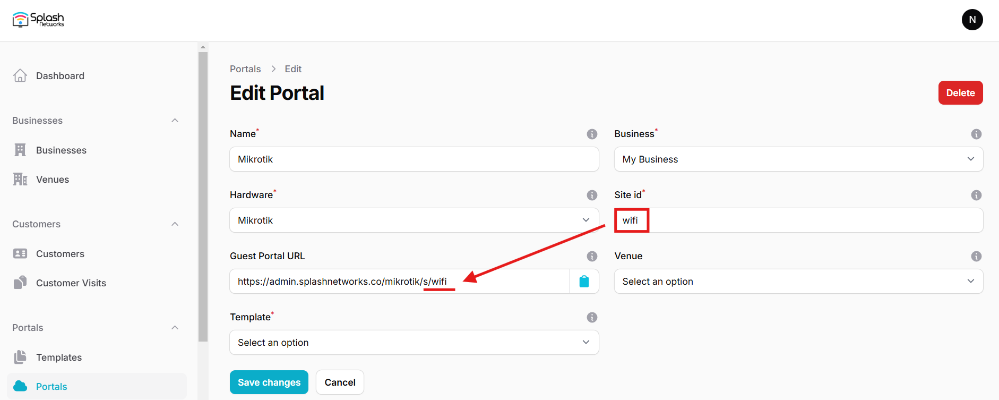
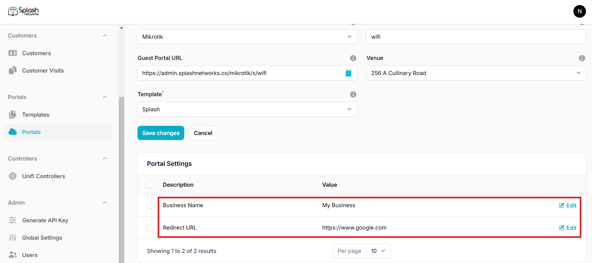
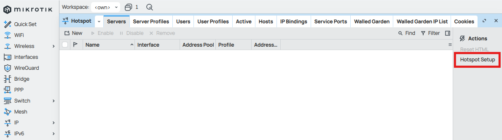
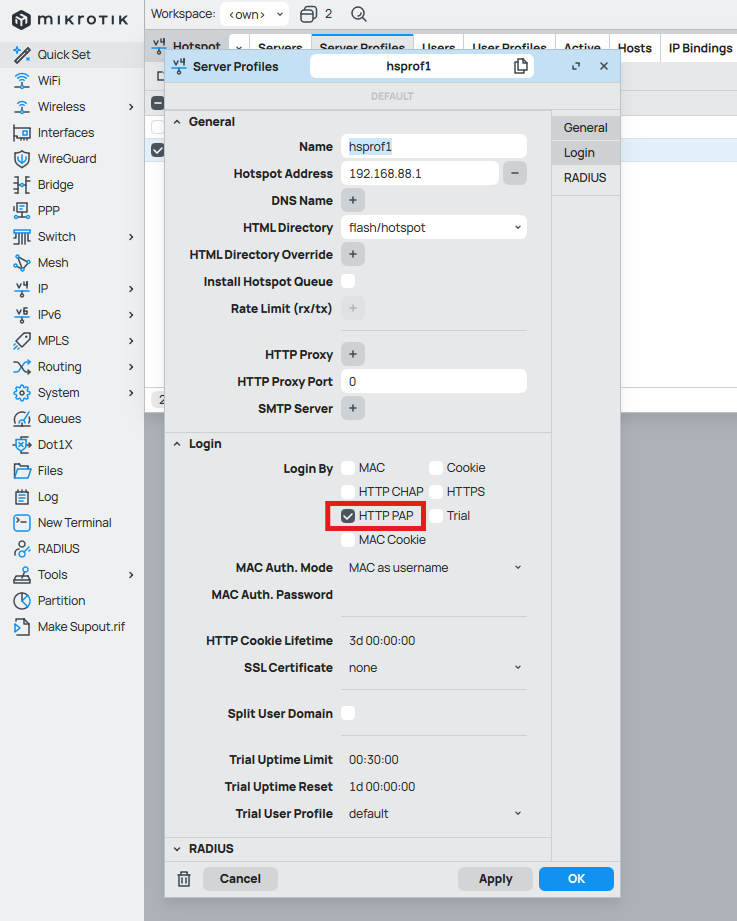
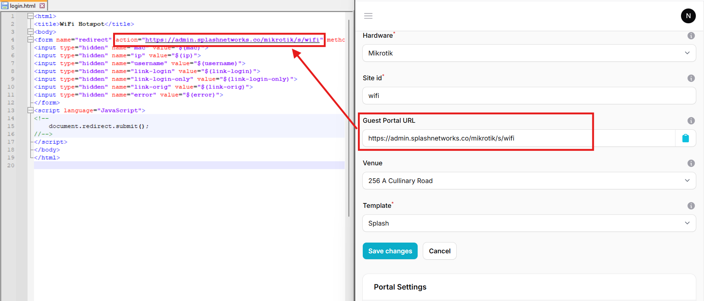
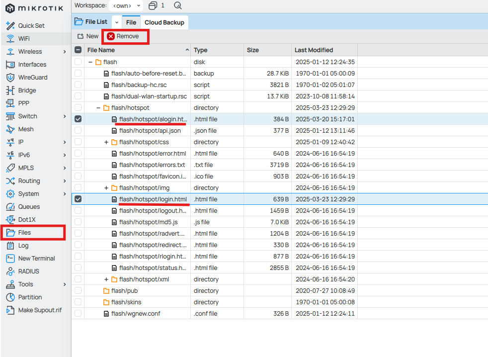

To set up a portal for Mikrotik first you need to [create a template](../defining-templates.md).

## Add a Portal

To create a portal go to the Portal tab and click on the New portal button. Enter a name for the portal, and in Hardware select `Mikrotik`. Then, enter a Site ID based on which the path of the portal URL will be defined.



The `Guest Portal URL` will be created based on the URL of the Splash Admin Panel app followed by the path given by Site ID. Note this URL as it will be required later.

Select the venue and template and click on the Create button.

## Portal Settings

You can go to Portals to view the settings for the portal(s) just added.

Clicking on a portal takes you to the details for that portal. It lets you specify additional settings:

```
Business Name: name of the venue which will be displayed on top of the portal
Redirect URL: the URL a user is redirected to after succesful portal authorization
Expiry: the time in days after which a repeat user will have to enter their data again on the portal
```

You can click on the Edit button against each entry to modify it if needed.



## Mikrotik Settings

Before setting up Hotspot on Mikrotik it is important to enable access from WAN side, otherwise you would be locked out of the system once Hotspot is enabled.

Access your Mikrotik router using Winbox. Go to IP -> Firewall and disable the following rules that block access from WAN:


Go to IP -> Addresses and note your router's WAN IP (usually WAN interface is `ether1`). Connect to your Mikrotik router through WinBox using this IP before proceeding further.

### Hotspot Setup

Go to IP -> Hotspot and click on Hotspot Setup.



A series of dialog boxes will appear. Select the following options:

1. In HotSpot Interface select bridge and press Next.
2. In Local address of network keep the default option and press Next.
3. In Address Pool of Network keep the default option and press Next.
4. In Select Certificate select None and press Next.
5. In IP Address of SMTP Server keep the default option and press Next.
6. In DNS Servers keep the default option and press Next.
7. In DNS name type nothing and press Next.
8. In Create local HotSpot user, keep Name `admin` and password blank and press Next.

The setup is now complete. Go to IP -> Hotspot -> Server Profiles and select `hsprof1` profile. In Login tab check `HTTP PAP` option and uncheck all other options. Click OK to save settings.



In IP -> Hotspot -> User Profiles open the `default` profile and disable MAC Cookie. Change the number of `Shared Users` to the maximum number of devices that you want to be connected to the hotspot simultaneously.


Go to IP -> Hotspot -> Walled Garden IP List and create a new entry. In Dst. Address add the IP address of your Splash Admin Panel server and click OK.


### Portal Files

Download this [file](../files/mikrotik.zip) and unzip it. Open the `login.html` file in a text editor. The Guest Portal URL generated earlier should be pasted in the form action field as shown below:



Go to Files and in Hotspot select `login.html` and `alogin.html` files and remove them.



Replace them with the files on your computer by dragging and dropping them into the `hotspot` directory:


