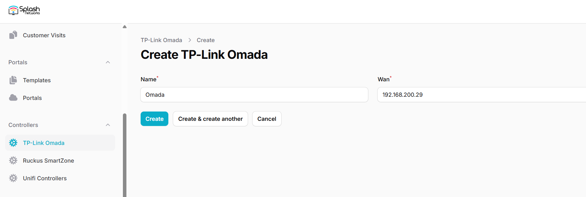
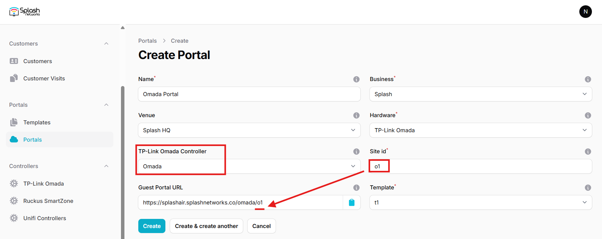
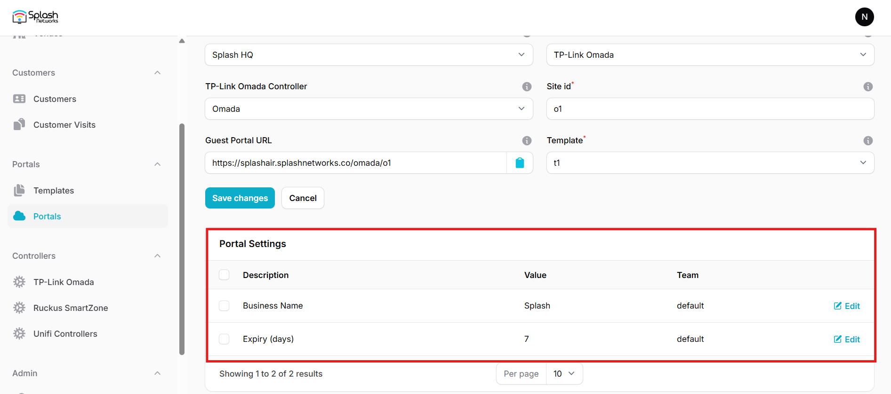
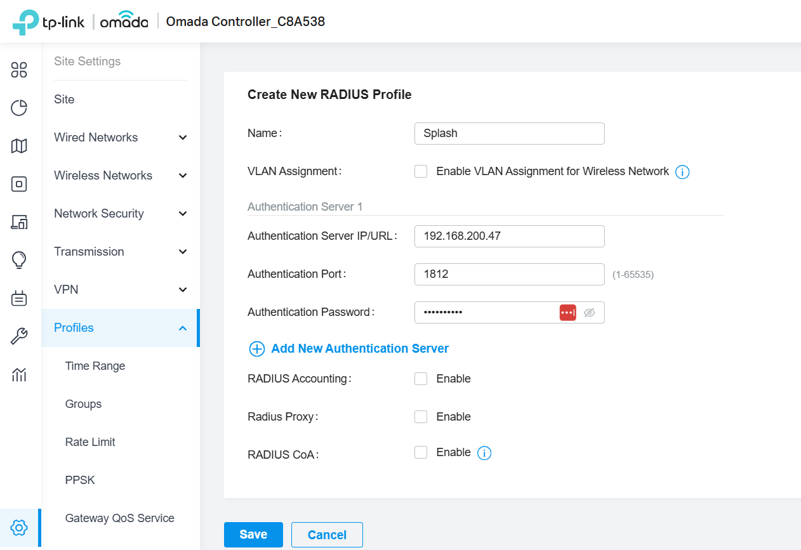
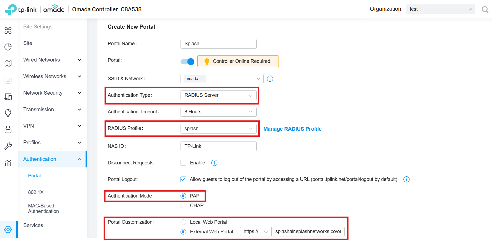
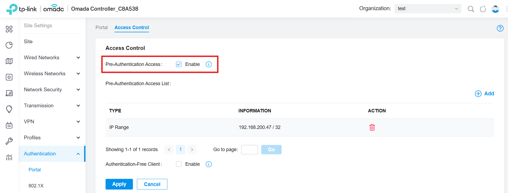
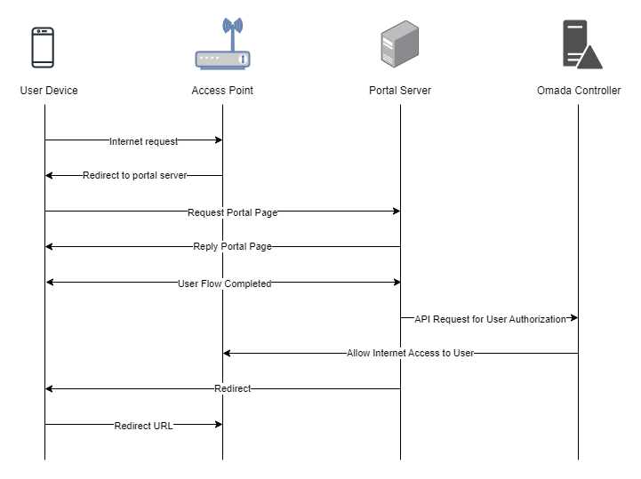

To set up a portal for TP-Link Omada first you need to [create a template](../defining-templates.md).

## Add a Portal

On Splash Air go to Controllers > TP-Link Omada and add a new controller. Specify a name for it, and enter the WAN IP or hostname of the Omada controller.



To create a portal go to the Portals tab and click on the New portal button. Enter a name for the portal and specify the business and venue. In Hardware select `TP-Link Omada`. Select the controller added in the previous step. Then, enter a Site ID based on which the path of the portal URL will be defined.



The `Guest Portal URL` will be created based on the URL of the Splash Air application followed by the path given by Site ID. Note this URL as it will be required later.

Select the template and click on the Create button.

## Portal Settings

You can go to Portals to view the settings for the portal(s) just added.

Clicking on a portal takes you to the details for that portal. It lets you specify additional settings:

```
Business Name: name of the venue which will be displayed on top of the portal
Expiry: the time in days after which a repeat user will have to enter their data again on the portal
Duration (seconds) after email verification: when using "Link" type Flow it is the "Session-Timeout" a user will receive via RADIUS after successful email verification 
```

You can click on the Edit button against each entry to modify it if needed.



## Omada Controller Settings

Access Omada controller using web interface. Go to Settings > Profiles > RADIUS Profile and create a new profile. Enter the IP address/URL and secret of your RADIUS server (details will be provided by Splash team).



Next, go to Settings > Authentication > Portal and create a new portal. Specify a name for it, and enable the Portal option. Select the SSID & Network on which portal should be enabled. In **Authentication Type** select `RADIUS Server`. In **RADIUS Profile** select the profile created in the previous step. In **Authentication Mode** select `PAP`. In **Portal Customization** select `External Web Portal` and paste the Guest Portal URL copied earlier.



Then go to Settings > Authentication > Portal > Access Control and enable **Pre-Authentication Access**. Add a new entry and put the IP address of the Splash Air server in it.



Click Apply to save the settings.

## Troubleshooting

To troubleshoot problems it is important to understand the components involved in the captive portal user authorization process and the interactions between them.

### Traffic Flow

Here is the traffic flow in the case of TP-Link Omada Controller:


