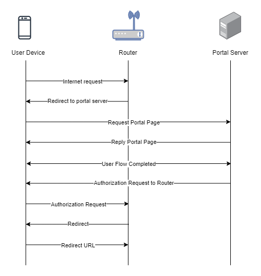

To set up a portal for OpenNDS first you need to [create a template](../defining-templates.md).

## Add a Portal

To create a portal go to the Portals tab and click on the New portal button. Enter a name for the portal and specify the business and venue. In Hardware select `OpenNDS`. Enter a secret which will be used to secure communication between the router/AP and Splash Air server. Then, enter a Site ID based on which the path of the portal URL will be defined.


The `Guest Portal URL` will be created based on the URL of the Splash Air application followed by the path given by Site ID. Note this URL as it will be required later.

Select the template and click on the Create button.

## Portal Settings

You can go to Portals to view the settings for the portal(s) just added.

Clicking on a portal takes you to the details for that portal. It lets you specify additional settings:

```
Business Name: name of the venue which will be displayed on top of the portal
Expiry: the time in days after which a repeat user will have to enter their data again on the portal
Redirect URL: the URL a user is redirected to after successful portal authorization
```

You can click on the Edit button against each entry to modify it if needed.

## OpenNDS Settings

OpenNDS is an open-source captive portal package which is used in many Linux based routers. This guide is written for OpenWRT. However, OpenNDS can be made to work on other Linux based devices such as a Raspberry Pi.

Access OpenWRT router/AP using LuCI web interface. By default, OpenWRT firewall does not allow web or SSH access on WAN IP. As a captive portal blocks all traffic on LAN until user is authenticated so when we initially enable captive portal on OpenWRT we would lose management access to the router. To manage OpenWRT we should therefore open access from WAN side. 

Go to Network > Firewall > Traffic Rules. Add a new rule with these properties:

```
Protocol: TCP
Source zone: wan
Destination zone: Device (input)
Destination port: 80
```

Similarly, add another rule for `Destination port: 22`. Click on Save and apply. Once these rules are added you would be able to access OpenWRT via web and SSH from WAN side.

Access your OpenWRT device over SSH using its WAN IP. Enter these commands:

```text { .copy }
opkg update
opkg install opennds nano
opkg install php8 php8-cli php8-mod-openssl
```

Recall the `Guest Portal URL` that was created earlier. In our example its value was: [https://splashair.splashnetworks.co/on/site1](https://splashair.splashnetworks.co/on/site1)

It consists of 2 parts:

**Hostname**: `splashair.splashnetworks.co`

**Path**: `/on/site1`

You will need to enter these parameters in the OpenNDS config file.

Open OpenNDS config file:

```text { .copy }
nano /etc/config/opennds
```

Add the following parameters at the end:

**option fasport `443`**: it tells OpenNDS that the captive portal is using HTTPS port 443

**option fasremotefqdn `<hostname>`**: the hostname in `Guest Portal URL`

**option faspath `<path>`**: the path in `Guest Portal URL`

**option fasremoteip `<IP address>`**: the IP address of Splash Air server

**option faskey `<secret>`**: the secret created with the portal will be entered here

Save and exit.

To apply the changes restart the service:

```text { .copy }
service opennds restart
```

To check current settings and status use this command:

```text { .copy }
ndsctl status
```

**_Note_**: on some devices with OpenNDS it is observed that an **option faskey `<secret>`** is appended automatically at the end of the config file by the device. In that case just modify that value and don't create a new `faskey` setting.

### Helpful commands

Enable/disable service

```text { .copy }
service opennds enable
service opennds disable
```

Logout connected user

```text { .copy }
ndsctl deauth <IP | MAC address>
```

View logs

```text { .copy }
logread -f
```

## Troubleshooting

To troubleshoot problems it is important to understand the components involved in the captive portal user authorization process and the interactions between them.

### Traffic Flow

Here is the traffic flow in the case of OpenNDS:

<figure markdown="1">

</figure>