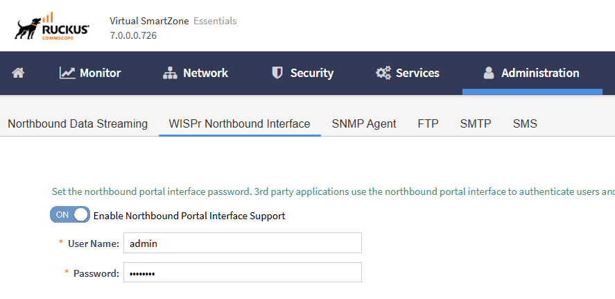
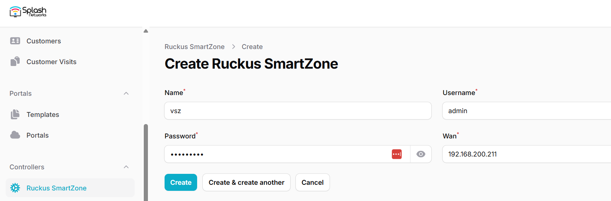
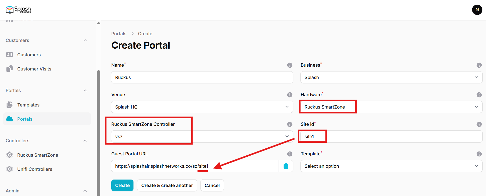
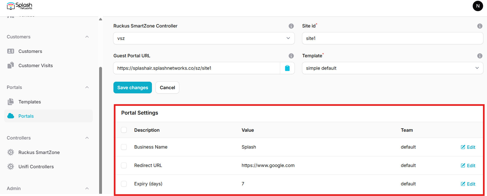
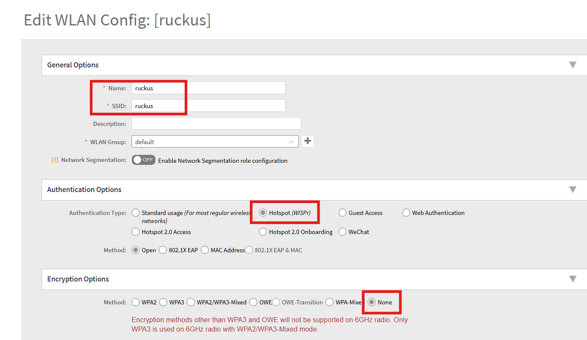
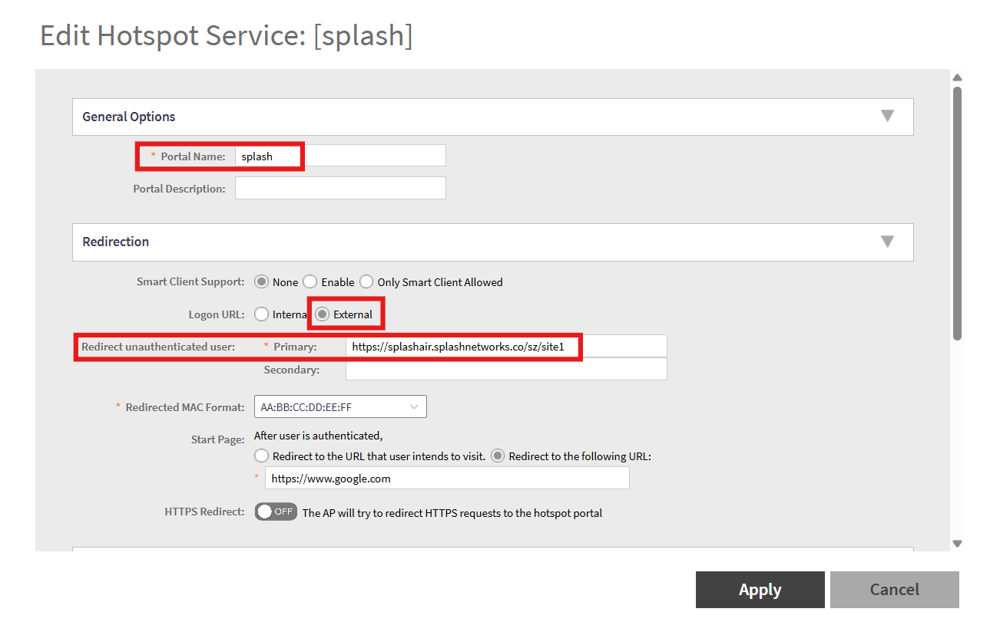
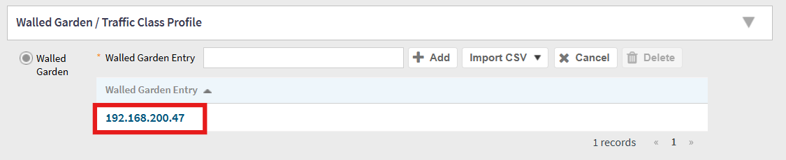
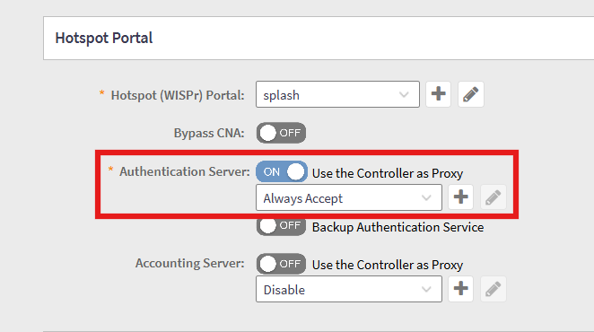

To set up a portal for Ruckus SmartZone (SZ) or virtual SmartZone (vSZ) first you need to [create a template](../defining-templates.md).

## Ruckus SZ Northbound Portal Interface

Access SmartZone using web interface. Go to Administration -> WISPr Northbound Interface. Enable Northbound Portal Interface Support and enter a username and password.



## Add a Portal

On Splash Air go to Controllers -> Ruckus SmartZone and add a new controller. Specify a name for it, and enter the username and password created in the previous step. Also enter the WAN IP or hostname of Ruckus SZ.



To create a portal go to the Portals tab and click on the New portal button. Enter a name for the portal and specify the business and venue. In Hardware select `Ruckus SmartZone`. Select the controller added in the previous step. Then, enter a Site ID based on which the path of the portal URL will be defined.



The `Guest Portal URL` will be created based on the URL of the Splash Air application followed by the path given by Site ID. Note this URL as it will be required later.

Select the template and click on the Create button.

## Portal Settings

You can go to Portals to view the settings for the portal(s) just added.

Clicking on a portal takes you to the details for that portal. It lets you specify additional settings:

```
Business Name: name of the venue which will be displayed on top of the portal
Redirect URL: the URL a user is redirected to after successful portal authorization
Expiry: the time in days after which a repeat user will have to enter their data again on the portal
Duration (seconds) after email verification: when using "Link" type Flow it is the "Session-Timeout" a user will receive via RADIUS after successful email verification 
```

You can click on the Edit button against each entry to modify it if needed.



## SmartZone Settings

Access SmartZone using web interface. Go to Network -> Wireless LAN and select your zone. Create a new WLAN (or edit an existing one). Enter a name and SSID. In Authentication Options select **Hotspot (WISPr)**. In Encryption Options select **None**.



In Hotspot Portal create a new profile in Hotspot (WISPr) Portal section. In Portal Name enter a name for it. In Login URL select **External**. In Redirect unauthenticated user Primary enter the Guest Portal URL copied earlier.



In Walled Garden add the IP address of the Splash Air server:



Click Apply to save the settings.

In Hotspot Portal -> Authentication Server select On and select the option **Always Accept**.

<figure markdown="span">
  { width="80%" }
</figure>

## MAC Encryption

Access SmartZone via SSH and enter the following command:
```
ruckus(config)# no encrypt-mac-ip
```
This will ensure that the MAC and IP address of customer are recorded in plain-text. Otherwise, the default behavior is that they are encrypted.