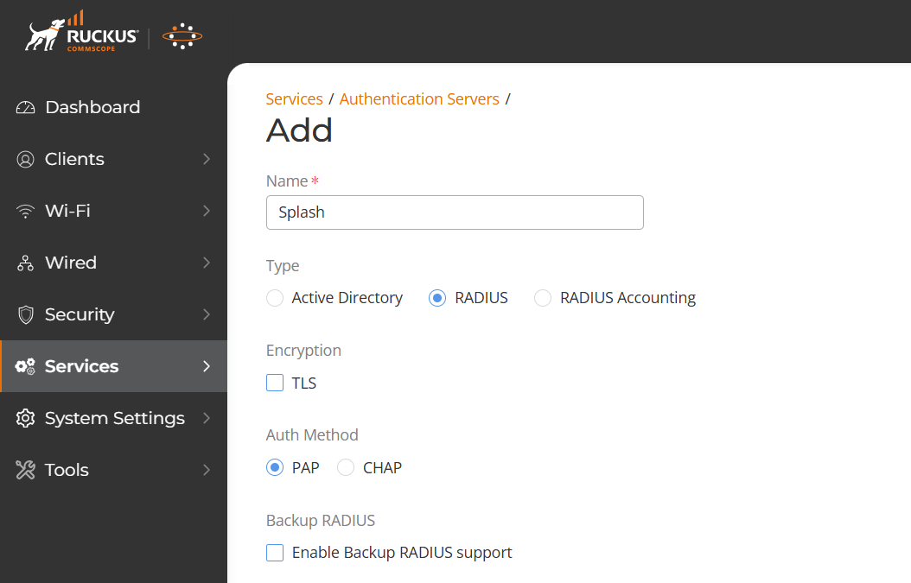
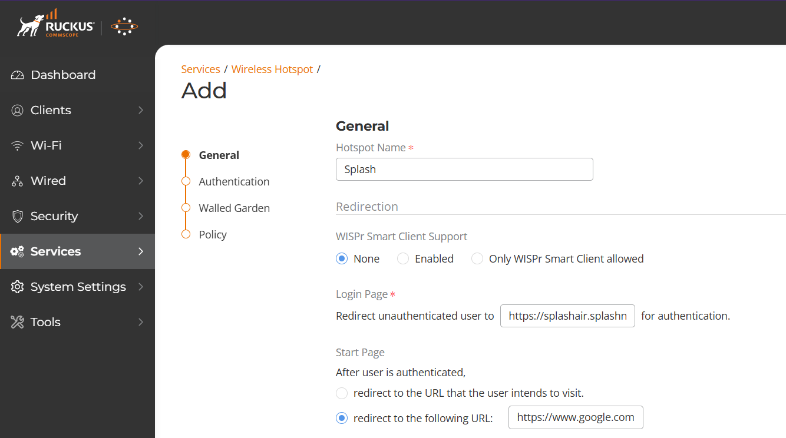
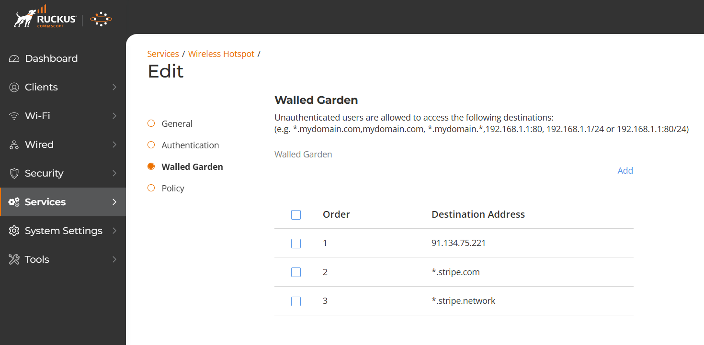
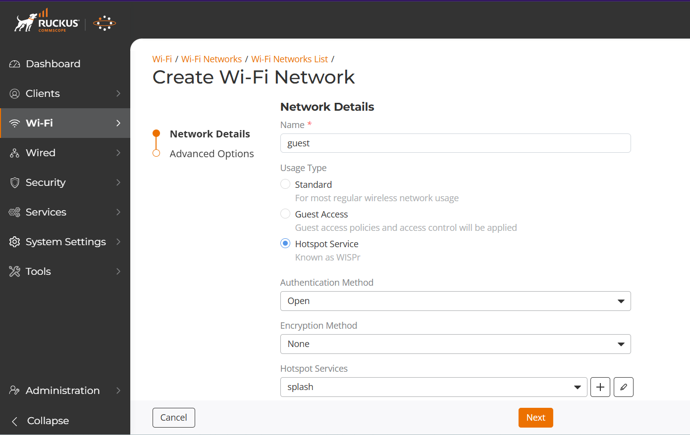
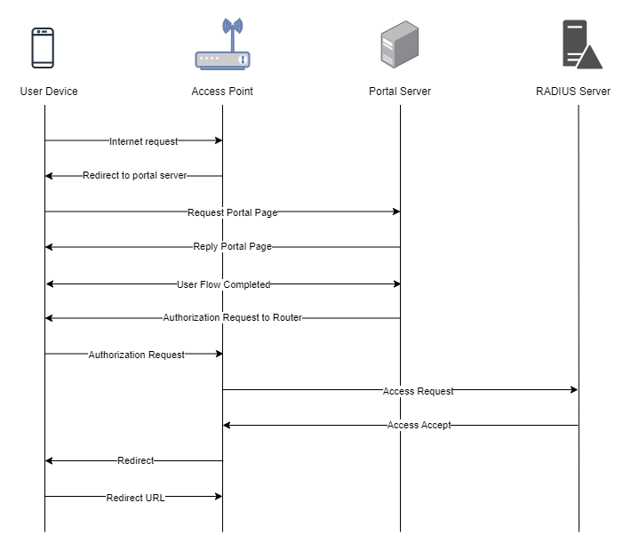

To set up a portal for Ruckus Unleashed first you need to [create a template](../defining-templates.md).

## Add a Portal

To create a portal go to the Portals tab and click on the New portal button. Enter a name for the portal and specify the business and venue. In Hardware select `Ruckus Unleashed`. Then, enter a Site ID based on which the path of the portal URL will be defined.


The `Guest Portal URL` will be created based on the URL of the Splash Air application followed by the path given by Site ID. Note this URL as it will be required later.

Select the template and click on the Create button.

## Portal Settings

You can go to Portals to view the settings for the portal(s) just added.

Clicking on a portal takes you to the details for that portal. It lets you specify additional settings:

```
Business Name: name of the venue which will be displayed on top of the portal
Redirect URL: the URL a user is redirected to after successful portal authorization
Expiry: the time in days after which a repeat user will have to enter their data again on the portal
Duration (seconds) after email verification: when using "Link" type Flow it is the "Session-Timeout" a user will receive via RADIUS after successful email verification 
```

You can click on the Edit button against each entry to modify it if needed.

## Ruckus Unleashed Settings

Access Ruckus Unleashed using web interface. Go to Services > Authentication Servers and add a new server. Enter a name for it, and in **Type** select `RADIUS`. **Auth Method** will be `PAP`. Enter the Server Address and Secret of your RADIUS server (these details will be provided by Splash team).



Then go to Services > Wireless Hotspot and add a new Hotspot. Enter a name for it, and in Login Page enter the `Guest Portal URL` created earlier. In the options for **After user is authenticated** select `redirect to the following URL` and enter your preferred URL.



On the next page in Authentication Servers section select the RADIUS server created previously. Keep the other options at their default values. Then click Next to go to the Walled Garden settings. Click on Add and enter the IP address of your portal server. If using `Payment` Flow you need to add [walled garden](../walled-garden.md) entries for your payment gateway such as Stripe.



On the next page related to Policy you do not need to create any rule. Click on the Add button to complete Hotspot configuration.

Finally, go to Wi-Fi > Wi-Fi Networks List and either create a new guest network (or modify an existing one). In **Usage Type** select `Hotspot Service`. In Hotspot Services select the service that you created.



Click Next to go to Advanced Options. You do not need to change anything here. Click Add to complete the setup.

## Troubleshooting

To troubleshoot problems it is important to understand the components involved in the captive portal user authorization process and the interactions between them.

### Traffic Flow

Here is the traffic flow in the case of Ruckus Unleashed:


