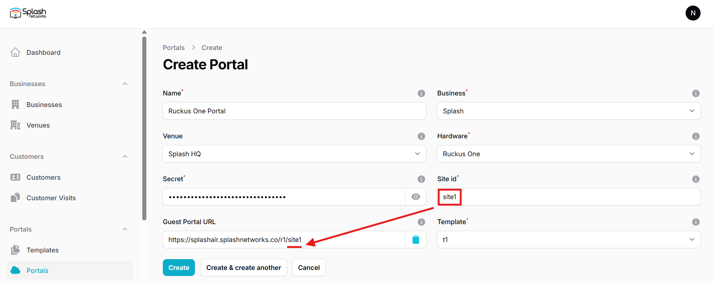
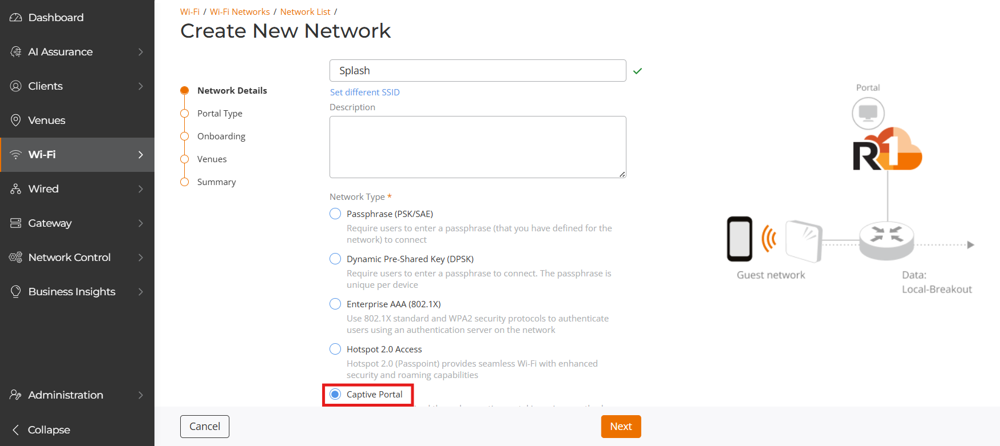
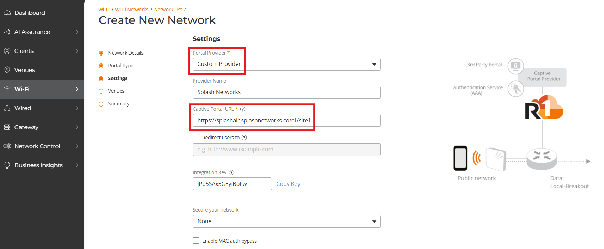
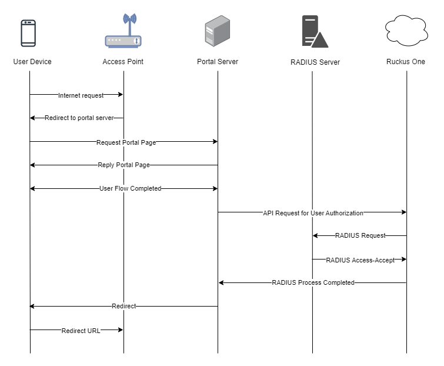

To set up a portal for Ruckus One first you need to [create a template](../defining-templates.md).

## Add a Portal

To create a portal go to the Portals tab and click on the New portal button. Enter a name for the portal and specify the business and venue. In Hardware select `Ruckus One`. In Secret enter the integration key obtained in Ruckus One (explained below in **Ruckus One Settings** section).Then, enter a Site ID based on which the path of the portal URL will be defined.



The `Guest Portal URL` will be created based on the URL of the Splash Air application followed by the path given by Site ID. Note this URL as it will be required later.

Select the template and click on the Create button.

## Portal Settings

You can go to Portals to view the settings for the portal(s) just added.

Clicking on a portal takes you to the details for that portal. It lets you specify additional settings:

```
Business Name: name of the venue which will be displayed on top of the portal
Redirect URL: the URL a user is redirected to after successful portal authorization
Expiry: the time in days after which a repeat user will have to enter their data again on the portal
Duration (seconds) after email verification: when using "Link" type Flow it is the "Session-Timeout" a user will receive via RADIUS after successful email verification 
```

You can click on the Edit button against each entry to modify it if needed.

## Ruckus One Settings

Access Ruckus One using web interface. Go to Wi-Fi > Wi-Fi Networks List and add a new network (or modify an existing network). Enter a name and in **Network Type** select `Captive Portal`.



Click Next. In **Portal Type** select `3rd Party Captive Portal (WISPr)` and click Next. In **Portal Provider** select `Custom Provider` and enter a name for it. In **Captive Portal URL** enter the `Guest Portal URL` created earlier. Copy the **Integration Key** which is given below and enter its value into the **Secret** field in Portal configuration on Splash Air.



Uncheck the following options:

_Enable MAC auth bypass_

_Enable the encryption for users’ MAC and IP addresses_

In Authentication Service click on **Add Server**. Enter a name for it, and enter the IP address and Shared Secret of your Splash Air RADIUS server (will be provided by Splash Networks' team).

Next select your venue and click on the **Activated** toggle button to activate it. In the final screen review the summary and click on the Add button.

## Troubleshooting

To troubleshoot problems it is important to understand the components involved in the captive portal user authorization process and the interactions between them.

### Traffic Flow

Here is the traffic flow in the case of Ruckus One:


