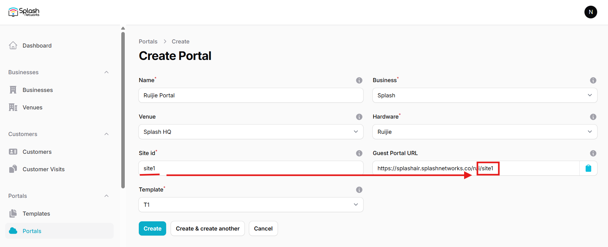
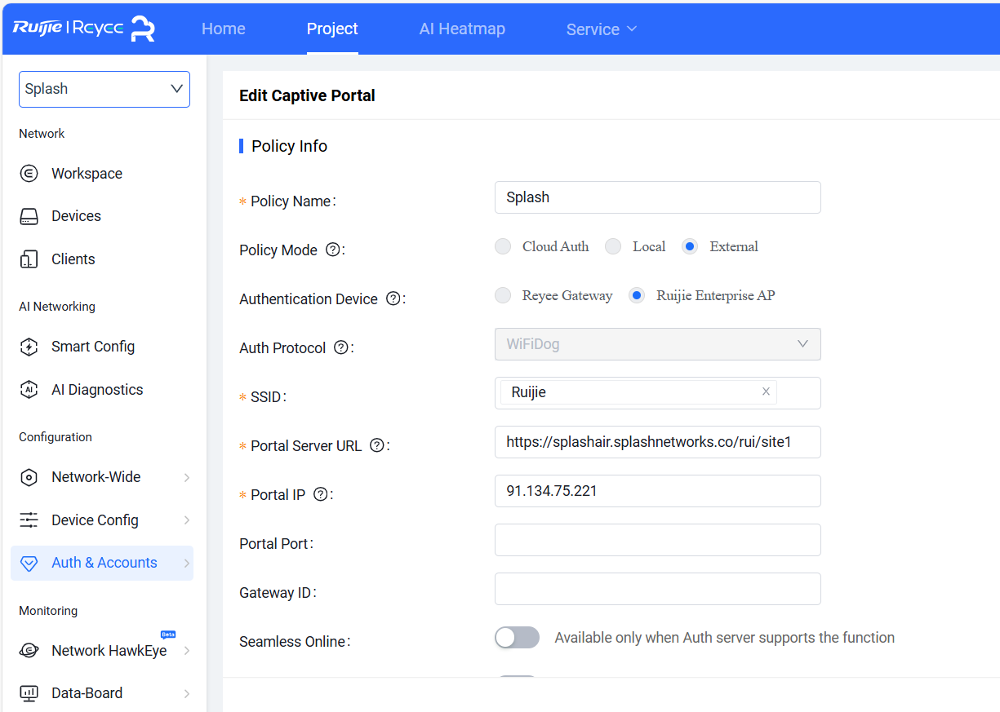
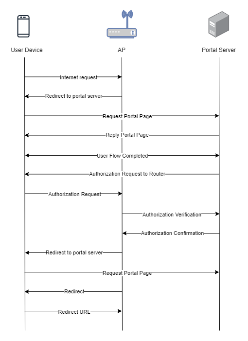

To set up a portal for Ruijie first you need to [create a template](../defining-templates.md).

## Add a Portal

To create a portal go to the Portals tab and click on the New portal button. Enter a name for the portal and specify the business and venue. In Hardware select `Ruijie`. Then, enter a Site ID based on which the path of the portal URL will be defined.



The `Guest Portal URL` will be created based on the URL of the Splash Air application followed by the path given by Site ID. Note this URL as it will be required later.

Select the template and click on the Create button.

## Portal Settings

You can go to Portals to view the settings for the portal(s) just added.

Clicking on a portal takes you to the details for that portal. It lets you specify additional settings:

```
Business Name: name of the venue which will be displayed on top of the portal
Redirect URL: the URL a user is redirected to after successful portal authorization
Expiry (days): the time in days after which a repeat user will have to enter their data again on the portal
Duration (seconds): the time in seconds for which a user is authorized on the network
Duration (seconds) before email verification: when using "Link" type Flow it is the time a user will be authorized on the network before email verification
```

You can click on the Edit button against each entry to modify it if needed.

## Ruijie Settings

Access Ruijie cloud using web interface. Go to Auth & Accounts > Authentication > Captive Portal and add a new captive portal. Enter a name and in **Policy Mode** select `External`. Select the **SSID** on which portal needs to be applied. In **Portal Server URL** enter the `Guest Portal URL` copied earlier. In **Portal IP** enter the IP address of Splash Air server. Click OK to save settings.



## Troubleshooting

To troubleshoot problems it is important to understand the components involved in the captive portal user authorization process and the interactions between them.

### Traffic Flow

Here is the traffic flow in the case of Ruijie:



### HTTP access

For Ruijie TCP port 80 and 443 should both be open as captive portal authorization process involves both HTTP and HTTPS traffic. Ensure that Ruijie AP can communicate with Splash Air server on HTTP over port 80.