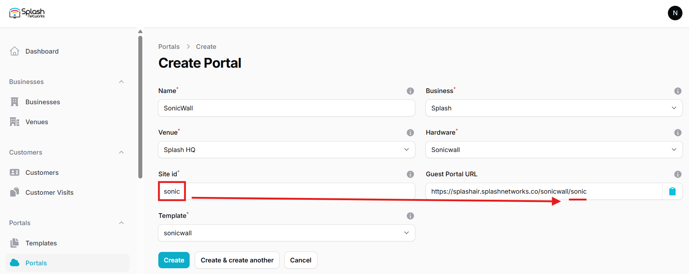
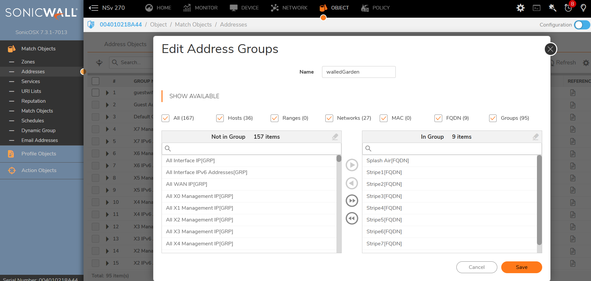
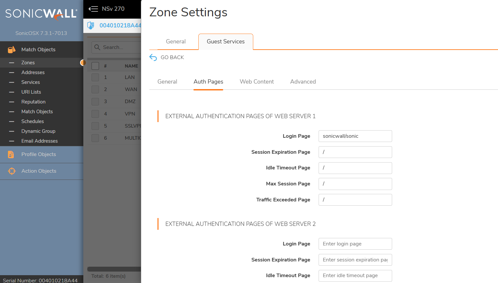
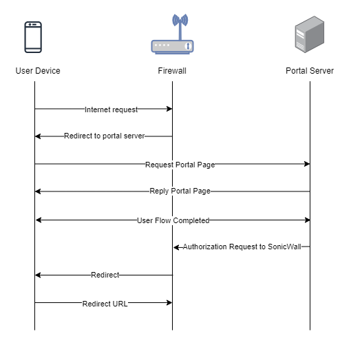

To set up a portal for Ruckus One first you need to [create a template](../defining-templates.md).

## Add a Portal

To create a portal go to the Portals tab and click on the New portal button. Enter a name for the portal and specify the business and venue. In Hardware select `Sonicwall`. Then, enter a Site ID based on which the path of the portal URL will be defined.



The `Guest Portal URL` will be created based on the URL of the Splash Air application followed by the path given by Site ID. Note this URL as it will be required later.

Select the template and click on the Create button.

## Portal Settings

You can go to Portals to view the settings for the portal(s) just added.

Clicking on a portal takes you to the details for that portal. It lets you specify additional settings:

```
Business Name: name of the venue which will be displayed on top of the portal
Expiry: the time in days after which a repeat user will have to enter their data again on the portal
Redirect URL: the URL a user is redirected to after successful portal authorization
Duration (seconds): the time for which a user is authorized on the network
Duration (seconds) after email verification: when using "Link" type Flow it is the time for which a user is authorized on the network after successful email verification 
```

You can click on the Edit button against each entry to modify it if needed.

## SonicWall Settings

Access SonicWall firewall appliance using web interface.

An entry based on the Guest Portal URL noted earlier will need to be added first. Suppose the Guest portal URL is: `https://splashair.splashnetworks.co/sonicwall/sonic`. It consists of 2 sections:

 - _Hostname_: `splashair.splashnetworks.co`

 - _URL_: `sonicwall/sonic`

Go to Object > Match Objects > Addresses and add a new entry:

**Name**: A friendly name

**Zone Assignment**: `WAN`

**Type**: `FQDN`

**FQDN Hostname**: the hostname as given in the example above

**Manually set DNS entries**: disabled

Save and exit.


If using `Payment` Flow you need to add [walled garden](../walled-garden.md) entries for your payment gateway such as Stripe in a similar way as given above. Then go to Address Group, create a new address group and add these entries to it.



Then go to Object > Match Objects > Zones and edit the zone on which you want to enable guest portal (such as LAN or DMZ). In Guest Services use these settings:

**Enable Guest Service**: enabled

**Enable External Guest Authentication**: enabled

**Max Guests**: based on your requirements

If an address group was created for `Payment` Flow, then:

**Pass Networks**: enabled - and select the address group created in the previous step


Then click on the Configure button next to `Enable External Guest Authentication`. In General use these settings:

**Client Redirect Protocol**: `HTTPS`

**Web Server 1 Protocol**: `HTTPS`

**Web Server 1 Host**: the server hostname object created in the first step

**Web Server 1 Port**: `443`

**Enable Message Authentication**: disabled

**Enable Social Network Login**: disabled


Then go to **Auth Pages** tab. In **External Authentication Pages of Web Server 1**:

**Login Page**: the URL as given in the example earlier

The remaining entries are not required when using Splash Air. However, leaving them blank is not allowed. So fill them up with a placeholder character like this:



## Troubleshooting

To troubleshoot problems it is important to understand the components involved in the captive portal user authorization process and the interactions between them.

### Traffic Flow

Here is the traffic flow in the case of SonicWall firewall:


