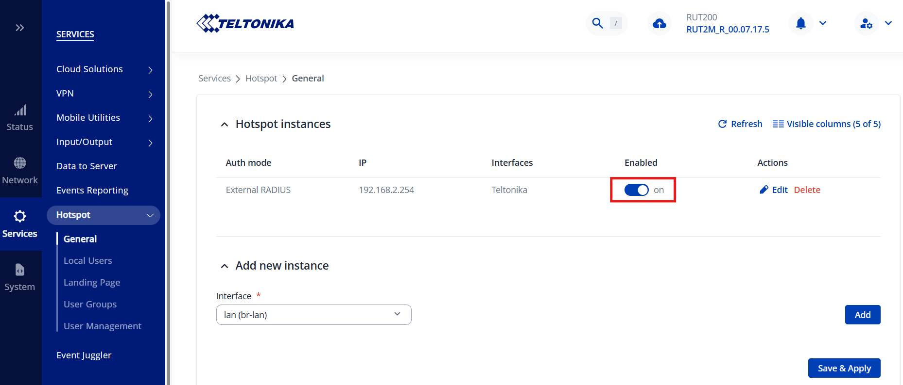

To set up a portal for Teltonika first you need to [create a template](../defining-templates.md).

## Add a Portal

To create a portal go to the Portal tab and click on the New portal button. Enter a name for the portal and specify the business and venue. In Hardware select `Coova Chilli`. Enter a secret which will be used to secure communication between the router/AP and Splash Air server. Then, enter a Site ID based on which the path of the portal URL will be defined.


The `Guest Portal URL` will be created based on the URL of the Splash Air application followed by the path given by Site ID. Note this URL as it will be required later.

Select the template and click on the Create button.

## Portal Settings

You can go to Portals to view the settings for the portal(s) just added.

Clicking on a portal takes you to the details for that portal. It lets you specify additional settings:

```
Business Name: name of the venue which will be displayed on top of the portal
Expiry: the time in days after which a repeat user will have to enter their data again on the portal
Redirect URL: the URL a user is redirected to after successful portal authorization
Duration (seconds) after email verification: when using "Link" type Flow it is the "Session-Timeout" a user will receive via RADIUS after successful email verification 
```

You can click on the Edit button against each entry to modify it if needed.

## Teltonika Settings

Access Teltonika device using web portal.

Go to System > Package manager and install **Hotspot** package.


Then go to Service > Hotspot > General and in Interface select the interface on which you want to enable hotspot.


Click the Add button to start hotspot configuration on the interface. In General tab configure these settings:

 - **Configuration profile**: Default
 - **Authentication mode**: RADIUS
 - **Landing page**: External
 - **Password encoding**: on
 - **Landing page address**: `Guest Portal URL` created earlier
 - **UAM secret**: the secret created earlier
 - **Success page**: Custom
 - **Custom URL**: the URL a user is redirected to after successful portal authorization

Next go to RADIUS tab and enter the IP address and secret of RADIUS server (will be provided by Splash Networks' team). Keep the other settings at their defaults and click Save and Apply.

Click on the **Enabled** option to turn on the Hotspot feature and click Save & Applyte.



## Troubleshooting

To troubleshoot problems it is important to understand the components involved in the captive portal user authorization process and the interactions between them.

### Traffic Flow

For traffic flow refer to the traffic flow section of Coova Chilli [here](coova-chilli.md/#traffic-flow).