To set up a portal for Unifi first you need to [create a template](../defining-templates.md). Then you have to add the Unifi controller which will be using that portal. A single template can be applied to multiple sites.

## Add a Unifi Controller

Unifi controllers can either be self-hosted or managed via Unifi Site Manager (unifi.ui.com).

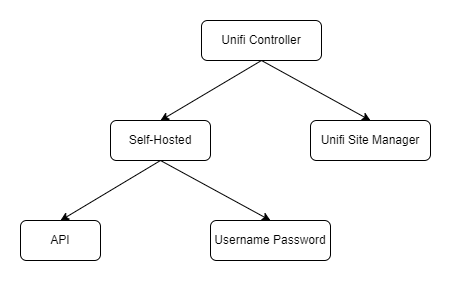

### Self-Hosted

In case of a self-hosted Unifi controller there are 2 authentication methods: 

1. API Key (recommended for Unifi OS)
2. Username Password (traditional method)

For creating an API Key access your Unifi Network application and go to Integrations > Create New API Key. Note this key as it won't be shown again.

If using a controller on which API Key option is not available the Username Password option will have to be used instead. It needs to be the username and password of a local admin user without 2FA.

The either case the controller should be reachable directly over the internet using the provided hostname, not via unifi.ui.com portal.

To add a Unifi Controller click on the New Ubiquiti Unifi button in Controllers > Ubiquiti Unifi. An interactive wizard will launch.

You need to enter the name, URL and API key or Username Password for the Unifi Controller.

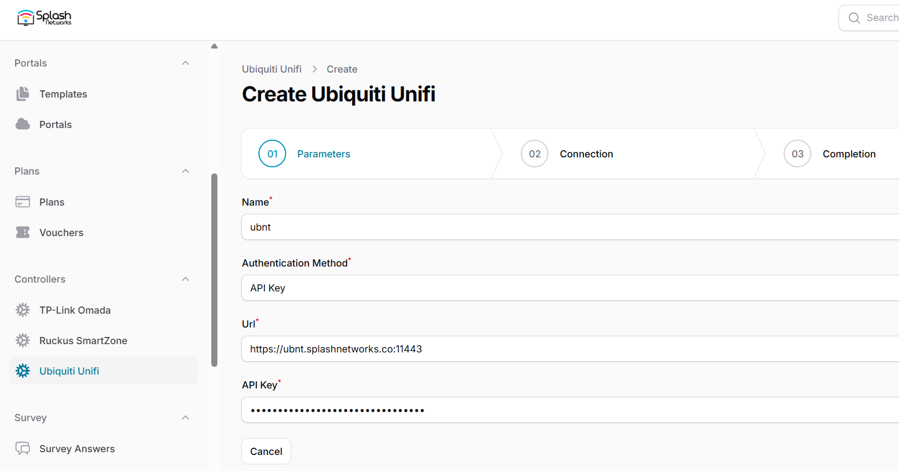

When using Username Password it will be added like this:

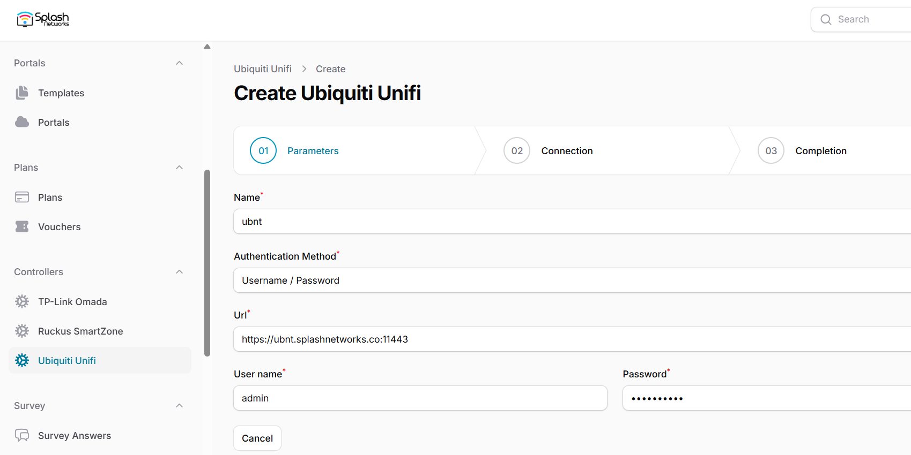

In the 2nd step the connection with the Unifi controller will be tested. If the connection is successful, you will get an option to assign sites on the Unifi controller to corresponding venues and templates on Splash Air. You can use the `+` button at the bottom to add multiple sites.

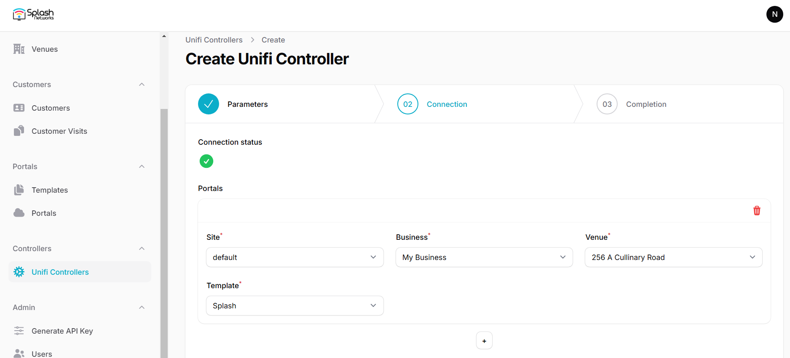

The 3rd and final step applies the settings for captive portal to the respective site on the Unifi controller. Click on the Create button to complete the process.

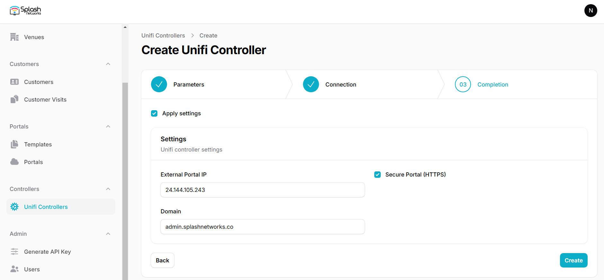

Completing this process sets up the captive portal for the selected site(s) on Splash Air.

The controller will start showing on the Unifi Controllers page:

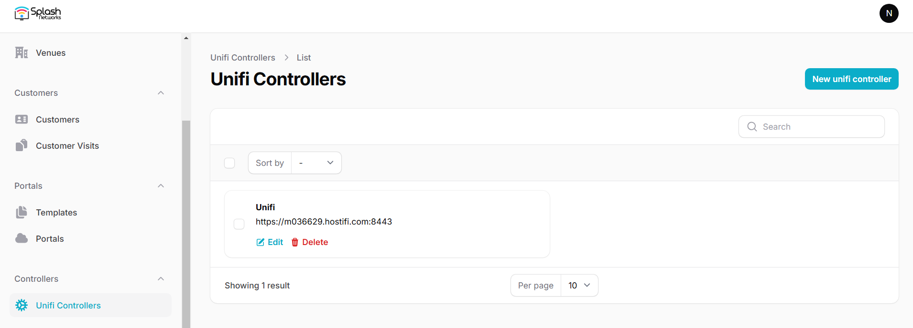

### Unifi Site Manager

A Unifi OS console or server adopted on a unifi.ui.com account can be added using the wizard. It requires a Site Manager API key generated by the console owner.

To generate a Site Manager API Key open unifi.ui.com and go to Settings > API Keys. Generate an API key with Unifi Network Application permission.

You will also require the Console ID. It can be found in the URL when you access the site.

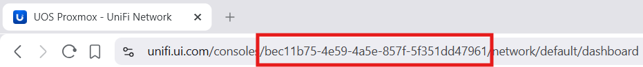

To add a Unifi Controller click on the New Ubiquiti Unifi button in Controllers > Ubiquiti Unifi. An interactive wizard will launch. Enter a name for the controller, select `Site Manager Proxy` as the **Authentication Method**, and enter the Console ID and Site Manager API Key.

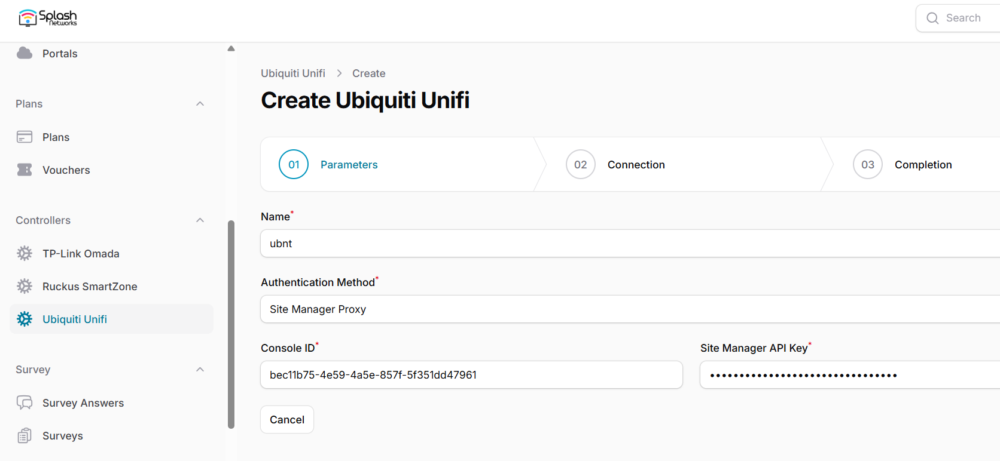

The next steps are the same as given above for [self-hosted](#self-hosted) controller.

## Unifi Settings

After adding the controller you should check the site in the Unifi Controller to double-check the captive portal settings. In Hotspot > Authentication `External Portal Server` should be selected.

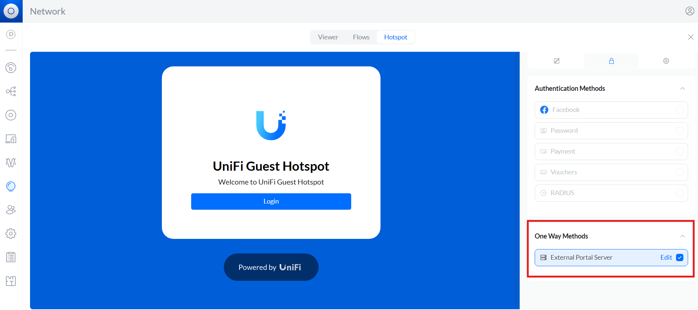

By clicking on Edit you can view the IP address: it should show the IP address of the Splash Air server.

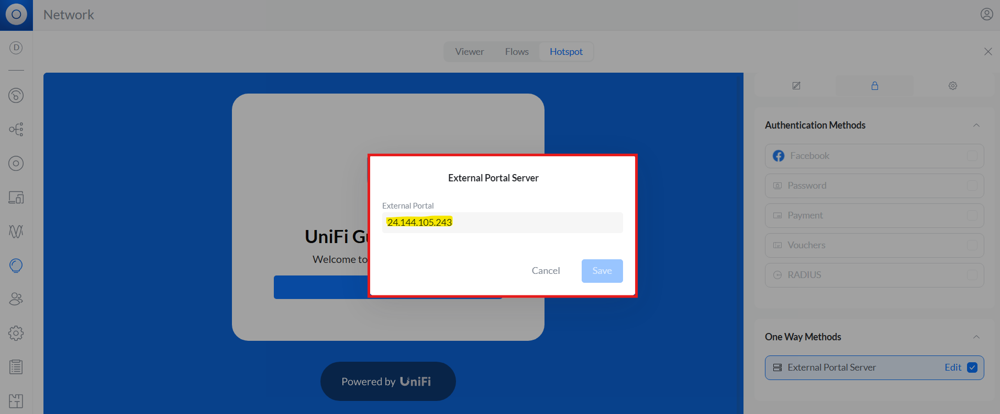

In the Settings tab the Landing Page Settings should be like this:

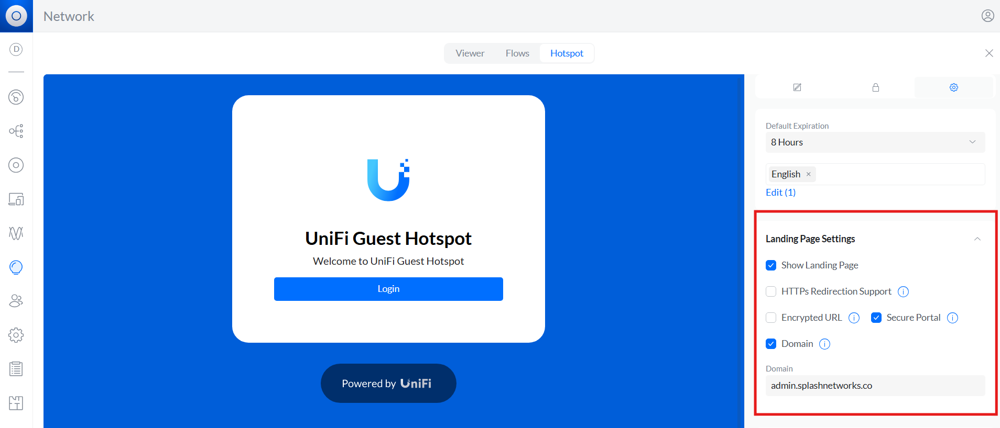

```
Show Landing Page: checked
HTTPs Redirection Support: unchecked
Encrypted URL: unchecked
Secure Portal: checked
Domain: checked

Domain: <Splash Air Domain>
```

Finally, go to Settings > WiFi and select your guest Wi-Fi network. Enable `Captive Portal` option in **Hotspot** section.

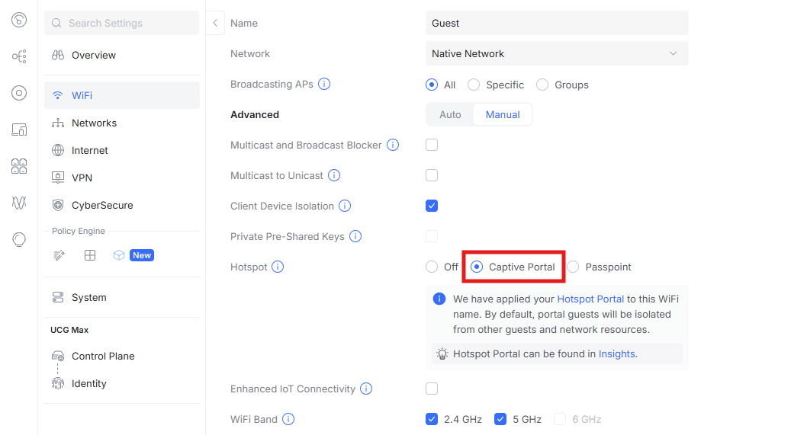

If using `Payment` Flow you need to add [walled garden](../walled-garden.md) entries for your payment gateway such as Stripe in Pre-Authorization Allowances section.

<figure markdown="1">
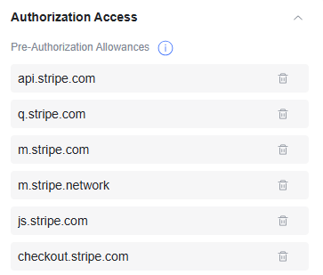
</figure>

## Portals

You can go to Portals to view the settings for the portal(s) just added.

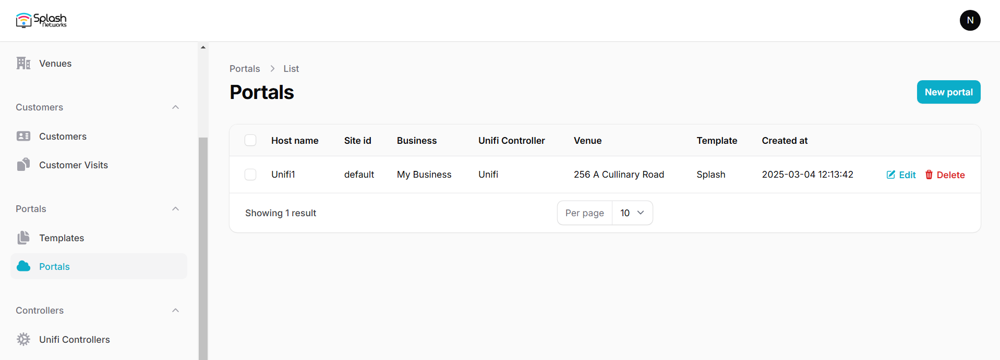

Clicking on a portal takes you to the details for that portal. It lets you specify additional settings:

```
Redirect URL: the URL a user is redirected to after successful portal authorization
Business Name: name of the venue which will be displayed on top of the portal
Duration: the time in minutes for which a user is authorized on the network
Expiry: the time in days after which a repeat user will have to enter their data again on the portal
```

You can click on the Edit button against each entry to modify it if needed.

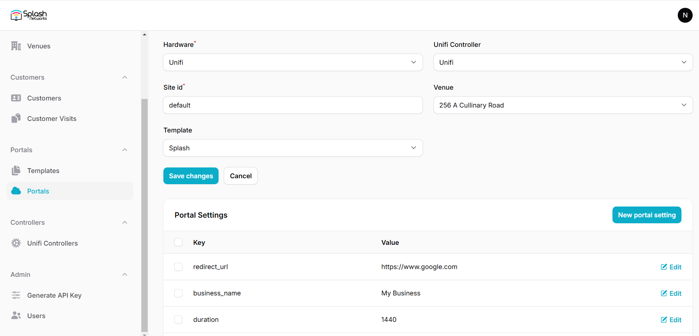

## Troubleshooting

To troubleshoot problems it is important to understand the components involved in the captive portal user authorization process and the interactions between them.

### Traffic Flow

Here is the traffic flow in the case of Ubiquiti Unifi:

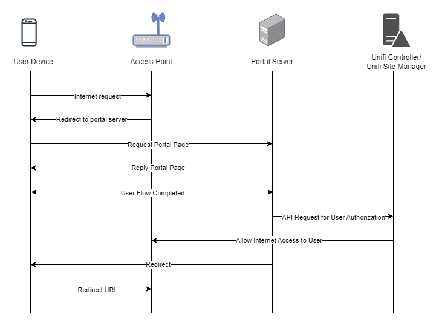

### Client Isolation

The client isolation setting on Unifi controller has been known to lead to this error when trying to access the captive portal:

```
Hotspot login cannot open the page because the network connection was lost
```

<figure markdown="1">
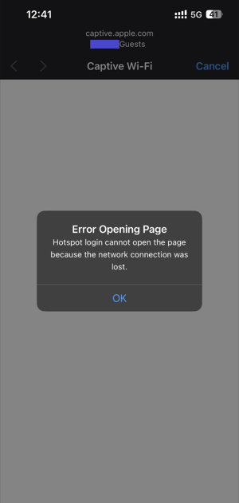
</figure>

To prevent it disable client device isolation in WiFi settings.

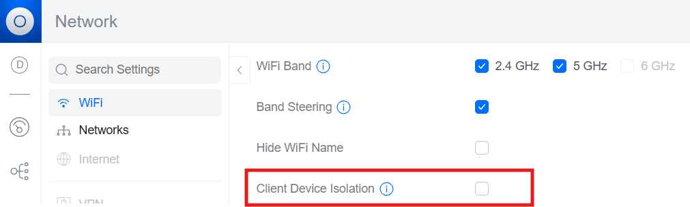

## Additional Information

[Unifi Authentication Methods](https://artofwifi.net/blog/unifi-api-authentication-local-admin-vs-api-key-vs-site-manager)

[How to Create Local Admin Account on Unifi Controller](https://artofwifi.net/blog/use-local-admin-account-unifi-api-captive-portal)

[Wireguard VPN Between Unifi Controller & Splash Air](https://blog.splashnetworks.co/wireguard-client-on-unifi-controller/)