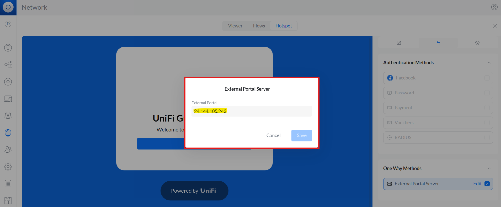

To set up a portal for Unifi first you need to [create a template](../defining-templates.md). Then you have to add the Unifi controller which will be using that portal. A single template can be applied to multiple sites.

## Add a Unifi Controller

To add a Unifi Controller you will click on the New unifi controller button in the Unifi Controllers tab. An interactive wizard will launch. You need to enter the name, URL and username password for the Unifi Controller. It needs to be a local user without 2FA. The controller should be reachable directly over the internet using the provided hostname, not via ui.com portal.


In the 2nd step the connection with the Unifi controller will be tested. If the connection is successful, you will get an option to assign sites on the Unifi controller to corresponding venues and templates on the Splash Admin Panel. You can use the `+` button at the bottom to add multiple sites.


The 3rd and final step applies the settings for captive portal to the respective site on the Unifi controller. Click on the Create button to complete the process.


Completing this process sets up the captive portal for the selected site(s) on the Admin Panel.

The controller will start showing on the Unifi Controllers page:


You should check the site in the Unifi Controller to double-check the captive portal settings. In Hotspot -> Authentication `External Portal Server` should be selected. 


By clicking on Edit you can view the IP address: it should show the IP address of the Splash Admin Panel server.



In the Settings tab the Landing Page Settings should be like this:


```
Show Landing Page: checked
HTTPs Redirection Support: unchecked
Encrypted URL: unchecked
Secure Portal: checked
Domain: checked

Domain: <Splash Admin Panel Domain>
```

## Portals

You can go to Portals to view the settings for the portal(s) just added.


Clicking on a portal takes you to the details for that portal. It lets you specify additional settings:

```
Redirect URL: the URL a user is redirected to after succesful portal authorization
Business Name: name of the venue which will be displayed on top of the portal
Duration: the time in minutes for which a user is authorized on the network
Expiry: the time in days after which a repeat user will have to enter their data again on the portal
```

You can click on the Edit button against each entry to modify it if needed.

