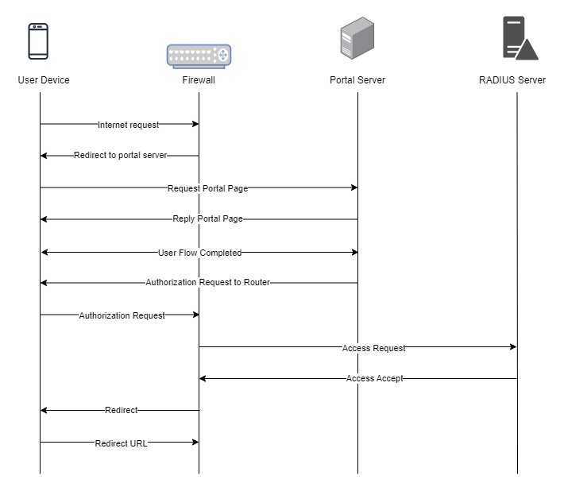
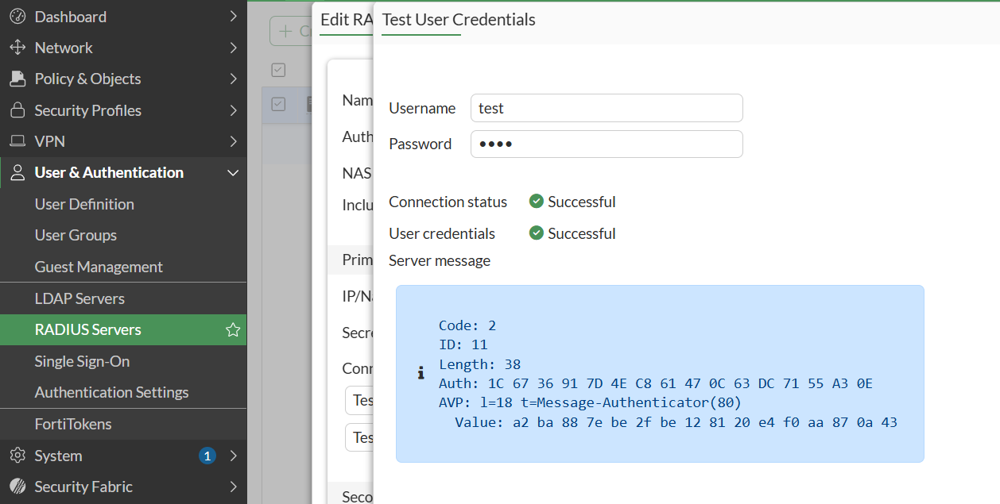

To troubleshoot problems it is important to understand the components involved in the captive portal user authorization process and the interactions between them.

## Traffic Flow

Here is the traffic flow in the case of FortiGate firewall:

## RADIUS Test

To test your RADIUS server You can go to User & Authentication -> RADIUS Servers. Select your RADIUS server and click on Test User Credentials. Here you can enter a username and password combination to see whether it passes RADIUS authorization or not.

