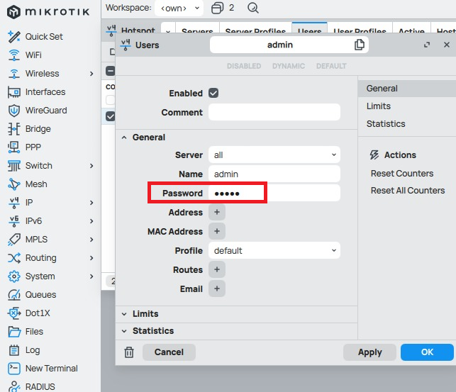

To troubleshoot problems it is important to understand the components involved in the captive portal user authorization process and the interactions between them.

## Traffic Flow

Here is the traffic flow in the case of Mikrotik:

<figure markdown="1">

</figure>

## Portal Loops Between Welcome and Authorization Screen & User is Not Authorized

This happens when your admin user has a password. Remove the password for the admin user to fix this issue.

