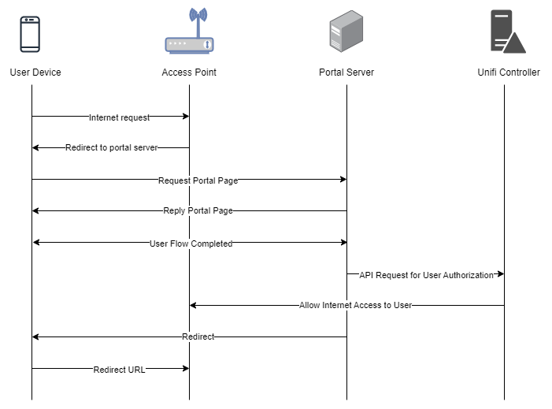

To troubleshoot problems it is important to understand the components involved in the captive portal user authorization process and the interactions between them.

## Traffic Flow

Here is the traffic flow in the case of Ubiquiti Unifi:



## Client Isolation

The client isolation setting on Unifi controller has been known to lead to this error when trying to access the captive portal:

```
Hotspot login cannot open the page because the network connection was lost
```

<figure markdown="1">

</figure>

To prevent it disable client device isolation in WiFi settings.

