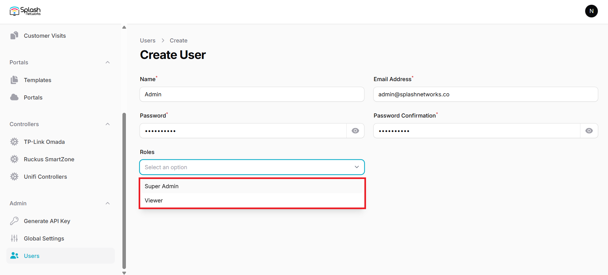

Users refer to administrative users that have access to Splash Air application for performing operational tasks such as creating portals and viewing customer data.

To create a new user go to Users and click on the New user button. Enter a name, email address, and password, and select the role:

There are 2 types of user roles in Splash Air:

1. **Super Admin**: a user that has full control of the application and can perform all operations
2. **Viewer**: a user that has read-only visibility of the application and data but cannot make any changes

If multi-tenancy is being used then the application has 3 [roles](global-settings.md/#user-roles) instead of the two mentioned above.