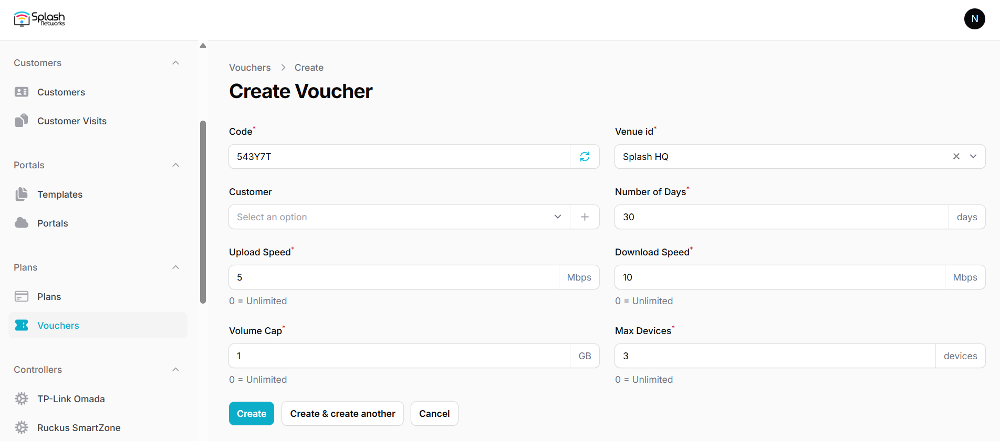
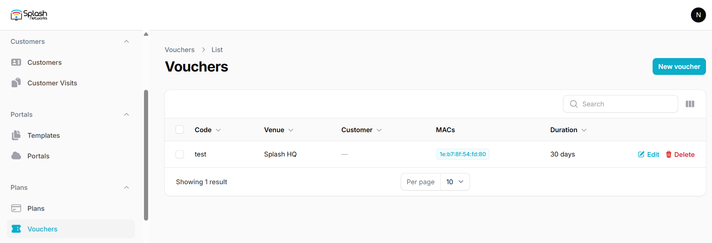

To create vouchers go to Vouchers and create a new voucher.

Enter the following parameters for it:

- **Name**: a name to identify the plan
- **Code**: it is auto-generated; you can manually enter a code as well
- **Venue ID**: the venue on which this voucher will work
- **Customer**: a voucher can be associated with an existing or new customer to email the voucher to the customer using an automation
- **Number of Days**: the duration for which the plan will be active after purchase
- **Upload Speed**: bandwidth rate-limit for upload
- **Download Speed**: bandwidth rate-limit for download
- **Volume Cap**: volume quota*
- **Max Devices**: number of devices allowed for a user

_*Note on volume quota: volume quota is calculated when a user connects. It does not affect a user's existing session. If a user exceeds their plan's volume they will not be able to connect the next time they attempt to connect._

Once a voucher is used on a device the device's MAC address is bound to the voucher. After the Max Devices is reached the voucher will not be usable on any other device.

